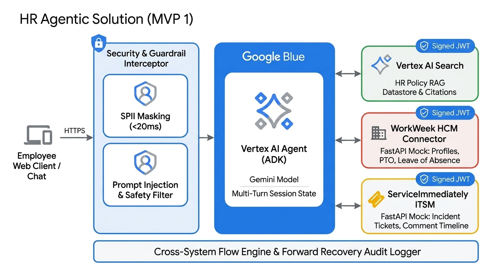
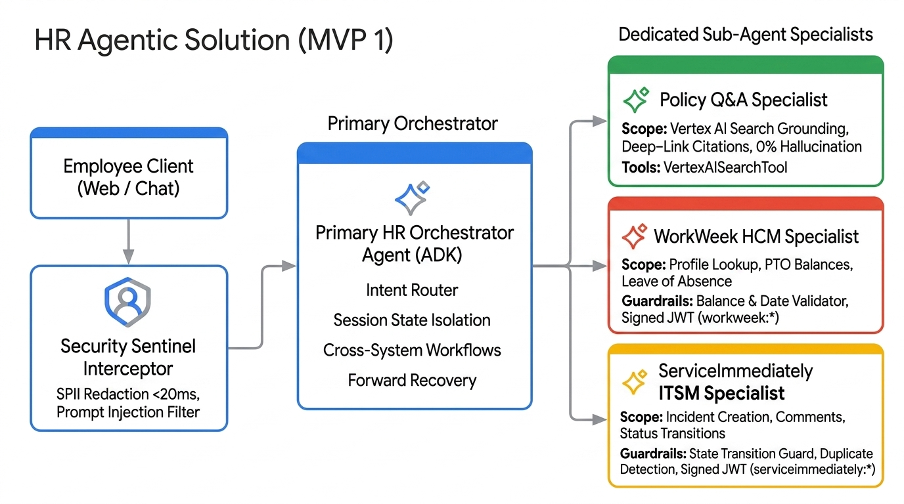
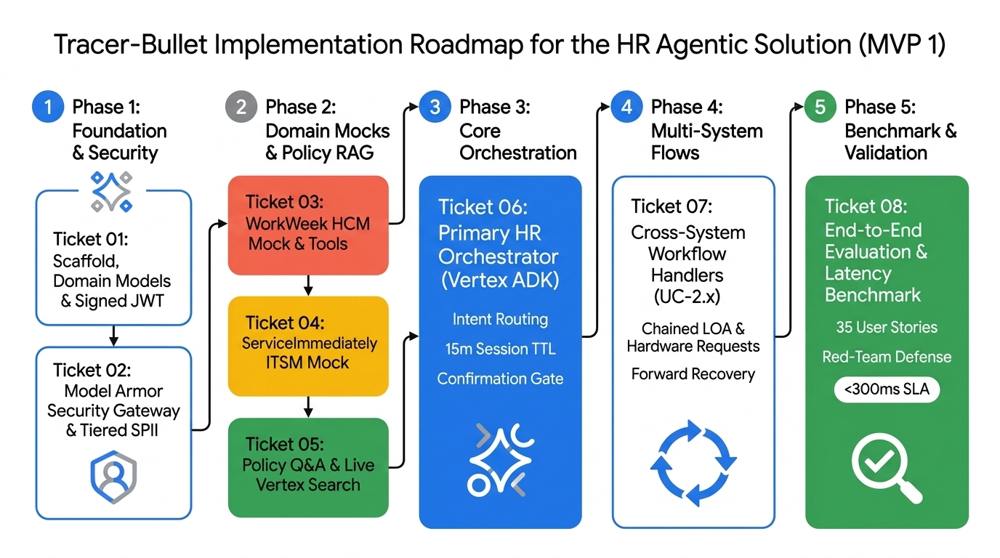
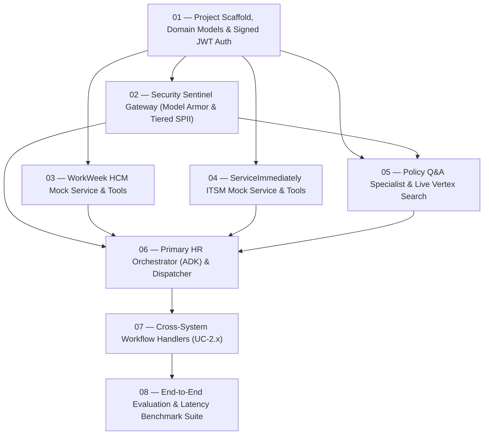

# HR Agentic Solution (MVP 1)

[](https://cloud.google.com/vertex-ai)
[](https://cloud.google.com/security-command-center)
[](https://cloud.google.com/generative-ai-app-builder)
[](./docs/adr/)
[](./.scratch/hr-agentic-mvp1/issues/)

A unified, multi-agent virtual assistant built on the **Google Cloud Vertex AI Agent Development Kit (ADK)** and secured by **Google Cloud Model Armor**. It automates Tier-1 employee HR/IT inquiries, enforces zero-trust identity provenance (Signed JWTs), and orchestrates complex cross-system workflows across **WorkWeek (HCM)** and **ServiceImmediately (ITSM)** with strict semantic grounding against official corporate policy documents in **Vertex AI Search**.

---

## 📑 Quick Links & Interactive Deliverables

* 📊 **[Interactive Google Slides Presentation Deck (16:9 Web Deck)](./docs/slides/index.html)**
* 📑 **[Google Material Styled Documentation (README.html)](./README.html)**
* 📜 **[Google Apps Script Drive Deck Generator (create_google_slides.gs)](./docs/slides/create_google_slides.gs)**
* 📋 **[Business Requirements Document (BRD)](./requirements/HR-Agentic-BRD.md)** ([HTML Preview](./requirements/HR-Agentic-BRD.html))
* 🏗️ **[Technical Feature Specification (35 User Stories)](./.scratch/hr-agentic-mvp1/spec.md)**
* 🤖 **[Multi-Agent Architecture & Scope Specification](./docs/multi_agent_architecture.md)**
* 📖 **[Domain Glossary (CONTEXT.md)](./CONTEXT.md)**
* 🏛️ **[Architectural Decision Records (ADRs 0001–0012)](./docs/adr/)**
* 🎯 **[Tracer-Bullet Implementation Tickets (01–08)](./.scratch/hr-agentic-mvp1/issues/)**

---

## 🏛️ Architecture Topologies

### 1. High-Definition System Architecture Topology


### 2. Hierarchical Multi-Agent Topology (Vertex ADK)


---

## 🤖 Multi-Agent Ecosystem & Responsibility Matrix

The system follows a hierarchical multi-agent pattern built on the **Vertex AI Agent Development Kit (ADK)**, isolating tool contexts and security scopes:

| Layer / Agent | Role & Scope | Dedicated Tools & Endpoints | Security & Auth Scopes |
| :--- | :--- | :--- | :--- |
| **Layer 0: Security Sentinel Gateway** | Managed AI security gateway intercepting prompt injections, jailbreaks & redacting SPII | Google Cloud Model Armor Client, Cloud DLP Templates, Presidio/Regex Fallback | Model Armor Template ID / SCC Integration |
| **Agent 1: Primary HR Orchestrator** | Multi-turn session manager (15m TTL), intent router, cross-system workflow coordinator, confirmation gate | ADK Sub-Agent Dispatcher, Confirmation Interceptor, Forward Recovery Logger | Signed Root JWT (`sub: <emp_id>`) |
| **Agent 2: Policy Q&A Specialist** | Semantic policy retrieval with structured metadata deep links & zero hallucination | `VertexAISearchTool` (Grounding Datastore), Citation Formatter | Read-only Policy Datastore |
| **Agent 3: WorkWeek HCM Specialist** | Live profile queries, PTO balances, and guarded leave of absence bookings | `/api/v1/employees/{id}`, `/api/v1/employees/{id}/pto`, `/api/v1/leave/requests` | Signed JWT (`scopes: workweek:*`) |
| **Agent 4: ServiceImmediately Specialist** | Support incident creation, timeline comments, lifecycle transition guards, duplicate mitigation | `/api/now/table/incident`, `/api/now/table/incident/{id}` | Signed JWT (`scopes: serviceimmediately:*`) |

---

## 🏛️ Architectural Decision Records (ADRs)

All architectural design choices are formally documented in [docs/adr/](./docs/adr/):

| ADR ID | Title | Core Architectural Decision |
| :--- | :--- | :--- |
| **[ADR-0001](./docs/adr/0001-fastapi-mock-services.md)** | FastAPI Mock Services | Embedded RESTful mock services with stateful JSON fixtures for deterministic local testing. |
| **[ADR-0002](./docs/adr/0002-vertex-ai-search-policy-rag.md)** | Vertex AI Search Policy RAG | Semantic retrieval & strict grounding engine returning clickable section deep links. |
| **[ADR-0003](./docs/adr/0003-hybrid-safety-guardrails.md)** | Hybrid Safety Guardrails | Sub-20ms regex/Presidio SPII masking + LLM safety classifier guaranteeing <300ms SLA. |
| **[ADR-0004](./docs/adr/0004-cross-system-forward-recovery.md)** | Cross-System Forward Recovery | Audit logging, pending sync tasks, and manual follow-up guidance on partial workflow failure. |
| **[ADR-0005](./docs/adr/0005-vertex-agent-development-kit.md)** | Vertex AI Agent Development Kit | Unified agent orchestration framework for Gemini model calling, declarative tools, and session state. |
| **[ADR-0006](./docs/adr/0006-signed-jwt-delegated-authorization.md)** | Signed JWT Delegated Authorization | Cryptographically signed bearer tokens passing user identity (`sub`) and origin (`iss: HR-Agent-v1`). |
| **[ADR-0007](./docs/adr/0007-human-confirmation-on-state-mutations.md)** | Human Confirmation Gate on Mutations | Explicit confirmation turn required before executing leave bookings, contact updates, or ticket closures. |
| **[ADR-0008](./docs/adr/0008-strict-live-vertex-ai-search-testing.md)** | Strict Live Vertex AI Search Testing | Integration tests connect directly to live GCP datastores to guarantee 100% production parity. |
| **[ADR-0009](./docs/adr/0009-session-ttl-and-explicit-purge.md)** | Session Expiry via Prompt & 15m TTL | Dual-trigger session memory purge on exit prompts (*"reset"*, *"clear"*, *"log out"*) or 15m idle. |
| **[ADR-0010](./docs/adr/0010-interactive-priority-downgrade-guardrail.md)** | Interactive Priority Verification | Interactive prompt when Critical priority tag lacks major business outage justification. |
| **[ADR-0011](./docs/adr/0011-tiered-spii-redaction-logging.md)** | Tiered SPII Redaction | Ephemeral UI self-viewing in active stream with strict persistent log and audit trace masking. |
| **[ADR-0012](./docs/adr/0012-google-cloud-model-armor.md)** | Google Cloud Model Armor | Managed Layer 0 AI security gateway with Cloud DLP SPII redaction, prompt sanitization, and SCC integration. |

---

## 🎯 Tracer-Bullet Implementation Roadmap



All 8 vertical slices are specified in [`.scratch/hr-agentic-mvp1/issues/`](./.scratch/hr-agentic-mvp1/issues/) with explicit blocking edges and `ready-for-agent` status:



| Ticket | Title | Blocked By | Deliverable Summary |
| :-: | :--- | :--- | :--- |
| **01** | **[`01-project-scaffold-domain-models-jwt.md`](./.scratch/hr-agentic-mvp1/issues/01-project-scaffold-domain-models-jwt.md)** | *None (Frontier)* | Domain schemas (Profile, PTO, Tickets) & cryptographic signed JWT generator/validator. |
| **02** | **[`02-security-sentinel-spii-guardrails.md`](./.scratch/hr-agentic-mvp1/issues/02-security-sentinel-spii-guardrails.md)** | `01` | Google Cloud Model Armor integration + Cloud DLP / Presidio tiered SPII masking. |
| **03** | **[`03-workweek-hcm-mock-service.md`](./.scratch/hr-agentic-mvp1/issues/03-workweek-hcm-mock-service.md)** | `01` | WorkWeek FastAPI mock endpoints + confirmation gate, PTO & temporal guardrails. |
| **04** | **[`04-serviceimmediately-itsm-mock-service.md`](./.scratch/hr-agentic-mvp1/issues/04-serviceimmediately-itsm-mock-service.md)** | `01` | ServiceImmediately FastAPI mock endpoints + lifecycle transitions & priority downgrade guardrail. |
| **05** | **[`05-policy-qa-specialist-vertex-search.md`](./.scratch/hr-agentic-mvp1/issues/05-policy-qa-specialist-vertex-search.md)** | `01, 02` | Policy Q&A Agent with live Vertex AI Search grounding, citations, and 0% hallucination fallback. |
| **06** | **[`06-primary-hr-orchestrator-adk.md`](./.scratch/hr-agentic-mvp1/issues/06-primary-hr-orchestrator-adk.md)** | `02, 03, 04, 05` | Root multi-turn session orchestrator in Vertex ADK dispatching to domain specialists. |
| **07** | **[`07-cross-system-workflow-handlers.md`](./.scratch/hr-agentic-mvp1/issues/07-cross-system-workflow-handlers.md)** | `06` | Chained execution for UC-2.1 (Equipment), UC-2.2 (Medical Leave), UC-2.3 (Relocation) + Forward Recovery. |
| **08** | **[`08-e2e-evaluation-benchmark-suite.md`](./.scratch/hr-agentic-mvp1/issues/08-e2e-evaluation-benchmark-suite.md)** | `07` | Comprehensive evaluation verifying all 35 user stories, red-team tests, and <300ms latency. |

---

## 📊 Requirements Traceability Matrix

| BRD Requirement ID | Requirement Name | Spec Module & Mechanism | Testing & Verification |
| :--- | :--- | :--- | :--- |
| **FR-1.1** | Capability & Lifecycle Governance | Tool registration bounding in Vertex ADK | Tool invocation boundary test suite |
| **FR-1.2** | Verification of Request Origin | Signed JWT bearer tokens (`sub`, `iss`, `scopes`) | Provenance header inspection on mock server |
| **FR-1.3** | Conversation Safety | Google Cloud Model Armor Ingress/Egress Gateway (ADR-0012) | Negative red-team injection & toxicity test suite |
| **FR-1.4** | Data Masking / Redaction | Cloud DLP / Presidio Tiered SPII redaction (ADR-0011 & ADR-0012) | Automated SPII log masking test (phone, address, SSN) |
| **FR-1.5** | RBAC & Data Isolation | Scoped delegated auth tokens per employee ID + 15m TTL | Multi-user cross-access isolation test suite |
| **FR-2.1** | Natural Language Understanding | Vertex AI ADK with Gemini model intent parser | Typo and synonym tolerance benchmark |
| **FR-2.2** | Multi-Turn Dialog | Isolated stateful session manager with TTL (ADR-0009) | Context retention & memory leak tests |
| **FR-3.1–3.4** | WorkWeek Integration | WorkWeek FastAPI Connector + Confirmation Gate (ADR-0007) | Balance constraint, date validity & confirmation tests |
| **FR-4.1–4.3** | ServiceImmediately Integration | ServiceImmediately Connector + Priority Guard (ADR-0010) | State transition, duplicate detection & priority tests |
| **FR-5.1–5.5** | Policy Document Q&A | Live Vertex AI Search datastore with metadata citations (ADR-0008) | Grounding precision benchmark (≥95% accuracy, 0% hallucination) |
| **UC-2.1–2.3** | Cross-System Orchestration | Cross-System Flow Engine with Forward Recovery (ADR-0004) | End-to-end workflow execution & failure recovery tests |

---

## 📁 Repository Structure

```
elevate-hrproject/
├── README.html                          # Styled Google Material HTML Documentation
├── README.md                            # GitHub Flavored Markdown Documentation
├── CONTEXT.md                           # Canonical Domain Glossary
├── requirements/
│   ├── HR-Agentic-BRD.md                # Markdown Business Requirements Document
│   ├── HR-Agentic-BRD.html              # Material HTML Preview of BRD
│   └── HR-Agentic-BRD.pdf               # Original BRD PDF Document
├── docs/
│   ├── multi_agent_architecture.md      # Multi-Agent Scope & Sequence Specification
│   ├── assets/
│   │   ├── hr_agent_architecture.jpg    # System Topology (2D Vector Graphic)
│   │   └── multi_agent_architecture.jpg # Multi-Agent Topology (2D Vector Graphic)
│   ├── adr/                             # Architectural Decision Records (0001–0012)
│   └── slides/
│       ├── index.html                   # Interactive 16:9 Google Slides Web Application
│       └── create_google_slides.gs      # Google Apps Script Drive Importer
└── .scratch/
    └── hr-agentic-mvp1/
        ├── spec.md                      # Feature Specification (35 User Stories)
        └── issues/                      # 8 Tracer-Bullet Tickets (01 through 08)
```
