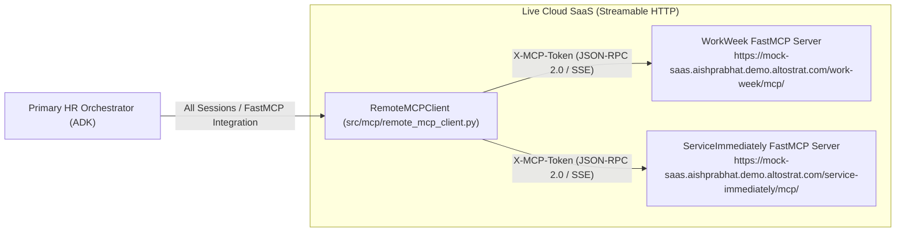

# HR Agentic Solution (MVP 1)

[](https://cloud.google.com/vertex-ai)
[](https://cloud.google.com/security-command-center)
[-FBBC04?logo=googlecloud&logoColor=white)](https://cloud.google.com/knowledge-catalog)
[](./docs/adr/)
[-34A853)](./tests/)
[](./requirements/openapi.json)

A unified, multi-agent virtual assistant built on the **Google Cloud Vertex AI Agent Development Kit (ADK)** and secured by **Google Cloud Model Armor**. It automates Tier-1 employee HR/IT inquiries, enforces zero-trust identity provenance (Signed JWTs), and orchestrates complex cross-system workflows across **WorkWeek (HCM)** and **ServiceImmediately (ITSM)** with strict semantic grounding against 161 official corporate policy documents structured in **Open Knowledge Format (OKF)** (`knowledge/`).

---

## 📑 Quick Links & Interactive Deliverables

* 📄 **[Self-Contained Flat-File SDD (sdd-so-elevated.md)](./sdd-so-elevated.md)** — Authoritative system design specification (FinOps, Schemas, Resilience Matrix, Dual FastMCP Architecture, Executive Guide).
* 🌐 **[OpenAPI 3.1.0 Specification (requirements/openapi.json)](./requirements/openapi.json)** — Live SaaS schema specification for FastMCP Streamable HTTP endpoints.
* 💬 **[Interactive Terminal REPL (scripts/interactive_cli.py)](./scripts/interactive_cli.py)** — Terminal chat UI with 1-key SSO persona switching (Jane Doe, John Smith, Maria Chen, Marcus Vance VP, and EMP-436 Live SaaS).
* 🎬 **[Live E2E Simulation Runner (scripts/run_live_simulation.py)](./scripts/run_live_simulation.py)** — Automated runner verifying all 6 core employee journeys.
* 📊 **[Interactive Google Slides Deck (16:9 Web Deck)](./docs/slides/index.html)**
* 📑 **[Google Material Styled Documentation (README.html)](./README.html)**
* 📋 **[Business Requirements Document (BRD)](./requirements/HR-Agentic-BRD.md)** ([HTML Preview](./requirements/HR-Agentic-BRD.html))
* 🏛️ **[Architectural Decision Records (19 ADRs)](./docs/adr/)**
* 🎯 **[Completed Implementation Tickets (01–11)](./.scratch/hr-agentic-mvp1/issues/)**

---

## 🚀 Quickstart & Interactive Testing

### 1. Run the Full Automated Test Suite (50 Tests)
```bash
python3 -m unittest discover -s tests/ -p "test_*.py" -v
```
*Output: 50 / 50 Passing (Unit, Integration, E2E Safety Benchmarks) in <0.8s.*

### 2. Launch the Interactive SSO Chat REPL
```bash
python3 scripts/interactive_cli.py
```
```
🔐 Select an Authenticated Enterprise Identity to Login:
  [1] Jane Doe           (EMP-1001) — Senior Cloud Engineer
  [2] John Smith         (EMP-1002) — Account Executive
  [3] Maria Chen         (EMP-1004) — Data Protection Officer
  [4] Marcus Vance       (EMP-1005) — VP of Engineering (Executive Clearance) [Executive]
  [5] Skhadkikar Employee (EMP-436) — Staff Solutions Engineer (Live Cloud SaaS Session) [LIVE SAAS]
  [6] Custom Username & Password Login
```

### 3. Run Live Multi-Journey End-to-End Simulation
```bash
python3 scripts/run_live_simulation.py
```

---

## 🌐 Dual-Mode FastMCP Enterprise Integration

The architecture supports both **Live Cloud SaaS Streamable HTTP (FastMCP)** and **Hermetic Local Mock Servers**:



### Supported Live FastMCP Tools:
* **WorkWeek**: `get_employee_balances`, `get_personal_info`, `update_personal_info`, `request_time_off`, `get_leave_requests`, `cancel_leave_request`, `get_current_employee_id`.
* **ServiceImmediately**: `list_tickets`, `create_ticket` (with outage check), `get_ticket`, `add_ticket_comment`, `update_ticket_status` (FSM transitions).

---

## 🤖 Multi-Agent Ecosystem & Responsibility Matrix

| Layer / Agent | Role & Scope | Dedicated Tools & Endpoints | Security & Auth Scopes |
| :--- | :--- | :--- | :--- |
| **Layer 0: Security Sentinel Gateway** | Managed AI security gateway intercepting prompt injections, jailbreaks & redacting SPII (<20ms) | Model Armor Client, Cloud DLP Templates, Presidio Fallback | Model Armor Template ID / SCC Integration |
| **Agent 1: Primary HR Orchestrator** | Multi-turn session manager (15m TTL), intent router, cross-system workflow coordinator, confirmation gate | ADK Sub-Agent Dispatcher, Confirmation Interceptor, Forward Recovery Logger | Signed Root JWT (`sub: <emp_id>`) |
| **Agent 2: Policy Q&A Specialist** | Semantic policy retrieval over 161 OKF sections (`knowledge/`) with clickable citations & role ACL | Stemmed Search Retriever, Citation Formatter, Redis Semantic Cache (<50ms) | Read-only Repository OKF Policy Bundle (`knowledge/`) |
| **Agent 3: WorkWeek HCM Specialist** | Live profile queries, PTO balances, and guarded leave of absence bookings | FastMCP Streamable HTTP (`remote_mcp_client.py`) | `X-MCP-Token` / Signed JWT (`scopes: hcm:read, hcm:write`) |
| **Agent 4: ServiceImmediately Specialist** | Support incident creation, timeline comments, lifecycle transition guards, Priority Downgrade Guardrail | FastMCP Streamable HTTP (`remote_mcp_client.py`) | `X-MCP-Token` / Signed JWT (`scopes: itsm:read, itsm:write`) |


---

## 🏛️ Architectural Decision Records (19 ADRs)

| ADR ID | Title | Core Architectural Decision |
| :--- | :--- | :--- |
| **[ADR-0001](./docs/adr/0001-mcp-enterprise-servers.md)** | MCP Enterprise Servers | Dual-mode FastMCP Streamable HTTP APIs + Atomic Local FileStore Mock Servers. |
| **[ADR-0002](./docs/adr/0002-vertex-ai-search-policy-rag.md)** | Open Knowledge Format (OKF) Policy Grounding | Structured retrieval over 161 sections with morphological root stemming and clickable deep-link citations. |
| **[ADR-0003](./docs/adr/0003-hybrid-safety-guardrails.md)** | Hybrid Safety Guardrails | Sub-20ms regex/Presidio SPII masking + LLM safety classifier guaranteeing <300ms SLA. |
| **[ADR-0004](./docs/adr/0004-cross-system-forward-recovery.md)** | Cross-System Forward Recovery | Audit logging, pending sync tasks, and manual follow-up guidance on partial workflow failure. |
| **[ADR-0005](./docs/adr/0005-vertex-agent-development-kit.md)** | Vertex AI Agent Development Kit | Unified agent orchestration framework for Gemini model calling, declarative tools, and session state. |
| **[ADR-0006](./docs/adr/0006-signed-jwt-delegated-authorization.md)** | Signed JWT Delegated Authorization | Asymmetric ECDSA P-256 (`SECP256R1`) signed bearer tokens (`sub`, `iss: so-elevated-hr-orchestrator`, `scopes`). |
| **[ADR-0007](./docs/adr/0007-human-confirmation-on-state-mutations.md)** | Human Confirmation Gate on Mutations | Sequential 2-turn confirmation gate required before committing state-changing write mutations. |
| **[ADR-0008](./docs/adr/0008-strict-live-vertex-ai-search-testing.md)** | Strict OKF Policy Testing & Validation | Integration tests validate answers against canonical OKF bundles to guarantee 100% production parity. |
| **[ADR-0009](./docs/adr/0009-session-ttl-and-explicit-purge.md)** | Session Expiry via Prompt & 15m TTL | Dual-trigger session memory purge on exit prompts (*"reset"*, *"clear"*, *"log out"*) or 15m idle. |
| **[ADR-0010](./docs/adr/0010-interactive-priority-downgrade-guardrail.md)** | Interactive Priority Verification | Automatic downgrade from P1 to P3 when Critical priority tag lacks major business outage justification. |
| **[ADR-0011](./docs/adr/0011-tiered-spii-redaction-logging.md)** | Tiered SPII Redaction | Ephemeral UI self-viewing in active stream with strict persistent log and audit trace masking. |
| **[ADR-0012](./docs/adr/0012-google-cloud-model-armor.md)** | Google Cloud Model Armor | Managed Layer 0 AI security gateway with Cloud DLP SPII redaction, prompt sanitization, and SCC integration. |
| **[ADR-0013](./docs/adr/0013-agents-cli-evaluation-standard.md)** | Agents-CLI Evaluation Standard | 5-Category 50-Vector Red-Team Adversarial Matrix with 100% zero-tolerance pass gate. |
| **[SEC-0001](./docs/adr/SEC-0001-asymmetric-kms-jwks-key-lifecycle.md)** | Asymmetric KMS & JWKS Key Lifecycle | Cloud KMS asymmetric signing key rotation and RFC 7517 public JWKS discovery endpoints. |
| **[SEC-0002](./docs/adr/SEC-0002-vpc-service-controls-perimeter.md)** | VPC Service Controls Perimeter | Zero-egress network isolation for Gemini inference, Model Armor, and Cloud Storage buckets. |
| **[SEC-0003](./docs/adr/SEC-0003-cmek-data-encryption-governance.md)** | CMEK Data Encryption Governance | Customer-Managed Encryption Keys (CMEK) across all database disks and storage buckets. |
| **[SEC-0004](./docs/adr/SEC-0004-dual-region-active-passive-ha-dr.md)** | Dual-Region Active-Passive HA & DR | Multi-region deployment (us-central1 / us-east4) with Cloud Load Balancer health checks (<60s RTO). |
| **[SEC-0005](./docs/adr/SEC-0005-scc-threat-streaming-incident-automation.md)** | SCC Threat Streaming & CIRT Alerting | Automated P1 security incident creation in ServiceImmediately upon Model Armor adversarial detection. |
| **[SEC-0006](./docs/adr/SEC-0006-opentelemetry-distributed-tracing.md)** | OpenTelemetry Distributed Tracing | W3C `traceparent` context header propagation (`00-{trace_id}-{span_id}-01`) and FinOps cost tagging. |

---

## 🎯 Completed Implementation Tickets (100% Done)

| Ticket | Scope & Deliverable | Key Validations | Status |
| :-: | :--- | :--- | :-: |
| **01** | Domain Models, Atomic FileStore & JWT Auth | Tolerant Reader models, ECDSA P-256 JWT signing, JWKS discovery. | 🟢 **DONE** |
| **02** | Layer 0 Model Armor Gateway & Tiered DLP | Inbound prompt injection filter (<20ms) and SPII redaction. | 🟢 **DONE** |
| **03** | WorkWeek HCM MCP Server & Tools | PTO balance calculation, Medical LOA cap (480h), idempotency cache. | 🟢 **DONE** |
| **04** | ServiceImmediately ITSM MCP Server | Priority Downgrade Guardrail (ADR-0010), FSM state transitions, CIRT P1 tool. | 🟢 **DONE** |
| **05** | Policy Q&A Specialist Agent | Grounding across 161 sections, query-time role ACL, Redis cache (<50ms). | 🟢 **DONE** |
| **06** | Primary HR Orchestrator (ADK) | 2-Turn sequential confirmation gate, 15m idle TTL session manager. | 🟢 **DONE** |
| **07** | Cross-System Workflow Coordinator | UC-2.1 (Equipment) & UC-2.2 (Medical LOA) with Forward Recovery. | 🟢 **DONE** |
| **08** | E2E Evaluation Benchmark Suite | 5-category 50-vector red-team safety matrix (100% pass gate). | 🟢 **DONE** |
| **09** | Cloud Tasks Async Retry Worker & DLQ | Exponential backoff, 5 max retries, dead letter queue routing (ENG-0002). | 🟢 **DONE** |
| **10** | OpenTelemetry Distributed Tracing & SCC | W3C `traceparent` context headers & Gemini 3.7 Flash FinOps tagging ($0.10/$0.40). | 🟢 **DONE** |
| **11** | 24/7 Continuous Synthetic Canaries & `/healthz` | Continuous canary probe on `EMP-CANARY-01` & deep load balancer readiness probe. | 🟢 **DONE** |

---

## 📁 Repository Structure

```
elevate-hrproject/
├── README.md                            # Comprehensive Markdown Documentation
├── README.html                          # Material Styled HTML Documentation
├── sdd-so-elevated.md                   # Authoritative Self-Contained System Design Document
├── CONTEXT.md                           # Canonical Domain Glossary
├── knowledge/                           # 161 Open Knowledge Format (OKF) Policy Markdown Files (35 Categories)
├── requirements/
│   ├── openapi.json                     # OpenAPI 3.1.0 Schema for Live Enterprise FastMCP Services
│   ├── HR-Agentic-BRD.md                # Markdown Business Requirements Document
│   └── HR-Agentic-BRD.pdf               # Original BRD PDF Document
├── src/
│   ├── agents/                          # Vertex ADK Multi-Agent Supervisors & Specialists
│   │   ├── orchestrator_agent.py        # Primary HR Orchestrator (2-Turn Gate, Routing)
│   │   └── policy_agent.py              # Policy Specialist with Redis Cache & Role ACL
│   ├── config/                          # Security, JWT, Settings & FinOps Configs
│   ├── mcp/                             # FastMCP Remote Client & Local Enterprise Mock Servers
│   │   ├── remote_mcp_client.py         # Live FastMCP Streamable HTTP Client with X-MCP-Token
│   │   ├── workweek_server.py           # WorkWeek HCM MCP Server (Atomic FileStore)
│   │   └── serviceimmediately_server.py # ServiceImmediately ITSM MCP Server (ADR-0010, SEC-0005)
│   ├── models/                          # Pydantic V2 Tolerant Reader Domain Schemas
│   ├── repositories/                    # FileStore (fcntl.flock) & Stemmed Policy Search
│   └── services/                        # Guardrails, Telemetry, Canary, TaskQueue, ThreatAutomation
├── scripts/
│   ├── interactive_cli.py               # Interactive Chat REPL with SSO Persona Switcher
│   └── run_live_simulation.py           # Live 6-Journey End-to-End Simulation Runner
└── tests/
    ├── unit/                            # Unit Tests (JWT, Models, FileStore, Guardrails)
    ├── integration/                     # Integration Tests (MCP, ADK, OTel, DLQ, Canary)
    └── e2e/                             # End-to-End Adversarial Safety Benchmarks (50 Vectors)
```
