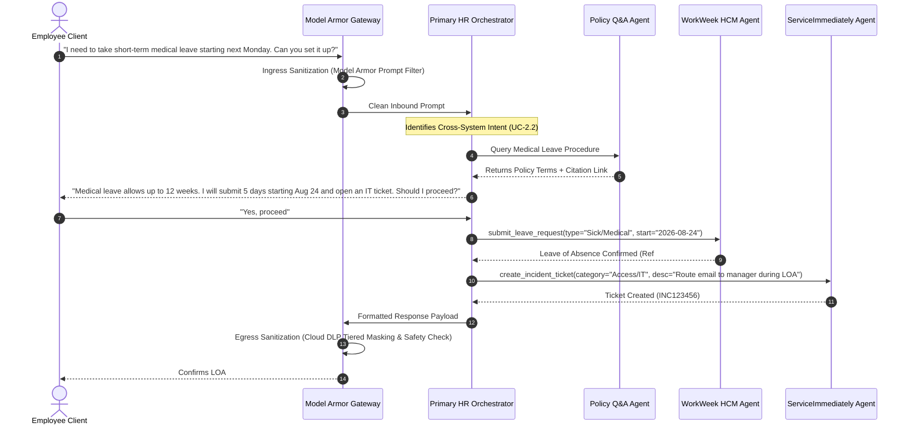

# Multi-Agent Architecture & Scope Specification

## 1. Architectural Overview

The **HR Agentic Solution (MVP 1)** is structured as a hierarchical multi-agent system powered by the **Google Cloud Vertex AI Agent Development Kit (ADK)** with **Google Cloud Model Armor** as the enterprise security gateway.

To prevent tool selection ambiguity, enforce least-privilege security boundaries, and provide deterministic execution for complex cross-system enterprise workflows, the workload is decomposed across **1 Primary Coordinator Agent**, **3 Domain-Specialist Sub-Agents**, and a managed **Security Sentinel Gateway (Model Armor)**.

---

## 2. Agent Inventory & Scope Matrix

| Agent / Layer | Classification | Primary Responsibility | Dedicated Tools & Skills | Security & Auth Scopes |
| :--- | :--- | :--- | :--- | :--- |
| **0. Security Sentinel Gateway** | Managed Gateway / Middleware | Inbound prompt sanitization, jailbreak defense & Cloud DLP SPII redaction (ADR-0012) | Google Cloud Model Armor Client (Cloud DLP & Safety Filters), Presidio/Regex Fallback | Model Armor Template ID / SCC Integration |
| **1. Primary HR Orchestrator** | Root Coordinator (ADK) | Intent routing, session state, cross-system workflows, human confirmation gate | Sub-Agent Dispatcher, Forward Recovery Logger, Confirmation Gate | Signed Root JWT (`sub: emp_id`) |
| **2. Policy Q&A Specialist** | Domain Sub-Agent | Grounded knowledge retrieval from HR policy docs via live Vertex AI Search | `VertexAISearchTool`, Citation Deep-Link Formatter | Read-only Policy Datastore |
| **3. WorkWeek HCM Specialist** | Domain Sub-Agent | Employee self-service & PTO management | `get_profile`, `update_contact`, `get_pto`, `submit_leave` | Signed JWT (`scopes: workweek:*`) |
| **4. ServiceImmediately Specialist** | Domain Sub-Agent | Support incident & ticket lifecycle management | `get_ticket`, `create_ticket`, `post_comment`, `update_status` | Signed JWT (`scopes: serviceimmediately:*`) |

---

## 3. Detailed Agent Specifications & Guardrail Protocols

### 3.1. Layer 0: Security Sentinel Gateway (Google Cloud Model Armor)
- **Role**: Managed AI security perimeter for all inbound prompts and outbound model payloads (ADR-0012).
- **Latency Budget**: $< 300\text{ms}$ total overhead SLA (NFR-2.1).
- **Scope of Usage**:
  - **Inbound Prompt Sanitization**: Employs Google Cloud Model Armor inspection models to intercept prompt injections, jailbreaks, malicious payloads, and system prompt leakage attempts (FR-1.3).
  - **Outbound Response Sanitization & Cloud DLP (ADR-0011 & ADR-0012)**: Uses Cloud Sensitive Data Protection (DLP) infoType inspection templates to redact SPII (SSNs, home addresses, phone numbers) before writing to persistent logs and audit traces, while preserving ephemeral self-viewing in UI responses.
  - **Enterprise Telemetry**: Automatically forwards security findings and policy violations to **Security Command Center (SCC)**.
  - **Local Development Fallback**: When running in offline environments or unit tests without active GCP credentials, the interceptor seamlessly falls back to the in-memory Presidio/Regex engine.

### 3.2. Agent 1: Primary HR Orchestrator Agent (ADK)
- **Role**: Top-level conversational interface managing the multi-turn session lifecycle.
- **Scope of Usage**:
  - **Multi-Turn Dialog & TTL Management (ADR-0009)**: Maintains isolated session context with dual-trigger purge (explicit reset prompts or 15-minute idle TTL) (FR-2.2, FR-1.5).
  - **Human Confirmation Gate (ADR-0007)**: Intercepts all state-changing write operations (leave booking, profile updates, ticket closure) to require explicit confirmation before execution.
  - **Intent Classification & Routing**: Evaluates employee prompts and delegates execution to the appropriate specialized sub-agent.
  - **Cross-System Workflow Coordination**: Orchestrates multi-step workflows spanning policy verification, WorkWeek updates, and ServiceImmediately tickets (UC-2.1, UC-2.2, UC-2.3).
  - **Forward Recovery & Compensation (ADR-0004)**: When a downstream sub-agent call fails during a multi-step workflow, writes high-priority audit logs and issues clear manual follow-up guidance.

### 3.3. Agent 2: Policy Q&A Specialist Agent
- **Role**: Dedicated knowledge assistant grounded strictly in official corporate HR documents.
- **Scope of Usage**:
  - **Live Vertex AI Search Grounding (ADR-0008)**: Connects to live Google Cloud Vertex AI Search datastores containing approved policies (Leave, Expenses, Remote Work, Code of Conduct).
  - **Deep-Link Citations (FR-5.3)**: Formats every answer with explicit document name, section title, and clickable deep-link URL.
  - **Strict Zero-Hallucination Fallback (FR-5.2, FR-5.4)**: If a topic is not present in the indexed knowledge base, explicitly states that the policy is unavailable.

### 3.4. Agent 3: WorkWeek HCM Specialist Agent
- **Role**: Specialist sub-agent executing employee self-service transactions against the WorkWeek HCM backend.
- **Scope of Usage**:
  - **Real-Time Data Fetching (FR-3.4)**: Retrieves live Employee Profile and PTO balances on every query (no caching).
  - **Guarded Leave Submissions (FR-3.2, FR-3.3)**:
    - Verifies requested days do not exceed accrued vacation or sick balance.
    - Rejects past dates or inverted chronological ranges (start date after end date).
  - **Contact Information Updates**: Updates personal address and phone numbers with regex format verification.
  - **Authorization**: Attaches a signed JWT bearer token containing `sub: <employee_id>` and `scopes: ["workweek:read", "workweek:write"]`.

### 3.5. Agent 4: ServiceImmediately ITSM Specialist Agent
- **Role**: Specialist sub-agent managing support incidents and helpdesk requests against ServiceImmediately.
- **Scope of Usage**:
  - **Incident Inquiries & Timeline (FR-4.2)**: Fetches ticket status, priority level, assignee, and chronological activity comments.
  - **Incident Ticket Creation**: Opens tickets with validated categories, descriptions, and priority levels (`1 - Critical` to `4 - Low`).
  - **Interactive Priority Verification (ADR-0010)**: Interactively prompts the user when a Critical priority tag fails business outage criteria.
  - **Lifecycle Transition Guardrails (FR-4.3)**: Prevents illegal state jumps (e.g. `New` directly to `Closed` without `Resolved`).
  - **Duplicate Mitigation**: Scans for rapid identical submissions from the same employee ID before creating new tickets.
  - **Authorization**: Attaches a signed JWT bearer token containing `sub: <employee_id>` and `scopes: ["serviceimmediately:read", "serviceimmediately:write"]`.

---

## 4. Cross-System Workflow Execution Sequence

### Scenario: Medical Leave Request (UC-2.2)

---

## 5. Architectural References
- **[CONTEXT.md](../CONTEXT.md)**: Domain Glossary
- **[docs/adr/0001-fastapi-mock-services.md](./adr/0001-fastapi-mock-services.md)**: Mock Server Architecture
- **[docs/adr/0002-vertex-ai-search-policy-rag.md](./adr/0002-vertex-ai-search-policy-rag.md)**: Policy Grounding Engine
- **[docs/adr/0003-hybrid-safety-guardrails.md](./adr/0003-hybrid-safety-guardrails.md)**: Safety Pipeline
- **[docs/adr/0004-cross-system-forward-recovery.md](./adr/0004-cross-system-forward-recovery.md)**: Failure Recovery
- **[docs/adr/0005-vertex-agent-development-kit.md](./adr/0005-vertex-agent-development-kit.md)**: Vertex ADK Foundation
- **[docs/adr/0006-signed-jwt-delegated-authorization.md](./adr/0006-signed-jwt-delegated-authorization.md)**: Delegated Auth Tokens
- **[docs/adr/0007-human-confirmation-on-state-mutations.md](./adr/0007-human-confirmation-on-state-mutations.md)**: Human Confirmation Gate
- **[docs/adr/0008-strict-live-vertex-ai-search-testing.md](./adr/0008-strict-live-vertex-ai-search-testing.md)**: Live Vertex Search Testing
- **[docs/adr/0009-session-ttl-and-explicit-purge.md](./adr/0009-session-ttl-and-explicit-purge.md)**: Session TTL & Purge
- **[docs/adr/0010-interactive-priority-downgrade-guardrail.md](./adr/0010-interactive-priority-downgrade-guardrail.md)**: Interactive Priority Guardrail
- **[docs/adr/0011-tiered-spii-redaction-logging.md](./adr/0011-tiered-spii-redaction-logging.md)**: Tiered SPII Redaction
- **[docs/adr/0012-google-cloud-model-armor.md](./adr/0012-google-cloud-model-armor.md)**: Google Cloud Model Armor
