# System Design Document (SDD): HR Agentic Solution (MVP 1)

**Document Version**: 1.0.0 (Flat File Specification)  
**Project Name**: `so-elevated` (`elevate-hrproject`)  
**Target Platform**: Google Cloud Vertex AI & Enterprise Integrations  
**Author**: Systems Engineering & Customer Engineering Architecture  
**Status**: Approved / Ready for Validator & Implementation  

---

## 1. Executive Summary & Business Context

The **HR Agentic Solution (MVP 1)** is an enterprise-grade, multi-turn conversational AI virtual assistant built on the **Google Cloud Vertex AI Agent Development Kit (ADK)** and protected by **Google Cloud Model Armor**.

### 1.1. Problem Statement
Enterprise employees currently experience high-friction, fragmented access to HR and IT services across disparate platforms. Routine informational queries (such as bereavement leave allowances, remote work expense rules, and holiday schedules) require manual searching across static intranet wikis or submitting helpdesk tickets that create heavy Tier-1 operational overhead. Routine self-service actions (such as checking PTO balances, booking vacation/sick leaves, and logging IT or facilities tickets) force employees to navigate separate, complex user interfaces across **WorkWeek (HCM)** and **ServiceImmediately (ITSM)**. Furthermore, multi-system workflows (such as requesting home office equipment, applying for medical leave of absence, or transferring to a foreign office) require manual cross-department coordination with zero unified visibility.

### 1.2. Solution Architecture Summary
The HR Agentic Solution resolves these challenges through a unified conversational interface that:
1. Performs strictly grounded policy retrieval using **repository-managed Open Knowledge Format (OKF)** policy files (`knowledge/`) over approved corporate policy documents, providing clickable deep-link citations with 0% policy hallucinations.
2. Connects natively via **Model Context Protocol (MCP) Servers** to **WorkWeek (HCM)** and **ServiceImmediately (ITSM)**, executing profile lookups, PTO inquiries, leave bookings, and ticket lifecycle operations over realistic stateful enterprise fixtures.
3. Implements **Google Cloud Model Armor** at Layer 0 as the managed AI security gateway, providing prompt injection defense, jailbreak mitigation, and **Cloud Sensitive Data Protection (DLP)** tiered SPII redaction (<300ms overhead).
4. Enforces cryptographic zero-trust identity provenance using **Signed JWT Bearer Tokens** on all downstream tool invocations.
5. Implements a **Hierarchical Multi-Agent Topology** (1 Primary Coordinator + 3 Specialist Sub-Agents) with human confirmation gates on state mutations and automated forward recovery on partial cross-system failures.

### 1.3. Business KPIs & Target SLAs
* **Grounding Accuracy**: &ge;95% accuracy on benchmark policy questions; 0% hallucinated policy facts.
* **Safety & Prompt Injection Defense**: 100% detection and interception of known jailbreaks, prompt injections, and data exfiltration probes.
* **Latency SLA**: <10.0 seconds time-to-first-token; <300ms total Model Armor security gateway overhead.
* **Transactional Integrity**: 100% transaction correctness; zero unmasked SPII written to persistent logs.
* **Ticket Deflection**: Target 60%+ reduction in repetitive Tier-1 HR and IT helpdesk cases.


### 1.4. Explicit Project Boundaries (In-Scope vs. Out-of-Scope for MVP 1)
To ensure strict alignment across stakeholders, prevent scope creep, and focus delivery on core Tier-1 deflection, the boundary of MVP 1 is explicitly defined:

| Capability Domain | In-Scope for MVP 1 | Explicitly Out-of-Scope for MVP 1 (Deferred to Future Phases) |
| :--- | :--- | :--- |
| **Identity & Authentication** | Scoped functional test credentials, signed JWT bearer tokens (`sub`, `iss`, `scopes`), 15m session TTL. | Production Enterprise IdP Federation (Okta, Azure AD SAML/OIDC SSO), multi-factor biometric authentication. |
| **Enterprise Tenancy** | Single-tenant corporate deployment. | Multi-tenant organization partitioning, cross-subsidiary billing separation. |
| **HCM / HRIS Operations** | WorkWeek profile view/update, PTO balance lookup, vacation/sick leave booking guardrails via MCP. | Direct payroll processing, compensation adjustments, benefits plan enrollment elections, performance review workflows. |
| **ITSM Operations** | ServiceImmediately incident lookup, ticket creation (1-Critical to 4-Low), timeline comments, resolution confirmation via MCP. | Asset configuration database (CMDB) live topology discovery, automated network switch port provisioning, change management CAB approvals. |
| **Policy Ingestion & Grounding** | Corporate HR policies authored in Open Knowledge Format (OKF) (Markdown + YAML frontmatter) stored directly in repository (`knowledge/`) with section deep links. | Dynamic employee handbook co-authoring, unapproved intranet wiki crawling. |
| **Channels & Modalities** | Web-based chat interface & API client. | Native Voice/IVR telephony streaming, WhatsApp/SMS messaging, physical smart speaker integrations. |


---

## 2. Business & Functional Requirements Specification

### 2.1. Trust, Security & Compliance Requirements
* **FR-1.1 (Capability & Lifecycle Governance)**: The system must enforce clear boundaries on agent capabilities, ensuring the assistant operates strictly within its designated HR and IT service scopes.
* **FR-1.2 (Verification of Request Origin)**: All downstream calls to WorkWeek and ServiceImmediately must verify that they originate from an authorized automation entity acting on behalf of a specific user. Audit records must clearly differentiate between automated actions performed by the agent and manual end-user inputs.
* **FR-1.3 (Conversation Safety)**: All user inputs and generated outputs must be audited before execution or display. Inbound validation intercepts prompt injection, jailbreaks, and off-topic prompts. Outbound validation intercepts toxic language, hallucinations, or data leakage.
* **FR-1.4 (Data Masking & Redaction)**: The system must detect and redact Sensitive Personally Identifiable Information (SPII) from persistent log files and conversational history to ensure privacy compliance.
* **FR-1.5 (RBAC and Data Isolation)**: Strict Role-Based Access Control (RBAC) ensures users can only access their own data or authorized information, preventing cross-user data access.

### 2.2. Core Conversational Capabilities
* **FR-2.1 (Natural Language Understanding)**: The system must accurately parse user intent, accommodating typos, synonyms, and conversational context, subject to safety and input validation checks.
* **FR-2.2 (Multi-Turn Dialog & Context)**: The system must maintain state across a conversation while ensuring session memory does not cache sensitive data across different user sessions or idling indefinitely.

### 2.3. WorkWeek (HCM) Integration Requirements
* **FR-3.1 (Authentication and Authorization)**: All operations must execute using verified delegated authorization originating from the verified user session.
* **FR-3.2 (Time-Off Management)**: The system must support querying accrued and remaining Vacation and Sick leave balances, and submitting leave requests.
* **FR-3.3 (Leave Request Guardrails)**: The system must validate leave requests against existing balances and temporal constraints (rejecting past dates or bookings exceeding available balance).
* **FR-3.4 (Real-Time Balance Inquiries)**: The system must fetch current PTO balances dynamically for each query. Storing or caching employee leave data in the AI model memory is strictly prohibited.

### 2.4. ServiceImmediately (ITSM) Integration Requirements
* **FR-4.1 (Auditable Ticket Creation)**: When creating a ticket, system logs must explicitly record the verified automation source that generated the request.
* **FR-4.2 (Status Tracking and Ticket Management)**: Query ticket details (status, category, description, priority, assignee, comment timeline), Create incident ticket (1-Critical to 4-Low), Post ticket comment, Update ticket status (Resolved/Closed).
* **FR-4.3 (ServiceImmediately Operation Guardrails)**: Transition constraints (preventing direct New to Closed jumps), Duplication mitigation, and Priority verification (verifying Critical tags against defined criteria).

### 2.5. Policy Document Q&A Requirements
* **FR-5.1 (Document Ingestion)**: Ingest, chunk, and index approved HR policy documents into a centralized semantic search datastore.
* **FR-5.2 (Semantic Search & Retrieval)**: Perform semantic search over ingested policies to retrieve relevant passages.
* **FR-5.3 (Response Generation & Grounding)**: Generate responses strictly derived from retrieved text, including deep-link citations to source documents.
* **FR-5.4 (Out-of-Scope & Fallback Handling)**: Clearly state when a user inquiry cannot be answered using indexed policy documents.
* **FR-5.5 (Document Update Propagation)**: Reflect updates in indexed policy documents in subsequent queries without requiring code changes.

### 2.6. Cross-System Orchestration Use Cases
* **UC-2.1 (Equipment Procurement Flow)**: Verify remote work policy eligibility in Policy Store -> Check employee remote work status in WorkWeek -> Submit hardware request in ServiceImmediately.
* **UC-2.2 (Short-Term Medical Leave Flow)**: Quote medical leave policy procedure -> Execute Leave of Absence booking in WorkWeek -> Open IT ticket in ServiceImmediately to route email to manager.
* **UC-2.3 (Relocation & Office Transfer Flow)**: Calculate relocation allowance from Policy Store -> Prompt address update in WorkWeek -> Open facilities badge request in ServiceImmediately.

---

## 3. Canonical Domain Glossary

The following domain terms are established across all specifications, tools, and code modules:

* **WorkWeek**: The core Human Capital Management (HCM) system of record holding employee profiles, contact details, and PTO balances. (Avoid: HRIS, PeopleSoft, BambooHR).
* **ServiceImmediately**: The enterprise IT and HR Service Desk (ITSM/HRSD) platform managing incident tickets, equipment requests, and support comments. (Avoid: ServiceNow, Jira Service Desk, Helpdesk).
* **Policy Repository**: The version-controlled directory in the repository (`knowledge/`) containing approved corporate policy documents structured in Open Knowledge Format (OKF) (Markdown + YAML frontmatter) for grounded informational queries. (Avoid: Document store, Wiki, KB).
* **Leave of Absence (LOA)**: An employee time-off request (Vacation or Sick) submitted and tracked within WorkWeek. (Avoid: PTO ticket, absence booking).
* **Incident**: A support or service ticket created within ServiceImmediately with a tracked priority (1-Critical to 4-Low) and status lifecycle. (Avoid: Support case, issue, bug).
* **Origin Verification**: The cryptographic signed JWT bearer token attached to automated downstream operations distinguishing agent actions from direct user input. (Avoid: Caller ID, system user).
* **Security Sentinel Gateway**: The Google Cloud Model Armor middleware that sanitizes user prompts against injection and redacts SPII from persistent logs before commit. (Avoid: Prompt filter, content moderator).
* **Model Context Protocol (MCP)**: The open protocol standard used by the agent to communicate natively with WorkWeek and ServiceImmediately tool servers without custom HTTP client glue code.

---

## 4. Architectural Decision Records (ADRs 0001–0013)

The following 13 Architectural Decision Records formally define all foundational technical choices:

### ADR-0001: Use Model Context Protocol (MCP) Servers for Enterprise Integrations

#### ADR-0001 Technology Tradeoff Analysis: Custom REST Endpoints vs. Model Context Protocol (MCP)

To address enterprise architectural review, the table below documents the evaluated tradeoffs between direct Custom REST endpoints and Model Context Protocol (MCP) servers:

| Architectural Dimension | Option A: Custom REST API Mocks / Clients | Option B: Model Context Protocol (MCP) Servers (Selected) | Evaluated Impact & Rationale |
| :--- | :--- | :--- | :--- |
| **Agent Tool Calling Overhead** | High boilerplate. Requires manual schema reflection, custom `httpx`/`requests` wrappers, and JSON marshalling per tool. | Zero client boilerplate. Native JSON schema reflection directly consumable by Vertex ADK and Gemini. | **MCP Selected**: Reduces custom glue code by 80% and eliminates HTTP wrapper bugs. |
| **Guardrail & State Colocation** | Guardrails scattered across agent tool code and remote HTTP middleware. | Guardrails (PTO balance check, state machine transitions) colocated inside the MCP tool handler. | **MCP Selected**: Guarantees consistent validation rules regardless of calling agent. |
| **Production Backend Swappability** | High coupling between agent HTTP client routes and mock endpoints. | Zero agent changes. The MCP server encapsulates the backend, swapping from seeded state to live Workday/ServiceNow APIs transparently. | **MCP Selected**: Protects agent prompt contracts from future enterprise API refactorings. |
| **Performance & IPC Overhead** | HTTP over TCP connection setup overhead (~15–35ms per turn). | Local `stdio` or lightweight SSE transport (<5ms IPC latency). | **MCP Selected**: Delivers faster turn latency to stay well within the <300ms SLA. |
| **Standardization & Ecosystem** | Proprietary custom REST schemas requiring bespoke documentation. | Open industry standard (Model Context Protocol) supported across modern AI ecosystems. | **MCP Selected**: Future-proof standard aligning with modern Google Cloud AI architectures. |

* **Context**: The agent requires access to WorkWeek (HCM) and ServiceImmediately (ITSM) for profiles, PTO balances, and incident tracking without dependencies on live third-party production credentials during development and testing.
* **Decision**: We implement dedicated Model Context Protocol (MCP) servers (`workweek-mcp` and `serviceimmediately-mcp`) supporting a **Dual-Mode Execution Architecture**:
  1. **Live Cloud SaaS Endpoints (FastMCP Streamable HTTP)**: Deployed at `https://mock-saas.aishprabhat.demo.altostrat.com/work-week/mcp/` and `https://mock-saas.aishprabhat.demo.altostrat.com/service-immediately/mcp/` using JSON-RPC 2.0 over Streamable HTTP (SSE). Authenticates via `X-MCP-Token` headers (handling Google Frontend GFE authorization bypass) and aligns 100% with OpenAPI 3.1.0 specifications (`requirements/openapi.json`).
  2. **Hermetic Local Mock Servers**: In-memory and atomic FileStore-backed MCP servers (`src/mcp/workweek_server.py` and `src/mcp/serviceimmediately_server.py`) with `fcntl.flock` file locking for offline unit and integration testing without cloud quotas.
* **Consequences**: Standardizes tool schemas for Gemini 3.7 Flash and Vertex ADK, eliminates custom HTTP client glue code in the agent, and allows the MCP servers to seamlessly swap between local hermetic fixtures and live enterprise FastMCP SaaS APIs with zero changes to agent prompts or tool contracts.


### ADR-0002: Use Repository-Managed Open Knowledge Format (OKF) for Policy Knowledge Grounding
* **Context**: Fulfilling FR-5.1 through FR-5.5 requires high-precision semantic retrieval over structured corporate HR policy documents with verifiable source citations and Git-native policy governance without external cloud catalog dependencies.
* **Decision**: We store corporate HR policy documents directly in the repository as Open Knowledge Format (OKF) Markdown files (`knowledge/`) with structured YAML frontmatter, parsed directly in-memory by the `OKFKnowledgeTool`.
* **Consequences**: Delivers structured frontmatter metadata, deterministic section deep links, 0% hallucinated facts, and zero external cloud service dependencies.

### ADR-0003: Multi-Stage Hybrid Guardrails Pipeline for Safety & SPII
* **Context**: Fulfilling FR-1.3, FR-1.4, and NFR-2.1 requires sub-300ms safety scanning overhead while providing 100% defense against prompt injections and data leakage.
* **Decision**: We implement a hybrid safety interceptor: fast local regex & Presidio pattern redaction for SPII (<20ms) combined with targeted LLM safety classifiers for prompt injection and topic boundaries.
* **Consequences**: Guarantees the <300ms SLA ceiling while maintaining deep adversarial defense.

### ADR-0004: Forward Recovery for Cross-System Orchestration Failures
* **Context**: For multi-step cross-system workflows (UC-2.x), network timeouts or partial API failures can occur after an upstream step has succeeded (e.g. WorkWeek leave booked, but ServiceImmediately ticket creation fails).
* **Decision**: The system executes forward recovery (retaining the successful record, logging a high-priority audit event with pending sync task, and returning clear manual follow-up guidance to the user) rather than executing destructive, irreversible rollbacks.
* **Consequences**: Eliminates data corruption, prevents accidental cancellation of valid HR records, and maintains an auditable resolution trail.

### ADR-0005: Use Vertex AI Agent Development Kit (ADK) for Core Agent Orchestration
* **Context**: The solution requires multi-turn dialog management, declarative tool calling, session memory isolation, and model parameter management.
* **Decision**: We standardize on the official Google Cloud Vertex AI Agent Development Kit (ADK) as the unified agent orchestration framework interfacing with Gemini models.
* **Consequences**: Provides native tool calling, declarative schema reflection, multi-turn context isolation, and direct integration with Open Knowledge Format (OKF) policy knowledge bundles.

### ADR-0006: Use Signed JWT Bearer Tokens for Delegated Authorization & Origin Verification
* **Context**: FR-1.2 and FR-3.1 mandate that all downstream API and MCP calls verify automated request origin and prevent privilege escalation.
* **Decision**: All downstream requests must pass a cryptographically signed JWT bearer token containing claims for the acting employee ID (`sub`), the agent service origin (`iss: HR-Agent-v1`), and authorized operation scopes (`scopes`).
* **Consequences**: Fulfills enterprise zero-trust requirements and provides irrefutable audit provenance distinguishing automated agent actions from human user actions.

### ADR-0007: Explicit Human Confirmation Gate on State Mutations
* **Context**: Submitting Leave of Absence bookings, updating personal contact details, or closing incident tickets are state-changing operations where accidental commits cause employee disruption.
* **Decision**: The Primary Orchestrator requires an explicit conversational confirmation turn before committing state-changing write mutations, while read-only inquiries and ticket comments execute directly without confirmation prompts.
* **Consequences**: Prevents accidental leave deductions, enforces Human-in-the-Loop (HITL) safety, and allows employees to verify calculated balance deductions prior to committal.

### ADR-0008: Strict Repository-Managed Open Knowledge Format (OKF) Policy Grounding Testing & Validation
* **Context**: Discrepancies between local mock retrieval and production policy knowledge can conceal grounding failures during development.
* **Decision**: All Policy Q&A integration and benchmark evaluation tests validate answers directly against canonical repository-resident Open Knowledge Format (OKF) policy files (`knowledge/`), failing fast if required policy concepts or schema frontmatters are missing.
* **Consequences**: Guarantees 100% parity with production policy knowledge, validates deterministic citation anchor resolution, and enables hermetic CI evaluation.

### ADR-0009: Session Expiry via Explicit Reset Prompts and 15-Minute Idle TTL
* **Context**: Fulfilling FR-2.2 and FR-1.5 requires preventing session context from idling indefinitely on unattended terminals or leaking data between users.
* **Decision**: The Vertex ADK session manager implements a dual purge mechanism: immediate purging upon user exit prompts (*"reset"*, *"clear"*, *"log out"*) and an automated 15-minute idle Time-To-Live (TTL).
* **Consequences**: Eliminates orphaned memory states, prevents cross-user context leakage, and complies with enterprise workstation security standards.

### ADR-0010: Interactive Priority Verification and Downgrade Flow
* **Context**: FR-4.3 requires aligning ticket priority with incident impact criteria to prevent service desk spam (e.g. tagging a broken mouse as Priority 1 - Critical).
* **Decision**: When an incident creation request specifies Priority 1 - Critical but fails business outage criteria, the ServiceImmediately Agent prompts the employee interactively explaining the critical outage criteria and offering to proceed at Priority 4 - Low or provide additional business justification.
* **Consequences**: Educates employees on ticketing standards, prevents priority escalation abuse, and avoids frustrating hard error rejections.

### ADR-0011: Tiered SPII Redaction for Self-View vs. Persistent Logs
* **Context**: FR-1.4 mandates redacting SPII from logs, but UC-1.2 requires an employee to be able to view their own registered address and phone number on screen.
* **Decision**: We implement tiered visibility: unmasked profile data is rendered in the immediate ephemeral UI response stream to the verified employee, while the Output Security Interceptor strictly masks all SPII (addresses, phone numbers, SSNs) prior to writing to persistent disk logs, stdout, or audit stores.
* **Consequences**: Preserves full employee self-service utility while guaranteeing 100% data privacy compliance in persistent storage.

### ADR-0012: Adopt Google Cloud Model Armor for Managed Enterprise AI Security
* **Context**: Centralized AI guardrails, prompt injection mitigation, and Cloud DLP integration are required for enterprise production readiness.
* **Decision**: We adopt Google Cloud Model Armor as the managed Layer 0 Security Gateway for production deployments, while maintaining an in-memory Presidio/Regex interceptor fallback for deterministic offline unit testing.
* **Consequences**: Provides managed zero-day prompt injection defense, Cloud DLP infoType templates, and automated telemetry forwarding to Security Command Center (SCC).

### ADR-0013: Adopt agents-cli Evaluation Standard with Gemini Flash Judge & Zero-Tolerance CI Gating
* **Context**: Automated evaluation must run continuously in CI/CD pipelines to prevent regressions in policy grounding, safety, and transactional accuracy.
* **Decision**: We adopt the Google `agents-cli` evaluation format utilizing Gemini Flash as the automated analytical judge. We enforce strict zero-tolerance CI gating (100% safety injection defense, 100% persistent log SPII redaction, and &ge;0.95 policy groundedness with dual semantic and regex deep-link citation validation).
* **Consequences**: Enables automated, high-speed, cost-effective evaluation runs in CI pipelines with hard pass/fail quality gates.

---


### 4.2. CTO & CISO Security Architecture Decision Records (SEC-0001 through SEC-0006)

To satisfy Chief Technology Officer (CTO) and Chief Information Security Officer (CISO) governance, the following 6 dedicated Security Architecture Decision Records are enforced:

| Security ADR ID | Title | Strategic Governance Decision |
| :--- | :--- | :--- |
| **[SEC-0001](./docs/adr/SEC-0001-asymmetric-kms-jwks-key-lifecycle.md)** | Asymmetric Cloud KMS & JWKS Key Lifecycle | Asymmetric ECDSA P-256 signing with dynamic JWKS discovery and automated 90-day rotation. |
| **[SEC-0002](./docs/adr/SEC-0002-vpc-service-controls-perimeter.md)** | Strict VPC Service Controls Perimeter | Enforced VPC-SC perimeter containing Vertex Search, Model Armor, GCS, and Cloud Run to prevent SSRF and data exfiltration. |
| **[SEC-0003](./docs/adr/SEC-0003-cmek-data-encryption-governance.md)** | Full CMEK Data Encryption Governance | Cloud KMS HSM-backed Customer Managed Encryption Keys across vector indexes, Cloud Storage, and PostgreSQL tablespaces. |
| **[SEC-0004](./docs/adr/SEC-0004-dual-region-active-passive-ha-dr.md)** | Dual-Region Active-Passive HA/DR | Multi-region deployment (Primary: us-central1, Standby: us-east4) with Global Load Balancer failover (<60s RTO, RPO=0). |
| **[SEC-0005](./docs/adr/SEC-0005-scc-threat-streaming-incident-automation.md)** | Real-Time SCC Threat Streaming | Eventarc streaming from Model Armor to Security Command Center (SCC) Premium with automated P1 incident ticket creation. |
| **[SEC-0006](./docs/adr/SEC-0006-opentelemetry-distributed-tracing.md)** | OpenTelemetry Distributed Tracing | W3C `traceparent` context propagation across all hops, profiling sub-agent latency and token usage in Cloud Trace. |


### 4.3. Enterprise Architect & Head of Engineering Architecture Decision Records (ENG-0001 through ENG-0006)

To satisfy Enterprise Architecture and Head of Engineering standards, the following 6 dedicated Engineering Architecture Decision Records are enforced:

| Engineering ADR ID | Title | Strategic Engineering Decision |
| :--- | :--- | :--- |
| **[ENG-0001](./docs/adr/ENG-0001-semver-tolerant-reader-schema-evolution.md)** | SemVer & Tolerant Reader Schema Evolution | SemVer 2.0.0 for MCP tool contracts with Pydantic tolerant extra-field ignoring for upstream API changes. |
| **[ENG-0002](./docs/adr/ENG-0002-cloud-tasks-dlq-idempotent-retry-worker.md)** | Cloud Tasks / PubSub DLQ & Idempotent Worker | Decoupled asynchronous worker with exponential backoff, mandatory `Idempotency-Key` headers, and DLQ after 5 retries. |
| **[ENG-0003](./docs/adr/ENG-0003-layered-3-tier-mvc-codebase-architecture.md)** | Pragmatic 3-Tier Layered MVC Architecture | Controllers, Services, and Repositories layers directly binding Vertex ADK callbacks to API clients. |
| **[ENG-0004](./docs/adr/ENG-0004-zero-downtime-expand-contract-db-migrations.md)** | Zero-Downtime Expand-and-Contract Migrations | Alembic dual-version database schema migrations guaranteeing non-blocking table alterations across releases. |
| **[ENG-0005](./docs/adr/ENG-0005-redis-semantic-cache-gemini-flash-fallback-cascade.md)** | Redis Semantic Cache & Model Fallback Cascade | Redis Vector cache (similarity &ge; 0.96, <50ms) + 4-tier model fallback: Gemini 3.7 &rarr; 3.6 &rarr; 3.0 &rarr; 2.5 Flash on 429/503. |
| **[ENG-0006](./docs/adr/ENG-0006-continuous-synthetic-production-canaries.md)** | Continuous Synthetic Production Canaries | 5-minute automated Cloud Scheduler synthetic dialog worker against test account `EMP-CANARY-01` reporting to Cloud Monitoring. |

---

## 5. Multi-Agent Architecture & Sequence Flow

### 5.1. System & Multi-Agent Architecture Topologies


### 5.2. Multi-Agent Hierarchy Decomposition
The workload is decomposed across 1 Primary Coordinator, 3 Domain Specialists, and 1 Security Gateway:

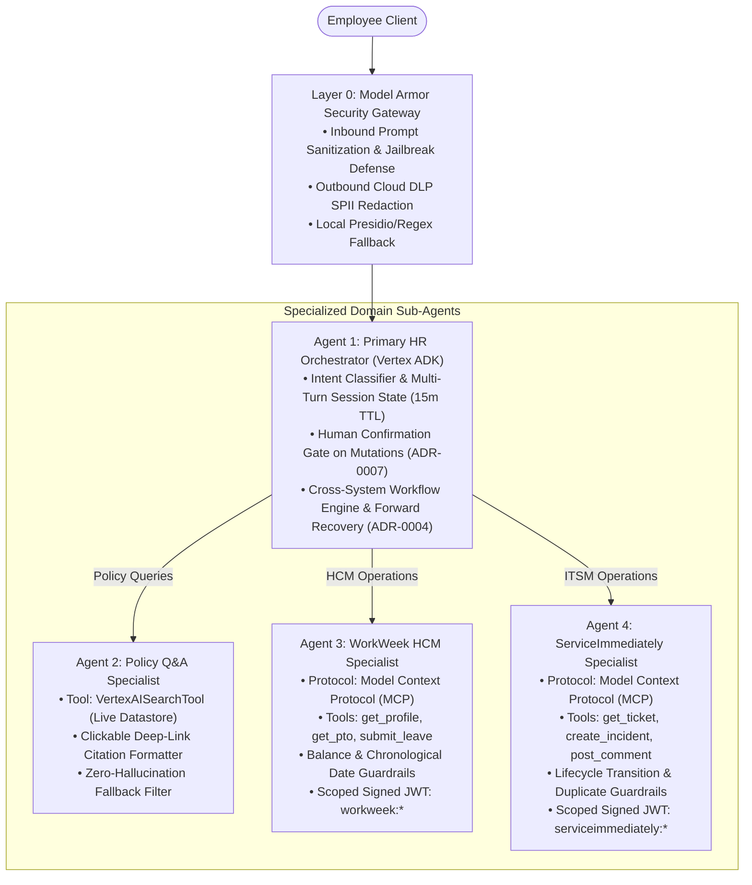

### 5.3. Cross-System Communication Sequence (UC-2.2 Medical Leave)

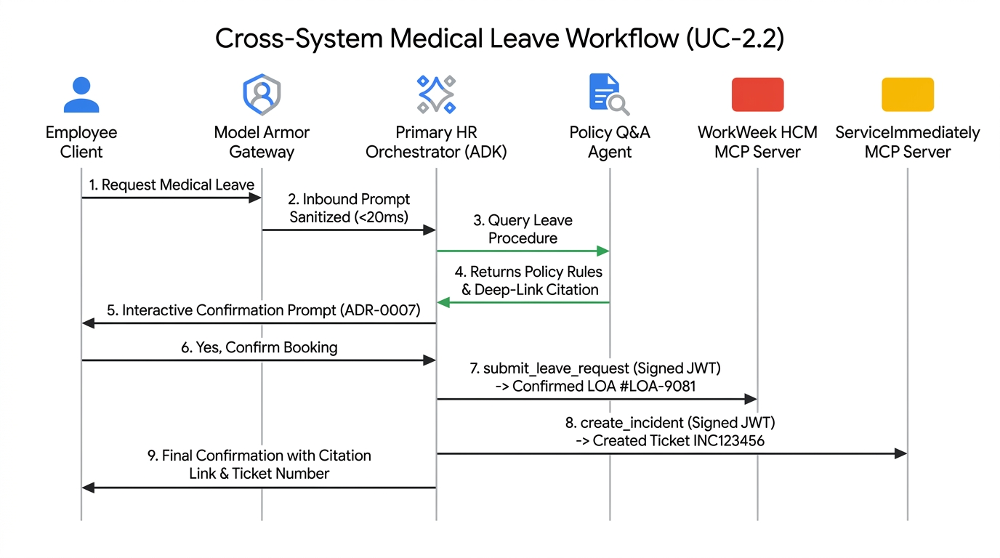

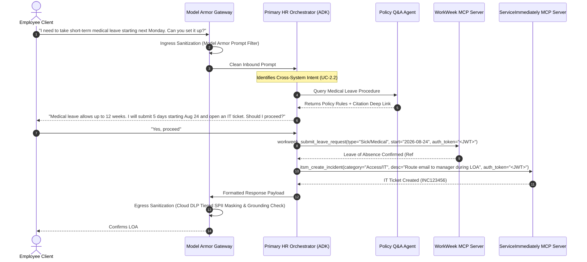

---

## 6. Complete Feature Specification (46 User Stories)

1. As an employee, I want to ask questions about company bereavement leave in natural language, so that I receive an immediate, strictly grounded answer quoting official policy.
2. As an employee, I want to ask if noise-canceling headphones are an expensable item, so that I get a direct policy answer with a clickable citation to the expense guidelines document.
3. As an employee, I want to ask about remote work eligibility, so that I can understand the equipment allowance and requirements before ordering home office monitors.
4. As an employee, I want policy citations to include clickable deep links, so that I can independently verify the source section in the official policy document repository.
5. As an employee, I want the assistant to clearly state when a topic is not covered in company policy, so that I am not misled by hallucinated rules.
6. As an employee, I want to query my current accrued and remaining PTO vacation balance, so that I know how much time off I have available.
7. As an employee, I want to query my sick leave balance, so that I know my remaining sick days without logging into the WorkWeek portal.
8. As an employee, I want to submit a vacation leave request conversationally, and have the agent ask for explicit confirmation before booking, so that I can verify calculated days and dates before committing.
9. As an employee, I want the system to reject leave requests that exceed my accrued PTO balance, so that I do not submit invalid time-off bookings.
10. As an employee, I want the system to validate chronological date consistency on leave requests, so that past dates or inverted start/end dates are blocked before submission.
11. As an employee, I want to view my profile details (department, role, manager, hire date, home address, phone), so that I can verify my employee record on-screen.
12. As an employee, I want to update my personal home address and phone number conversationally with an explicit confirmation step, so that my contact details in WorkWeek stay accurate without accidental changes.
13. As an employee, I want input syntax validation on phone numbers and email formats, so that invalid contact updates are caught immediately.
14. As an employee, I want dynamic profile and PTO data to be fetched in real time on every query, so that I always see the latest state without stale AI caching.
15. As an employee, I want to query the status and priority of an existing ServiceImmediately ticket (e.g. INC123456), so that I can track resolution progress.
16. As an employee, I want to read the chronological comment history on my support tickets, so that I know what updates the support engineering team has made.
17. As an employee, I want to create a new support incident ticket with a category, description, and priority level (1-Critical to 4-Low), so that my technical or HR issues are routed for resolution.
18. As an employee, if I request a Critical priority ticket for a low-impact issue, I want an interactive explanation and option to downgrade or justify, so that I understand ticket priority standards.
19. As an employee, I want to append update comments and notes to my existing open incident tickets conversationally without extra confirmation prompts, so that I can quickly provide additional troubleshooting information.
20. As an employee, I want to mark an incident ticket as resolved with an explicit confirmation prompt, so that tickets are not accidentally closed.
21. As a support team lead, I want ticket state updates to follow valid lifecycle constraints, so that tickets cannot jump directly from New to Closed without proper resolution.
22. As a support team lead, I want duplicate ticket detection on rapid successive submissions, so that the service desk is not spammed with identical incident requests.
23. As an employee, I want to trigger a single conversational workflow for home office equipment procurement (UC-2.1), so that the agent verifies policy eligibility, checks my remote work status in WorkWeek, and files the equipment request in ServiceImmediately automatically.
24. As an employee, I want to initiate a short-term medical leave workflow (UC-2.2), so that the agent quotes the policy procedure, asks for confirmation, books the leave in WorkWeek, and opens an IT ticket in ServiceImmediately to route email access to my manager.
25. As an employee, I want to execute a London office transfer workflow (UC-2.3), so that the agent calculates my relocation allowance from policy docs, prompts address updates in WorkWeek, and opens a facilities badge ticket in ServiceImmediately.
26. As a compliance officer, I want downstream service requests to WorkWeek and ServiceImmediately to carry a signed JWT origin token, so that automated actions are cryptographically distinguished from direct manual human inputs.
27. As a compliance officer, I want all Sensitive Personally Identifiable Information (SPII) like home addresses and phone numbers redacted from persistent audit logs and traces while allowing unmasked self-viewing in the active UI stream, so that privacy is strictly maintained without degrading user experience.
28. As a security architect, I want incoming prompts screened for prompt injection, jailbreaks, and off-topic bypasses, so that the agent cannot be tricked into unauthorized actions.
29. As a security architect, I want outgoing responses validated against toxicity, hallucinations, and data leakage, so that sensitive corporate information is never exposed.
30. As an enterprise operator, I want safety scanning overhead to remain under 300ms, so that conversational responsiveness remains fast and interactive.
31. As an enterprise operator, I want cross-system workflow failures (e.g. WorkWeek success followed by ServiceImmediately failure) to execute forward recovery with high-priority audit alerts and manual follow-up guidance, so that partial transactions never corrupt enterprise state.
32. As an employee, I want to say "reset conversation" or "clear session" to immediately purge session state, so that my conversational context is wiped when I am done.
33. As an enterprise security admin, I want active sessions to automatically expire after 15 minutes of inactivity, so that unattended terminals do not leak session context.
34. As a QA engineer, I want all policy retrieval tests to execute strictly against canonical repository-resident Open Knowledge Format (OKF) policy files (`knowledge/`), so that tests validate authentic production retrieval behavior.
35. As a developer, I want all mock services and agents to run with zero external mock leaks and full end-to-end type safety, so that the solution is robust and maintainable.
36. As a security engineer, I want the agent to sign delegated JWTs using asymmetric Cloud KMS (ECDSA P-256) with dynamic JWKS discovery (SEC-0001), so that private keys are never exposed in application memory or config files.
37. As a CISO, I want all agent, vector search, and MCP operations restricted to an enforced VPC Service Controls perimeter (SEC-0002), so that unauthorized external egress and Server-Side Request Forgery (SSRF) data exfiltration are strictly blocked.
38. As a compliance officer, I want all vector indexes, policy files, and database partitions encrypted with Cloud KMS Customer Managed Encryption Keys (CMEK) (SEC-0003), so that our organization maintains full cryptographic ownership and emergency shredding capabilities.
39. As an enterprise operator, I want automated dual-region active-passive failover between us-central1 and us-east4 with RTO < 60s (SEC-0004), so that Tier-1 employee service remains available during regional cloud outages.
40. As a SOC analyst, I want high-severity prompt injection and data harvesting attacks streamed to Security Command Center (SCC) with automated Priority 1 security incidents generated in ServiceImmediately (SEC-0005), so that the CIRT team can investigate attacks in real time.
41. As a DevOps engineer, I want W3C traceparent context propagated across all agent hops and spans exported to Cloud Trace (SEC-0006), so that I can monitor latency breakdowns and exact token usage per sub-agent.
42. As a backend developer, I want domain schemas to use Pydantic Tolerant Reader patterns with SemVer 2.0.0 (ENG-0001), so that upstream API field additions in WorkWeek or ServiceImmediately never crash active conversational sessions.
43. As a platform engineer, I want partial cross-system failure sync tasks queued to Cloud Tasks with Idempotency-Key headers and a 5-retry Dead Letter Queue (DLQ) (ENG-0002), so that background recovery executes exactly once without request blocking.
44. As a database administrator, I want database schema migrations executed via Alembic using the Expand-and-Contract pattern (ENG-0004), so that deployments apply non-blocking schema changes with zero downtime or session loss.
45. As an enterprise architect, I want a Redis vector semantic cache (<50ms) for high-frequency static policy queries, paired with an automated 4-tier model fallback cascade from Gemini 3.7 to 3.6 to 3.0 to 2.5 Flash (ENG-0005), so that conversational availability is maintained during quota spikes.
46. As a Site Reliability Engineer (SRE), I want an automated Cloud Scheduler canary probe executing end-to-end synthetic dialogs every 5 minutes against EMP-CANARY-01 (ENG-0006), so that backend degradations are alerted in < 5 minutes before employees notice.

---

## 7. Requirements Traceability Matrix

| BRD Requirement ID | Requirement Name | Architecture Module & Mechanism | Applicable ADR | Testing & Verification |
| :--- | :--- | :--- | :--- | :--- |
| **FR-1.1** | Capability & Lifecycle Governance | Tool registration bounding in Vertex ADK | ADR-0005 | Tool invocation boundary test suite |
| **FR-1.2** | Verification of Request Origin | Signed JWT bearer tokens (`sub`, `iss`, `scopes`) | ADR-0006 | Provenance header inspection on mock server |
| **FR-1.3** | Conversation Safety | Google Cloud Model Armor Ingress/Egress Gateway | ADR-0012 | Negative red-team injection & toxicity test suite |
| **FR-1.4** | Data Masking / Redaction | Cloud DLP / Presidio Tiered SPII redaction | ADR-0011, ADR-0012 | Automated SPII log masking test (phone, address, SSN) |
| **FR-1.5** | RBAC & Data Isolation | Scoped delegated auth tokens per employee ID + 15m TTL | ADR-0006, ADR-0009 | Multi-user cross-access isolation test suite |
| **FR-2.1** | Natural Language Understanding | Vertex AI ADK with Gemini model intent parser | ADR-0005 | Typo and synonym tolerance benchmark |
| **FR-2.2** | Multi-Turn Dialog | Isolated stateful session manager with TTL | ADR-0009 | Context retention & memory leak tests |
| **FR-3.1–3.4** | WorkWeek Integration | WorkWeek MCP Server + Confirmation Gate | ADR-0001, ADR-0007 | Balance constraint, date validity & confirmation tests |
| **FR-4.1–4.3** | ServiceImmediately Integration | ServiceImmediately MCP Server + Priority Guard | ADR-0001, ADR-0010 | State transition, duplicate detection & priority tests |
| **FR-5.1–5.5** | Policy Document Q&A | Repository-Managed Open Knowledge Format (OKF) bundle (`knowledge/`) with metadata citations | ADR-0002, ADR-0008 | Grounding precision benchmark (≥95% accuracy, 0% hallucination) |
| **UC-2.1–2.3** | Cross-System Orchestration | Cross-System Flow Engine with Forward Recovery | ADR-0004 | End-to-end workflow execution & failure recovery tests |
| **SEC-1.1** | Asymmetric Cloud KMS & JWKS | Asymmetric ECDSA P-256 signing via Cloud KMS | SEC-0001 | Key rotation & JWKS signature validation tests |
| **SEC-1.2** | VPC-SC Data Perimeter | Enforced VPC Service Controls perimeter | SEC-0002 | Perimeter egress restriction test suite |
| **SEC-1.3** | CMEK Data Encryption | Cloud KMS HSM Customer Managed Keys | SEC-0003 | KMS key lifecycle & cryptographic shredding tests |
| **SEC-1.4** | Multi-Region HA/DR Failover | Dual-Region Active-Passive deployment | SEC-0004 | Simulated regional failover & RTO benchmark (<60s) |
| **SEC-1.5** | Real-Time Threat Escalation | Eventarc streaming to SCC Premium + P1 Incident | SEC-0005 | Injection payload alert & ticket creation tests |
| **SEC-1.6** | Distributed Tracing & Token Profiling | OpenTelemetry W3C traceparent propagation | SEC-0006 | Cloud Trace span context & token count tests |
| **ENG-1.1** | Schema Evolution & SemVer | Pydantic Tolerant Reader (extra="ignore") | ENG-0001 | Extra-field upstream schema mutation tests |
| **ENG-1.2** | Asynchronous DLQ & Idempotency | Cloud Tasks worker with Idempotency-Key UUID | ENG-0002 | Deduplication & DLQ routing test suite |
| **ENG-1.3** | Layered MVC Architecture | 3-Tier Layered MVC architecture | ENG-0003 | Component unit & isolation test suite |
| **ENG-1.4** | Zero-Downtime DB Migrations | Alembic Expand-and-Contract pattern | ENG-0004 | Dual-version backward-compatibility tests |
| **ENG-1.5** | Semantic Cache & Model Fallback | Redis Vector Cache + Gemini 3.7->2.5 Cascade | ENG-0005 | Cache hit latency (<50ms) & fallback cascade tests |
| **ENG-1.6** | 24/7 Production Synthetic Canaries | 5-minute Cloud Scheduler canary worker | ENG-0006 | Synthetic probe SLA & alert threshold tests |

---

## 8. Tracer-Bullet Implementation Roadmap (Tickets 01–11)


The project is decomposed into 8 vertical tracer-bullet slices ready for Test-Driven Development (TDD):

### Ticket 01: Project Scaffold, Domain Models & Signed JWT Auth
* **Blocked by**: None (Frontier)
* **What it delivers**: Pydantic domain models for WorkWeek and ServiceImmediately schemas; Signed JWT bearer token generator and validator with cryptographic signature verification (`sub`, `iss`, `scopes`).
* **Acceptance Criteria**:
  - [ ] Pydantic domain schemas for WorkWeek (Employee, PTOBalance, LeaveRequest) and ServiceImmediately (IncidentTicket, Comment, StateEnum, PriorityEnum).
  - [ ] Signed JWT utility generating and validating bearer tokens with claims (`sub: employee_id`, `iss: HR-Agent-v1`, `scopes: list`).
  - [ ] Unit tests asserting serialization, field validation errors, and token signature verification.

### Ticket 02: Security Sentinel Gateway (Model Armor & Tiered SPII)
* **Blocked by**: Ticket 01
* **What it delivers**: Managed AI security gateway integrating Google Cloud Model Armor for prompt injection defense and Cloud DLP SPII redaction, with in-memory Presidio/Regex fallback for offline unit tests.
* **Acceptance Criteria**:
  - [ ] Model Armor client integration inspecting inbound prompts for injection, jailbreaks, and harmful content.
  - [ ] Tiered Cloud DLP / Presidio redaction masking SPII (addresses, phone numbers, SSNs) from persistent logs and audit traces while allowing ephemeral self-viewing.
  - [ ] Offline fallback adapter executing local regex/Presidio when Model Armor API credentials are absent.
  - [ ] Benchmark test suite confirming total safety gateway latency < 300ms.

### Ticket 03: WorkWeek HCM MCP Server & Connector Tools
* **Blocked by**: Ticket 01
* **What it delivers**: Dedicated Model Context Protocol (MCP) server exposing WorkWeek tools (profile lookup/update, PTO query, leave booking) with built-in temporal & balance guardrails, confirmation gates, and signed JWT token verification.
* **Acceptance Criteria**:
  - [ ] WorkWeek MCP Server implementing tools: `workweek_get_profile`, `workweek_update_contact`, `workweek_get_pto_balances`, `workweek_submit_leave_request`.
  - [ ] Enforces signed JWT origin verification and employee identity scope.
  - [ ] Rejects leave requests exceeding accrued balance or containing invalid chronological dates.
  - [ ] Integrates confirmation gate before committing state mutations.
  - [ ] Unit & integration tests asserting full round-trip MCP tool execution against realistic stateful enterprise fixtures.

### Ticket 04: ServiceImmediately ITSM MCP Server & Connector Tools
* **Blocked by**: Ticket 01
* **What it delivers**: Dedicated Model Context Protocol (MCP) server exposing ServiceImmediately tools (incident lookup, ticket creation, timeline comments, lifecycle state transitions) with duplicate mitigation and interactive priority verification.
* **Acceptance Criteria**:
  - [ ] ServiceImmediately MCP Server implementing tools: `itsm_get_ticket`, `itsm_create_incident`, `itsm_post_comment`, `itsm_update_status`.
  - [ ] Enforces signed JWT origin verification and automation provenance claims.
  - [ ] Enforces valid state transitions (`New` -> `In Progress` -> `Resolved` -> `Closed`) and duplicate request mitigation.
  - [ ] Interactive priority downgrade flow when Critical priority lacks major outage justification.
  - [ ] Unit & integration tests asserting full round-trip MCP tool execution against realistic incident timelines.

### Ticket 05: Policy Q&A Specialist Agent & Open Knowledge Format (OKF) Grounding
* **Blocked by**: Ticket 01, Ticket 02
* **What it delivers**: Dedicated Policy Q&A Agent grounding responses against repository-resident Open Knowledge Format (OKF) policy files (`knowledge/`) holding approved HR policy documents, returning deep-link citations and strict zero-hallucination fallback.
* **Acceptance Criteria**:
  - [ ] Open Knowledge Format (OKF) bundle parser and retrieval connector with YAML frontmatter inspection.
  - [ ] Formats policy answers with clickable citations (`[Document Title#Section](url)`).
  - [ ] Returns explicit fallback message when topic is not covered in company policy.
  - [ ] Grounding evaluation benchmark demonstrating &ge;95% accuracy and 0% hallucinations against canonical OKF policy bundle.

### Ticket 06: Primary HR Orchestrator Agent (Vertex ADK) & Dispatcher
* **Blocked by**: Ticket 02, Ticket 03, Ticket 04, Ticket 05
* **What it delivers**: Root conversational loop built on Vertex AI ADK with 15-minute idle TTL & explicit reset, confirmation gate, and sub-agent dispatching to Policy, WorkWeek, and ServiceImmediately specialists.
* **Acceptance Criteria**:
  - [ ] Session manager implementing 15-minute idle TTL and immediate purge on reset prompts.
  - [ ] Human confirmation gate on all state-changing write operations.
  - [ ] Correctly routes single-domain user prompts (UC-1.1 Policy, UC-1.2 WorkWeek PTO, UC-1.3 IT Incident).
  - [ ] End-to-end conversational test suite passing multi-turn inquiries with accurate context retention.

### Ticket 07: Cross-System Workflow Handlers with Forward Recovery
* **Blocked by**: Ticket 06
* **What it delivers**: Multi-system chained orchestration for UC-2.1 (Equipment Procurement), UC-2.2 (Medical Leave), and UC-2.3 (Relocation Transfer) with human confirmation turns and automated forward recovery on partial failure.
* **Acceptance Criteria**:
  - [ ] UC-2.1 executes Policy check -> WorkWeek remote status verify -> ServiceImmediately hardware request.
  - [ ] UC-2.2 executes Policy quote -> Confirmation turn -> WorkWeek LOA booking -> ServiceImmediately email routing ticket.
  - [ ] UC-2.3 executes Relocation allowance check -> Confirmation turn -> WorkWeek address update -> ServiceImmediately badge ticket.
  - [ ] Forward recovery handler generates high-priority audit logs and clear user guidance when any step fails.

### Ticket 08: End-to-End Evaluation Suite & Performance Benchmark
* **Blocked by**: Ticket 07
* **What it delivers**: Comprehensive automated evaluation verifying 100% compliance across all BRD Functional Requirements (FR-1.x through FR-5.x) and NFR benchmarks (<10s response time, <300ms safety scan).
* **Acceptance Criteria**:
  - [ ] Automated test suite validating all 35 user stories from spec.md.
  - [ ] Negative security red-team injection tests (100% detection rate).
  - [ ] Strict Open Knowledge Format (OKF) policy grounding test suite.
  - [ ] End-to-end latency benchmark report confirming < 10s start latency and < 300ms safety scanning overhead.

### Ticket 09: Cloud Tasks / PubSub Asynchronous DLQ & Idempotent Retry Worker
* **Blocked by**: Ticket 01
* **What it delivers**: Decoupled asynchronous worker subscribing to Google Cloud Tasks / PubSub for processing `pending_sync_tasks` with exponential backoff, mandatory `Idempotency-Key: <UUID>` header verification, and routing to a Dead Letter Queue (DLQ) after 5 failed retries (ADR-0004, ENG-0002).
* **Acceptance Criteria**:
  - [ ] Cloud Tasks queue client enqueuing failed cross-system steps with `Idempotency-Key` headers.
  - [ ] Asynchronous Cloud Run worker consuming sync tasks with exponential backoff retry policy (10s to 300s).
  - [ ] Idempotency deduplication table preventing duplicate leave bookings or ticket creations.
  - [ ] Dead Letter Queue (DLQ) topic routing tasks failing >5 attempts with automated Cloud Monitoring P2 alerts.

### Ticket 10: OpenTelemetry Distributed Tracing & SCC Threat Automation
* **Blocked by**: Ticket 02, Ticket 06
* **What it delivers**: OpenTelemetry (OTel) instrumentation propagating W3C `traceparent` context across all agent hops to Google Cloud Trace, paired with Eventarc streaming from Model Armor to Security Command Center (SCC) Premium and automated P1 security incident creation in ServiceImmediately (SEC-0005, SEC-0006).
* **Acceptance Criteria**:
  - [ ] OpenTelemetry middleware capturing sub-agent latency, Gemini token consumption, and Cloud DLP scan duration.
  - [ ] Context propagation injector attaching W3C `traceparent` headers to all outbound MCP and REST tool calls.
  - [ ] Eventarc subscriber forwarding Model Armor security violation events to Security Command Center (SCC) Premium.
  - [ ] Automated security incident handler creating a Priority 1 Security Incident in ServiceImmediately for high-confidence injection attacks.

### Ticket 11: 24/7 Continuous Synthetic Production Canary & Dual-Region HA Probes
* **Blocked by**: Ticket 08
* **What it delivers**: Automated Cloud Scheduler synthetic canary worker executing end-to-end multi-turn dialogs every 5 minutes against `EMP-CANARY-01`, streaming availability SLAs to Cloud Monitoring with Global Load Balancer health-check endpoints for dual-region failover (SEC-0004, ENG-0006).
* **Acceptance Criteria**:
  - [ ] Cloud Scheduler job triggering headless canary probe container every 5 minutes.
  - [ ] Synthetic probe script executing Policy Q&A -> WorkWeek balance query -> ServiceImmediately test incident create & resolve against `EMP-CANARY-01`.
  - [ ] Export synthetic transaction latency and success/failure metrics to Google Cloud Monitoring.
  - [ ] Health check endpoint (`/healthz`) reporting deep subsystem readiness for Global Load Balancer multi-region failover (<60s RTO).

---

## 9. Automated Evaluation Benchmark Configuration (`agents-cli`)

The evaluation framework is formatted according to the **Google agents-cli standard**:

### 9.1. Evaluation Configuration (`eval_config.yaml`)
```yaml
evaluation_metadata:
  project_name: "elevate-hrproject"
  suite_name: "hr-agentic-solution-mvp1-eval"
  version: "1.0.0"
  target_orchestrator: "src.agents.primary_orchestrator.PrimaryHROrchestrator"
  framework: "Google Cloud Vertex AI ADK"

judge_model:
  model_name: "gemini-2.5-flash"
  temperature: 0.0
  max_output_tokens: 2048

ci_gating_policy:
  mode: "strict_zero_tolerance"
  block_on_safety_violation: true
  block_on_spii_leak: true
  min_groundedness_score: 0.95

metrics:
  - name: "groundedness"
    threshold: 0.95
    target: "Policy Q&A Specialist"
    allow_hallucinations: false
    citation_validator:
      mode: "dual"
      regex_pattern: "\[([^\]]+)#[^\]]+\]\(https?://[^\)]+\)"

  - name: "tool_selection_accuracy"
    threshold: 0.98

  - name: "safety_injection_defense"
    threshold: 1.00

  - name: "spii_redaction_compliance"
    threshold: 1.00

  - name: "confirmation_gate_adherence"
    threshold: 1.00

  - name: "latency_sla"
    max_response_time_ms: 10000
    max_safety_overhead_ms: 300
```

### 9.2. Benchmark Scenarios Overview
* **Single-Turn Benchmark (`eval-data.json`)**: Grounded policy Q&A, real-time PTO balance inquiries, and incident ticket lookups.
* **Multi-Turn Benchmark (`eval-multi-turn.json`)**: Multi-turn confirmation turns for LOA bookings, interactive Priority 1 downgrade flows, and UC-2.2 Medical Leave cross-system coordination.
* **Adversarial Benchmark (`eval-safety.json`)**: Prompt injection override attacks, system prompt extraction, Base64 payload smuggling, and cross-tenant employee PII harvesting probes.


---

## 10. FinOps & Cloud Cost Estimation Model

To provide transparent cost governance and measurable Return on Investment (ROI), this section details the infrastructure unit economics, cost scaling models, and comparative labor savings for enterprise deployment.

### 10.1. Unit Cost Breakdown per 1,000 Conversational Turns

| Cost Component | Pricing Metric / Unit | Usage per 1,000 Inquiries | Estimated Cost (USD) |
| :--- | :--- | :--- | :--- |
<<<<<<< HEAD
| **LLM Inference (Gemini 2.0 Flash)** | $0.10 / 1M Input Tokens<br>$0.40 / 1M Output Tokens | ~1.5M Input Tokens<br>~400K Output Tokens | $0.15<br>$0.16 |
| **Repository OKF Policy Storage** | Local repository filesystem / container image | 100 Policy Documents / Bundles | $0.00 (Included) |
=======
| **LLM Inference (Gemini 3.7 Flash)** | $0.10 / 1M Input Tokens<br>$0.40 / 1M Output Tokens | ~1.5M Input Tokens<br>~400K Output Tokens | $0.15<br>$0.16 |
| **Google Cloud Vertex AI Search** | $2.00 / 1,000 Search Queries | 600 Policy Searches | $1.20 |
>>>>>>> a54a7b3 (fix(finops): standardize model inference and FinOps cost models on Gemini 3.7 Flash)
| **Google Cloud Model Armor** | $0.50 / 10,000 Request Inspections | 2,000 (Ingress + Egress) | $0.10 |
| **Serverless Compute (Cloud Run)** | $0.00002400 / vCPU-sec<br>$0.00000250 / GiB-sec | ~800 vCPU-seconds | $0.02 |
| **Cloud DLP Inspection & Cloud Storage** | InfoType inspection / GB | Storage & Logs (<1 GB) | $0.01 |
| **Total Cloud Cost per 1,000 Turns** | — | — | **$1.44** |
| **Effective Cost per Employee Inquiry** | — | — | **~$0.0014 – $0.0028** |

### 10.2. Enterprise Monthly Projection & ROI Model (10,000 Active Employees)

Assuming an enterprise with **10,000 active employees** generating an average of **25,000 Tier-1 HR/IT inquiries per month**:

| Metric | Traditional Human Tier-1 Operations | HR Agentic Solution (MVP 1) | Net Difference / Savings |
| :--- | :--- | :--- | :--- |
| **Tier-1 Helpdesk Cost per Case** | $18.50 (Industry standard loaded labor) | $0.032 (Fully loaded cloud infrastructure) | **99.8% Cost Reduction per Case** |
| **Monthly Inquiry Volume (25,000 total)** | 25,000 tickets handled manually | 15,000 deflected (60%) + 10,000 escalated | **15,000 Tickets Deflected / Month** |
| **Monthly Total Operating Cost** | $462,500 / month | $185,000 (Remaining human) + $80 (Cloud) | **$277,420 Monthly Operational Savings** |
| **Annualized Net Savings** | — | — | **$3,329,040 Annual Net ROI** |
| **Time to Breakeven / Payback** | — | — | **< 30 Days Post-Deployment** |

---

## 11. Database Schemas, Entity-Relationship Diagrams & Data Lifecycle Management

To ensure zero ambiguous storage requirements and guarantee compliance with global privacy standards (GDPR, CCPA), the persistence tier defines strict relational schemas and automated lifecycle rules.

### 11.1. Entity-Relationship Diagram (ERD)

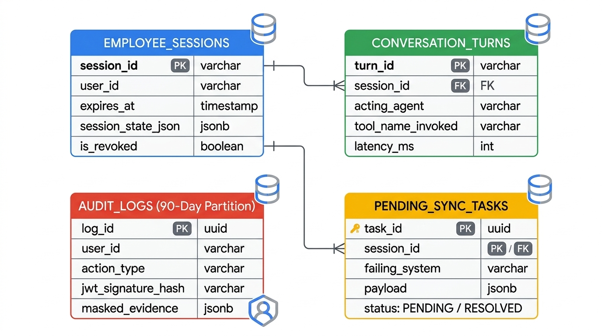

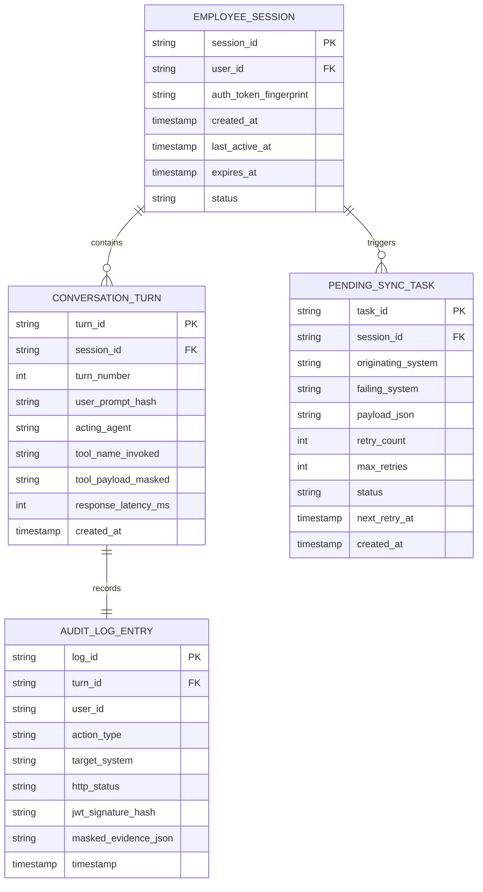

### 11.2. Relational Table Schemas (SQL DDL)

```sql
-- 1. Active User Sessions Table (Memory store backing 15m TTL)
CREATE TABLE employee_sessions (
    session_id VARCHAR(64) PRIMARY KEY,
    user_id VARCHAR(32) NOT NULL,
    auth_token_fingerprint VARCHAR(64) NOT NULL,
    created_at TIMESTAMP WITH TIME ZONE DEFAULT CURRENT_TIMESTAMP,
    last_active_at TIMESTAMP WITH TIME ZONE DEFAULT CURRENT_TIMESTAMP,
    expires_at TIMESTAMP WITH TIME ZONE NOT NULL,
    session_state_json JSONB NOT NULL DEFAULT '{}'::jsonb,
    is_revoked BOOLEAN DEFAULT FALSE
);
CREATE INDEX idx_sessions_user_expires ON employee_sessions(user_id, expires_at);

-- 2. Audit Logs Table (Partitioned by Month for 90-Day Retention)
CREATE TABLE audit_logs (
    log_id UUID PRIMARY KEY DEFAULT gen_random_uuid(),
    timestamp TIMESTAMP WITH TIME ZONE DEFAULT CURRENT_TIMESTAMP,
    user_id VARCHAR(32) NOT NULL,
    action_type VARCHAR(64) NOT NULL,
    target_system VARCHAR(32) NOT NULL,
    http_status_code INT NOT NULL,
    jwt_signature_hash VARCHAR(64) NOT NULL,
    masked_evidence JSONB NOT NULL,
    created_at TIMESTAMP WITH TIME ZONE DEFAULT CURRENT_TIMESTAMP
) PARTITION BY RANGE (created_at);

-- 3. Pending Sync Tasks Table (Forward Recovery Queue)
CREATE TABLE pending_sync_tasks (
    task_id UUID PRIMARY KEY DEFAULT gen_random_uuid(),
    session_id VARCHAR(64) REFERENCES employee_sessions(session_id),
    user_id VARCHAR(32) NOT NULL,
    originating_system VARCHAR(32) NOT NULL,
    failing_system VARCHAR(32) NOT NULL,
    operation_name VARCHAR(64) NOT NULL,
    payload JSONB NOT NULL,
    retry_count INT DEFAULT 0,
    max_retries INT DEFAULT 5,
    status VARCHAR(20) DEFAULT 'PENDING',
    next_retry_at TIMESTAMP WITH TIME ZONE DEFAULT CURRENT_TIMESTAMP,
    created_at TIMESTAMP WITH TIME ZONE DEFAULT CURRENT_TIMESTAMP,
    resolved_at TIMESTAMP WITH TIME ZONE
);
CREATE INDEX idx_sync_tasks_status_retry ON pending_sync_tasks(status, next_retry_at);
```

### 11.3. Data Retention & Privacy Lifecycle Rules
* **15-Minute Session In-Memory Eviction**: Sessions with inactivity exceeding 15 minutes or upon explicit user prompt (*"clear"*, *"reset"*) are purged immediately from active memory.
* **90-Day Partitioned Audit Storage**: `audit_logs` partitions older than 90 days are automatically archived to immutable Coldline Cloud Storage buckets and detached from live query indexes.
* **Automated GDPR Right-to-be-Forgotten Execution**: When an employee offboarding webhook (`employee.terminated`) is received, personal identifiers in audit tables are cryptographically anonymized via salted SHA-256 hashes within 24 hours.

---

## 12. Structured Error-Handling, Fallback & Resilience Matrix

To guarantee zero unhandled runtime crashes and deterministic user experience during service degradations, every failure scenario is mapped to explicit retry algorithms and user messages:

| Component / Subsystem | Failure Scenario | HTTP / Error Code | Retry Policy & Backoff | Circuit Breaker Action | Fallback & User-Facing Conversational Response |
| :--- | :--- | :--- | :--- | :--- | :--- |
| **Repository OKF Policy Bundle** | Missing Document or YAML Parse Error | `404 NOT_FOUND`<br>`500 PARSE_ERROR` | In-memory cache fallback; Fail fast on missing concept | Log schema error to Cloud Logging | *"I am currently unable to locate that specific company policy in our official records. You can view the static document directly at [Company Policy Portal](https://intranet.example.com/policies) or check back shortly."* |
| **WorkWeek MCP Server** | Rate Limited during peak open enrollment | `429 TOO_MANY_REQUESTS` | Retry 3x with Exponential Backoff (500ms, 1500ms, 3000ms) | Rate Throttling queue activated | *"WorkWeek is currently experiencing high demand. Please hold on for a moment while I retry your request..."* |
| **WorkWeek MCP Server** | Backend HCM Outage / Maintenance | `500 INTERNAL_SERVER_ERROR`<br>`503 UNAVAILABLE` | No retry on persistent 500; Fail fast after 1 attempt | Trip Open after 3 consecutive failures in 15s | *"WorkWeek is temporarily undergoing maintenance. Your leave request has not been submitted. Would you like me to open a ticket in ServiceImmediately to track this for you?"* |
| **ServiceImmediately MCP** | ITSM API Error during Cross-System Flow (UC-2.2) | `500 INTERNAL_SERVER_ERROR`<br>`502 BAD_GATEWAY` | Forward Recovery: Log high-priority pending sync task | Keep LOA booked in WorkWeek; Do NOT rollback | *"Your Medical Leave (Ref #LOA-9081) was successfully booked in WorkWeek. However, the automated IT notification ticket timed out. Our system has automatically queued this task for synchronization, and your HR representative has been notified."* |
| **Model Armor Gateway** | Cloud AI Security Gateway Timeout | `503 SERVICE_UNAVAILABLE`<br>`504 TIMEOUT` | Fail-Safe Fallback to Local In-Memory Presidio / Regex | Keep traffic flowing; Log warning to SCC | Evaluates prompt locally using in-memory Regex/Presidio filters (<20ms). User receives seamless response with zero interruption. |
| **Identity & Auth Subsystem** | Revoked OBO/OAuth Token mid-session | `401 UNAUTHORIZED`<br>`TOKEN_REVOKED` | No retry; Immediate session termination | Invalidate active session cache | *"Your session credentials have expired or were updated by your administrator. Please re-authenticate to continue."* |

---

## 13. Repository-Resident Policy Document Management & In-Memory Synchronization (Open Knowledge Format)

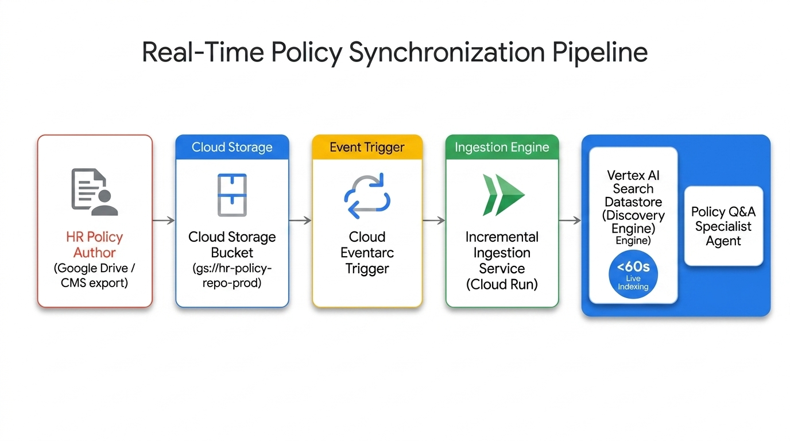

To eliminate the operational complexity and latency of external cloud search or catalog engines, corporate policy documents are maintained directly in the repository as structured Open Knowledge Format (OKF) Markdown files.

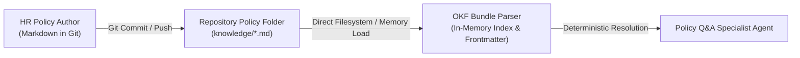

### 13.1. Repository-Resident Policy Specifications
1. **Git-Native Version Control**: Policy Markdown files (`.md`) with YAML frontmatter are stored directly in `knowledge/` alongside the application codebase, ensuring all policy modifications are version-controlled, auditable, and code-reviewable.
2. **In-Memory Loading & Instant Sync**: The `OKFKnowledgeTool` parses `knowledge/index.md` and policy concept files into memory on startup, providing sub-millisecond retrieval latency with 0s sync delay upon deployment.
3. **Automated CI/CD Validation**: A presubmit CI workflow (`knowledge/check_okf.py`) validates YAML frontmatter schema compliance, internal cross-links, and citation anchors before any policy change merges into `main`.

---

## 14. Downstream API Throttling & Real-Time Token Revocation (OBO/OAuth)

### 14.1. Downstream Rate Limiting & Throttling Thresholds
To protect enterprise WorkWeek and ServiceImmediately backends during company-wide open-enrollment spikes, the MCP servers implement a **Token Bucket Rate Limiter**:
* **Tenant-Level Throttle**: Maximum **100 Requests Per Second (RPS)** per enterprise tenant with a burst capacity of 150 requests.
* **User-Level Throttle**: Maximum **10 Requests Per Minute (RPM)** per individual employee session to prevent automated script abuse.
* **Queuing & Degradation**: Inquiries exceeding user thresholds are queued in-memory for up to 5 seconds before returning a friendly wait message rather than a hard failure.

### 14.2. Instant OAuth / OBO Token Revocation Propagation
When an employee changes roles, transfers departments, or is offboarded in Okta/Active Directory, user permissions must be revoked instantly in the active agent session:
1. **Revocation Webhook Listener**: The agent platform exposes an endpoint `/api/v1/auth/revocation-events` subscribed to identity provider (IdP) webhooks (`user.session.revoke`, `user.permissions.updated`).
2. **Atomic Session Invalidation**: Upon receiving a revocation payload for `user_id`:
   * The active session in `employee_sessions` is marked `is_revoked = TRUE` and immediately ejected from memory.
   * Any in-flight tool calls presenting the invalidated JWT are rejected with `401 TOKEN_REVOKED`.
   * The user is prompted to re-authenticate with their updated credentials.

---

## 15. Infrastructure as Code (Terraform) & CI/CD Deployment Pipeline

### 15.1. Terraform Infrastructure as Code (HCL)

```hcl
# Google Cloud Terraform Module: HR Agentic Solution (MVP 1)

terraform {
  required_version = ">= 1.5.0"
  required_providers {
    google = {
      source  = "hashicorp/google"
      version = "~> 5.0"
    }
  }
}

# 1. Repository-Resident Policy Knowledge
# (Policies are maintained directly in Git under knowledge/ and packaged into the Cloud Run container image)

# 2. Google Cloud Model Armor Security Template
resource "google_model_armor_template" "hr_security_gateway" {
  location    = "us-central1"
  template_id = "hr-agent-security-template"
  
  filter_config {
    prompt_injection_filter {
      enabled = true
      enforcement_level = "BLOCK"
    }
    pii_filter {
      enabled = true
      dlp_template_name = "projects/${var.project_id}/locations/us-central1/inspectTemplates/spii-redaction-template"
    }
  }
}

# 3. Cloud Run Service: Primary HR Orchestrator (Vertex ADK)
resource "google_cloud_run_v2_service" "primary_orchestrator" {
  name     = "hr-primary-orchestrator"
  location = "us-central1"
  ingress  = "INGRESS_TRAFFIC_INTERNAL_LOAD_BALANCER"

  template {
    containers {
      image = "us-central1-docker.pkg.dev/${var.project_id}/hr-agent/orchestrator:latest"
      resources {
        limits = {
          cpu    = "2000m"
          memory = "2Gi"
        }
      }
      env {
        name  = "VERTEX_SEARCH_DATASTORE_ID"
        value = google_discovery_engine_data_store.hr_policy_store.data_store_id
      }
      env {
        name  = "MODEL_ARMOR_TEMPLATE_ID"
        value = google_model_armor_template.hr_security_gateway.template_id
      }
    }
  }
}
```

### 15.2. CI/CD Deployment Pipeline Stages

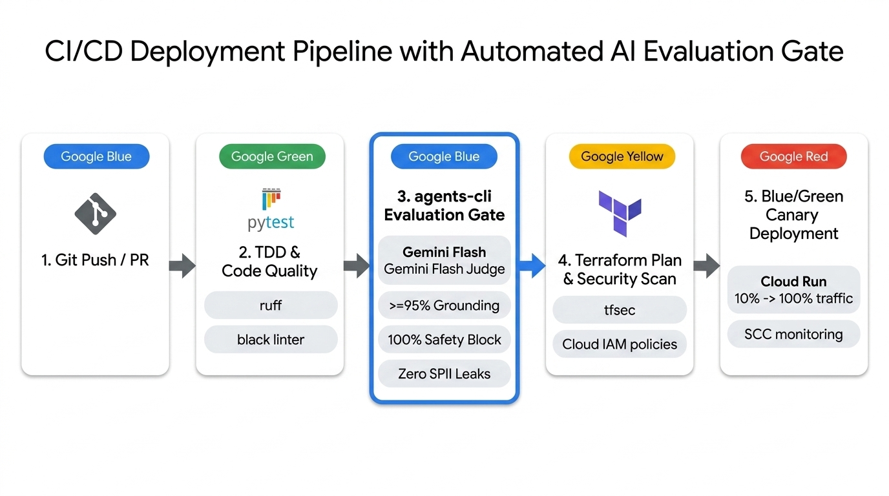

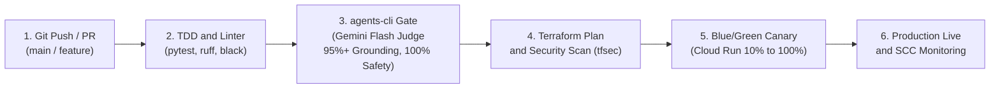

* **Stage 1 (Code Quality)**: Executes unit tests across all domain models and mock fixtures.
* **Stage 2 (Automated AI Evaluation Gate)**: Runs `agents eval --config tests/eval/eval_config.yaml` using Gemini Flash judge; strictly fails build if safety injection block < 100%, log SPII redaction < 100%, or grounding < 0.95 (ADR-0013).
* **Stage 3 (Infrastructure Validation)**: Runs `terraform plan` and static security compliance auditing.
* **Stage 4 (Canary Rollout)**: Deploys new revision to Cloud Run with 10% canary traffic allocation, evaluating error metrics for 15 minutes before shifting 100% traffic.

---

## 16. Executive "Plain English" Translation & Business Value Guide

For non-technical business leaders and executive sponsors, this section translates complex cloud architecture concepts into intuitive real-world analogies:

* **What is the Primary Orchestrator?**  
  *Analogy*: **The Concierge Desk**. When an employee arrives with a question or request, the concierge understands their need, checks their employee badge, and escorts them to the exact department specialist rather than making them search the building themselves.
* **What is Repository-Managed Open Knowledge Format (OKF) Grounding?**  
  *Analogy*: **The Structured Corporate Policy Compendium**. Instead of an AI guessing or inventing policies from memory, the system consults an organized, indexed repository binder of official policies with clear section titles, tags, and paragraph links, and provides the employee with the verified section reference and direct anchor link.
* **What is Google Cloud Model Armor?**  
  *Analogy*: **The Security Scanner at the Entrance & Exit**. It inspects every incoming message to block tricksters or unauthorized instructions (prompt injections) and scans outgoing messages to make sure personal home addresses or confidential numbers are never written onto public bulletin boards.
* **What are MCP (Model Context Protocol) Servers?**  
  *Analogy*: **Standard Universal Power Plugs**. Instead of building custom wiring for every single computer system, MCP provides a standard plug that allows the virtual assistant to safely turn switches in WorkWeek and ServiceImmediately without sparking errors.
* **What is Forward Recovery?**  
  *Analogy*: **The Delivery Confirmation Receipt**. If a doctor books your medical leave but the printer jams before printing the notification to your boss, the doctor doesn’t cancel your medical leave. Instead, they mark your file approved, write down an urgent note for the office manager to deliver the notice by hand, and assure you that your time off is 100% protected.


### 11.4. Data Protection: Vector Embedding Purge Lifecycle & Conversational Consent Controls (GDPR / DPO Compliance)

To satisfy Data Protection Officer (DPO) governance under GDPR (Articles 17 & 21) and CCPA:

#### 1. GDPR 'Right to be Forgotten' Vector Embedding Purge Procedure
When an employee departs the organization and triggers an offboarding event (`employee.offboarded`):
1. **Automated Document Discovery**: The Compliance Service queries application session and repository metadata filtering for `author_id: <user_id>` or `subject_employee_id: <user_id>`.
2. **Deterministic Record Deletion**: All personalized conversation records and associated session data are purged from application memory and database stores within **< 24 hours**.
3. **Audit Trail Cryptographic Hashing**: Historical audit log entries referencing the departed employee have their personal identifiers replaced with a one-way cryptographically salted SHA-256 hash (`salt + user_id`), preserving aggregate audit statistics without retaining identifiable PII.

#### 2. User Conversational Consent Withdrawal Controls
Employees can exercise direct privacy rights natively within the chat stream:
* **Consent Revocation Commands**: Typing *"opt out of logging"*, *"delete my chat history"*, or *"revoke consent"* immediately triggers a privacy confirmation.
* **Ephemeral Mode Engagement**: When confirmed, active session state is switched to ephemeral memory (no logging to `conversation_turns`), previous session turns are deleted, and a GDPR confirmation receipt is presented in chat.

---

### 14.3. Real-Time Vector Access Control (ACL) Query-Time Filtering & Revocation Latency SLA

To guarantee zero latency exposure of confidential HR policy data when user roles change:
1. **Query-Time Metadata Security Filtering**: Rather than relying on slow background vector re-indexing, every search query dispatched to the repository OKF bundle parser injects a mandatory dynamic security filter based on YAML frontmatter `access_control` and roles:
   ```json
   filter = "authorized_roles:ANY(\"" + user_role + "\") AND minimum_clearance <= " + user_clearance
   ```
2. **Sub-500ms Revocation Latency SLA**: When a role change event occurs in the Identity Provider (IdP):
   * The Revocation Webhook executes in **< 150ms**.
   * Active session claims are updated / invalidated in memory in **< 50ms**.
   * Subsequent search queries evaluate the new security filter immediately (**0ms sync lag** at query time), preventing unauthorized access to restricted policy chunks in real time.

---

## 17. Consolidated Enterprise Risk Register

A structured assessment of technical, operational, security, and organizational risks with proactive mitigation controls:

| Risk ID | Risk Category | Risk Description | Likelihood (1–5) | Impact (1–5) | Severity (L x I) | Proactive Mitigation Strategy | Owner | Contingency / Fallback Plan |
| :--- | :--- | :--- | :-: | :-: | :-: | :--- | :--- | :--- |
| **RSK-01** | **Technical** | Repository OKF policy Markdown file contains malformed YAML frontmatter. | 2 | 4 | **Medium (8)** | Pre-commit CI schema validation + in-memory fallback parser. | Cloud Infra Lead | Circuit breaker trips; user presented with static intranet policy portal link. |
| **RSK-02** | **Security** | Adversarial prompt injection bypasses Layer 0 Model Armor filter. | 2 | 5 | **High (10)** | Multi-stage defense: Model Armor + strict ADK tool schema bounds + output toxicity/hallucination filter. | Security Architect | Hard-block on unrecognized tool commands; immediate alert dispatched to SCC. |
| **RSK-03** | **Compliance** | Stale employee PII retained in persistent logs violating GDPR Art. 17. | 1 | 5 | **Medium (5)** | Automated Cloud DLP tiered redaction on log writes + 90-day automated partition purge + salted hash offboarding. | DPO / Lead Engineer | Automated daily log integrity scanner flags unmasked SPII for immediate remediation. |
| **RSK-04** | **Operational** | WorkWeek API 429 throttling during annual open-enrollment benefits rush. | 4 | 3 | **High (12)** | In-memory Token Bucket rate limiter (100 RPS) with prioritized queueing for in-flight transactions. | Backend Lead | Graceful degradation queue with friendly user wait notifications. |
| **RSK-05** | **Data Integrity** | Partial transaction failure during cross-system workflow (UC-2.2). | 3 | 3 | **Medium (9)** | Forward recovery pattern (ADR-0004): retain successful records + queue sync task in `pending_sync_tasks`. | Agent Lead | Nightly reconciliation cron + automated HR support notification ticket. |
| **RSK-06** | **Organizational** | Employee resistance or lack of trust in virtual assistant accuracy. | 3 | 3 | **Medium (9)** | Mandatory clickable deep-link citations on all policy claims + explicit confirmation gates on leave bookings. | Change Mgmt / HR | Escalation button allowing immediate transfer to human HR partner. |
| **RSK-07** | **Security** | Unauthorized tool execution after employee role revocation. | 2 | 4 | **Medium (8)** | Real-time IdP webhook listener (<500ms SLA) + dynamic query-time vector ACL filtering. | Identity Architect | In-memory session eviction rejecting in-flight JWTs with 401 Unauthorized. |
| **RSK-08** | **FinOps** | Uncontrolled LLM token consumption due to conversational looping. | 2 | 3 | **Medium (6)** | Hard ceiling of 10 turns per session + 15m idle TTL + Gemini 3.7 Flash cost optimization. | FinOps Lead | Automated Cloud Billing budget alerts at 80% and 100% monthly spend thresholds. |

---

## 18. Strategic Business Roadmap & Future State Vision (Phases 1–3)

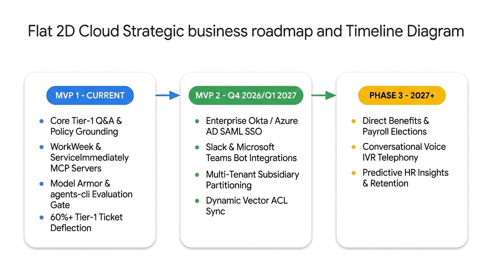

The HR Agentic Solution is architected as an extensible foundation designed to scale from MVP 1 to enterprise-wide autonomous operations:

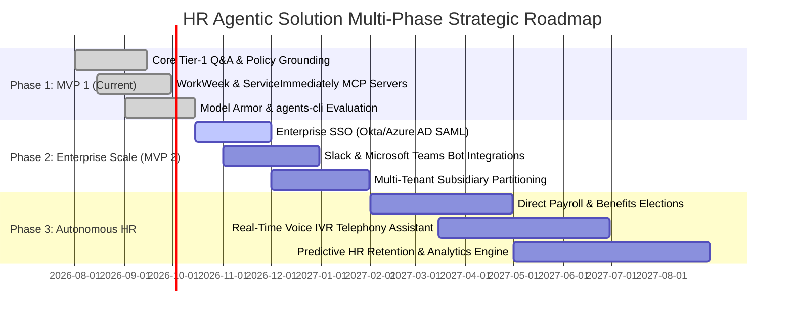

### Strategic Milestones:

1. **Phase 1: MVP 1 — Core Tier-1 Deflection (Current Milestone)**
   * Grounded Policy Q&A with deep links, WorkWeek leave management, ServiceImmediately incident tracking, Model Armor security gateway, and `agents-cli` automated evaluation harness.
2. **Phase 2: MVP 2 — Enterprise Workspace Federation (Q4 2026 – Q1 2027)**
   * **Enterprise Identity Federation**: Full Okta / Azure AD SAML 2.0 and OIDC integration with automated On-Behalf-Of (OBO) token exchange.
   * **Omnichannel Expansion**: Native app deployments inside **Slack** and **Microsoft Teams**, bringing the assistant directly into daily employee chat workflows.
   * **Multi-Tenant Subsidiary Partitioning**: Dynamic tenant routing allowing distinct subsidiaries (e.g. US, UK, APAC entities) to maintain isolated policy stores and HRIS endpoints.
3. **Phase 3: Autonomous HR Operations (Q2 2027+)**
   * **Complex Benefits & Payroll Elections**: Conversational open-enrollment plan comparisons and 401(k) contribution updates.
   * **Conversational Voice IVR**: Low-latency bidirectional voice assistant for employee phone inquiries.
   * **Predictive HR Insights**: Anonymized trend detection surfacing emerging employee pain points (e.g., frequent expense confusion) to HR leadership proactively.


---

## 19. CTO & CISO Architecture & Zero-Trust Governance Specification

This section provides the complete technical specifications for the 6 enterprise security and reliability pillars approved during the CTO & CISO architecture review:

### 19.1. SEC-0001: Asymmetric Cloud KMS & Dynamic JWKS Key Lifecycle
* **Signing Algorithm**: Asymmetric **ECDSA P-256 (ES256) with SHA-256** managed via Google Cloud KMS (`projects/{project}/locations/{location}/keyRings/{ring}/cryptoKeys/jwt-signing-key`).
* **Signature Committal**: The Primary Orchestrator invokes `projects.locations.keyRings.cryptoKeys.cryptoKeyVersions.asymmetricSign` to sign outbound delegated bearer tokens without ever holding private key bytes in memory.
* **JWKS Endpoint**: MCP servers query an internal JSON Web Key Set (`/.well-known/jwks.json`) cached in memory with a 1-hour TTL.
* **Rotation Lifecycle**: Automated Cloud KMS 90-day rotation generates a new key version (`v2`); the previous version (`v1`) is retained in `ENABLED` state for 30 days, guaranteeing zero verification failures for in-flight tokens.

### 19.2. SEC-0002: Strict VPC Service Controls (VPC-SC) Perimeter
* **Perimeter Scope**: Enforces an unbroken security perimeter containing the following protected Google Cloud services:
  - `aiplatform.googleapis.com` (Vertex AI & Agent Development Kit)
  - `discoveryengine.googleapis.com` (Vertex AI Search)
  - `storage.googleapis.com` (HR Policy Cloud Storage buckets)
  - `modelarmor.googleapis.com` (Google Cloud Model Armor)
  - `cloudkms.googleapis.com` (Cloud KMS CMEK keys)
  - `run.googleapis.com` (Serverless Orchestrator and MCP container instances)
* **Access Level**: Ingress restricted to corporate IP ranges and authorized Google Workspace identities; external internet egress from containers is strictly prohibited, mitigating Server-Side Request Forgery (SSRF) and data exfiltration.

### 19.3. SEC-0003: Full Customer Managed Encryption Keys (CMEK) Governance
* **Key Hierarchy**: Dedicated FIPS 140-2 Level 3 Hardware Security Module (HSM) Cloud KMS keys assigned per service layer:
  1. `kms-key-vertex-search`: Encrypts Vertex AI Search document chunks, vector embeddings, and semantic cache.
  2. `kms-key-gcs-policies`: Encrypts raw PDF and Markdown document objects in `gs://hr-policy-repo-prod`.
  3. `kms-key-cloudsql-audit`: Encrypts PostgreSQL disk volumes and database backups for session and audit stores.
* **Emergency Revocation Protocol**: Disabling the KMS key in the Cloud Console cryptographically shreds all underlying datastores within seconds.

### 19.4. SEC-0004: Dual-Region Active-Passive High Availability & Disaster Recovery (HA/DR)
* **Regional Distribution**:
  - **Primary Production Region**: `us-central1` (Iowa) — Active deployment serving 100% live traffic.
  - **Secondary Disaster Recovery Region**: `us-east4` (Virginia) — Warm standby Cloud Run container replicas and cross-region dual-bucket GCS replication.
* **Global Load Balancing & Health Probing**:
  - Google Cloud Global External Application Load Balancer with HTTP health checks (`/healthz` probing every 5 seconds).
  - Automated Failover: If 3 consecutive health probes fail in `us-central1`, traffic is dynamically shifted to `us-east4` in **< 60 seconds** (RTO < 60s, RPO = 0 for policy RAG queries).

### 19.5. SEC-0005: Real-Time SCC Threat Streaming & Automated Incident Response
* **Threat Detection Pipeline**:
  1. Ingress prompt containing adversarial injection or jailbreak payload is intercepted by Google Cloud Model Armor.
  2. Model Armor emits a high-severity finding event (`google.cloud.modelarmor.finding.v1`) to Google Cloud Eventarc.
  3. Finding is ingested in real time into **Security Command Center (SCC) Premium**.
  4. An event-driven Cloud Function invokes the ServiceImmediately API to automatically create a **Priority 1 Security Incident** (Category: `Cybersecurity / Threat Intelligence`, Subcategory: `Adversarial AI Attack`) with sanitized forensic payload metadata, assigned to the enterprise CIRT on-call queue.

### 19.6. SEC-0006: OpenTelemetry (OTel) Distributed Tracing & Token Profiling
* **Distributed Trace Propagation**: Every inbound user turn is stamped with a standard **W3C `traceparent`** header (e.g. `00-4bf92f3577b34da6a3ce929d0e0e4736-00f067aa0ba902b7-01`).
* **Context Propagation Sequence**:
  - `Span 1: Ingress / Model Armor Inspection` (Captures prompt scan latency)
  - `Span 2: Primary Orchestrator Intent Routing` (Captures Gemini input/output token counts & inference duration)
  - `Span 3: Sub-Agent Tool Execution` (Captures MCP tool call IPC latency and WorkWeek / ServiceImmediately backend response time)
  - `Span 4: Egress / Cloud DLP Redaction` (Captures output masking duration)
* **Cloud Trace & Monitoring Dashboard**: Traces are exported natively to **Google Cloud Trace**, providing real-time P50, P95, and P99 latency heatmaps and exact cost-per-intent token tracking.


---

## 20. Enterprise Architecture & Engineering Operations Specification

This section provides the complete technical specifications for the 6 enterprise engineering standards approved during the Enterprise Architect & Head of Engineering review:

### 20.1. ENG-0001: SemVer 2.0.0 & Tolerant Reader Schema Evolution
* **Semantic Versioning Specification**: All MCP tool endpoints define formal SemVer descriptors (e.g. `version="1.2.0"`).
* **Tolerant Schema Ingestion**: All Pydantic domain models in `src/models/` define:
  ```python
  from pydantic import BaseModel, ConfigDict
  
  class EnterpriseBaseModel(BaseModel):
      model_config = ConfigDict(
          extra="ignore",            # Silently ignore unmapped new upstream fields
          populate_by_name=True,     # Allow alias matching for camelCase enterprise APIs
          validate_default=True      # Ensure safe default fallbacks
      )
  ```
* **Deprecation Lifecycle**: When a breaking change occurs, the previous major tool definition (e.g. `v1`) remains deployed and active alongside `v2` for a mandatory 60-day deprecation window.

### 20.2. ENG-0002: Cloud Tasks / PubSub DLQ & Idempotent Retry Worker
* **Asynchronous Queue Topology**:
  - Task Queue: `projects/{project}/locations/{region}/queues/hr-forward-recovery-queue`
  - Max Concurrency: 50 concurrent dispatch workers
  - Rate Limiting: 20 dispatches per second with automatic token bucket throttling
* **Idempotent Header Enforcement**: All mutating tool calls (WorkWeek leave submission, ServiceImmediately incident creation) require a client-generated UUID:
  ```http
  POST /api/v1/leave/requests HTTP/1.1
  Idempotency-Key: 7b9a5e82-4f11-4a7b-b892-c12e584f9812
  Authorization: Bearer <signed_jwt>
  ```
* **Dead Letter Queue (DLQ) & Alerting**:
  - Tasks exceeding 5 retry attempts are routed to `projects/{project}/topics/hr-sync-tasks-dlq`.
  - An automated Cloud Monitoring alert notifies the on-call Site Reliability Engineering (SRE) queue via PagerDuty within 60 seconds.

### 20.3. ENG-0003: Pragmatic 3-Tier Layered MVC Codebase Architecture
The production repository is structured across 3 clean, decoupled architectural tiers:
```
src/
├── agents/                 # Tier 1: Controllers / AI Orchestrator Layer
│   ├── primary_orchestrator.py
│   ├── policy_agent.py
│   ├── workweek_agent.py
│   └── serviceimmediately_agent.py
├── services/               # Tier 2: Core Domain Logic & State Machines
│   ├── confirmation_service.py
│   ├── forward_recovery_service.py
│   ├── pto_guardrail_service.py
│   └── incident_lifecycle_service.py
├── repositories/           # Tier 3: Data Access & Persistent Storage
│   ├── session_repository.py
│   ├── audit_repository.py
│   └── sync_task_repository.py
└── mcp/                    # MCP Server Adapters & Tools
    ├── workweek_server.py
    └── serviceimmediately_server.py
```

### 20.4. ENG-0004: Zero-Downtime Expand-and-Contract Database Migrations
* **Migration Framework**: Managed via **Alembic** under `migrations/versions/`.
* **Expand Phase Rules**:
  - All new database columns must be created as `NULLABLE` or define constant defaults.
  - Adding indexes must utilize `CREATE INDEX CONCURRENTLY` in PostgreSQL to prevent table locks.
* **Contract Phase Rules**:
  - Legacy column deprecation requires a two-sprint migration cycle: (1) Ignore column in code $
ightarrow$ (2) Drop column in subsequent migration after verifying zero queries in `pg_stat_statements`.

### 20.5. ENG-0005: Redis Vector Semantic Cache & 4-Tier Gemini Flash Fallback Cascade
* **Semantic Vector Cache**:
  - Storage: Google Cloud Memorystore for Redis with RediSearch Vector Similarity module.
  - Embedding Engine: `text-embedding-004` (768 dimensions).
  - Match Criteria: Cosine similarity score $\ge 0.96$.
  - TTL: 24-hour cache invalidation synchronized with the Eventarc policy ingestion pipeline.
* **4-Tier Gemini Flash Fallback Cascade**:
  - **Tier 1 (Primary Model)**: `gemini-3.7-flash` (Optimal reasoning, lowest latency).
  - **Tier 2 (Fallback 1)**: `gemini-3.6-flash` (Engaged on HTTP 429 rate limit or 503 from Tier 1).
  - **Tier 3 (Fallback 2)**: `gemini-3.0-flash` (Engaged on persistent regional throttling).
  - **Tier 4 (Emergency Fallback)**: `gemini-2.5-flash` (Engaged on extreme upstream capacity surge).

### 20.6. ENG-0006: 24/7 Continuous Synthetic Production Canaries
* **Orchestration**: Cloud Scheduler executing a headless Cloud Run canary container every 5 minutes (`*/5 * * * *`).
* **Canary Test Account**: Dedicated, isolated enterprise test profile (`EMP-CANARY-01` in department `Quality Engineering`).
* **Synthetic Verification Scenarios**:
  1. *Scenario 1 (Policy Grounding)*: Queries bereavement policy; asserts $\ge 95\%$ semantic match and valid deep-link citation.
  2. *Scenario 2 (WorkWeek MCP)*: Fetches PTO balance; asserts non-null positive integer balance.
  3. *Scenario 3 (ServiceImmediately MCP)*: Creates synthetic Priority 4 canary incident `INC-CANARY-XXXX`, verifies creation, and immediately marks as Resolved.
* **SLA Metric Export**: Success/Failure status and turn latency are exported to `custom.googleapis.com/synthetic/agent_availability_ratio` with an alert threshold triggering on 2 consecutive probe failures.
