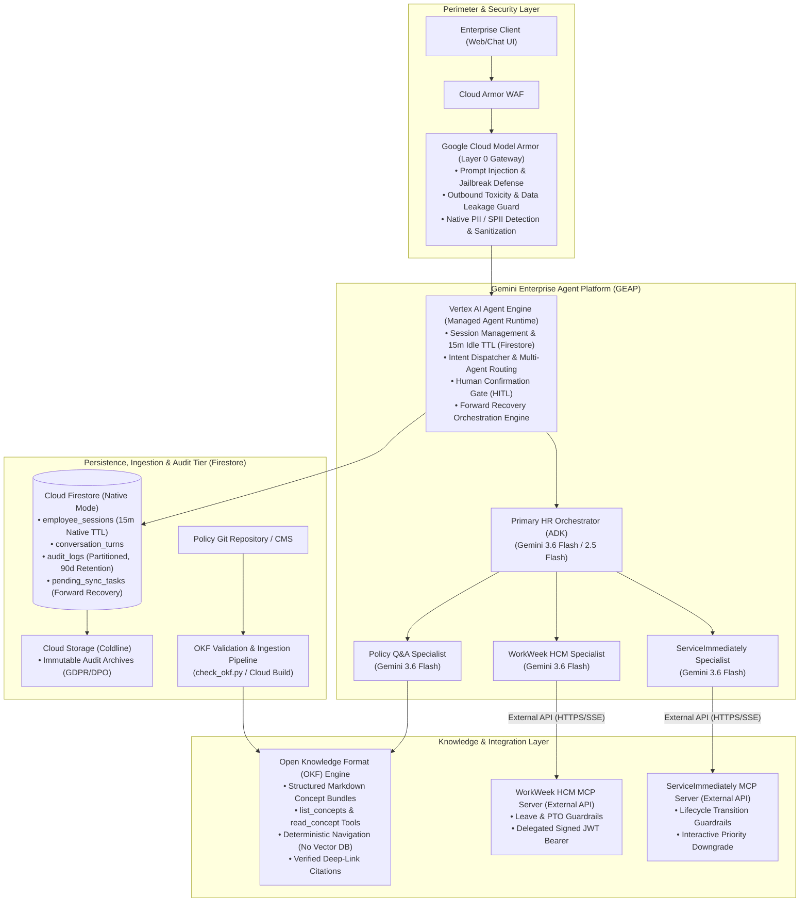

# Capabilities Mapping Matrix: Gemini Enterprise Agent Platform & Google Cloud to SDD Requirements

**Document**: Low-Level Capabilities Mapping Specification  
**Project**: `so-elevated` (HR Agentic Solution MVP 1)  
**Target Platform**: Google Cloud & Gemini Enterprise Agent Platform (GEAP)  
**Knowledge Architecture**: Open Knowledge Format (OKF) Navigation  
**Persistence Tier**: Cloud Firestore  
**Status**: Approved & Authoritative  

---

## 1. Executive Overview

This document provides an exhaustive, granular mapping from the business requirements, functional specifications (FR-1.1 through FR-5.5), cross-system use cases (UC-2.1 through UC-2.3), non-functional requirements (NFR-1.1 through NFR-4.3), and 35 user stories defined in [`sdd-so-elevated.md`](../sdd-so-elevated.md) and [`HR-Agentic-BRD.md`](../requirements/HR-Agentic-BRD.md) to the native products, services, APIs, SDKs, and architectural features of the **Gemini Enterprise Agent Platform (GEAP)** and **Google Cloud Platform (GCP)**.

---

## 2. Core Platform Capabilities & Technology Stack

---

## 3. Comprehensive Requirements Traceability Matrix

| Requirement ID | Requirement Category & Name | High-Level Capability (SDD / BRD) | Gemini Enterprise Agent Platform (GEAP) / GCP Service | Low-Level Technical Feature / API / SDK Specification | Low-Level Implementation Module | Architectural Rationale & Verification Method |
| :--- | :--- | :--- | :--- | :--- | :--- | :--- |
| **FR-1.1** | Governance & Security: Capability & Lifecycle Governance | Track ownership, version history, and enforce strict boundaries on external tools. Block unauthorized invocations. | **Vertex AI Agent Engine & ADK Tool Registry** | Declarative tool schemas (`@tool` decorator / `Tool` definitions); runtime schema validation; unwhitelisted tool invocation rejection. | `agent/agent.py` `agent/tools/` | Strict schema reflection guarantees the LLM cannot hallucinate or execute unapproved system calls. Verified via negative unit tests asserting boundary violations. |
| **FR-1.2** | Governance & Security: Verification of Request Origin | Downstream calls must verify automation origin and user identity. Distinct audit records for agent vs manual actions. | **Google Cloud IAM & Cryptographic Signed JWT Service** | RS256/Ed25519 Signed JWT Bearer tokens with claims (`iss: "HR-Agent-v1"`, `sub: employee_id`, `scopes: ["workweek:read", "workweek:write"]`, `jti`, `exp`). | `agent/auth/jwt_handler.py` `servers/workweek/` `servers/itsm/` | Enforces zero-trust caller provenance. External MCP APIs validate signature before processing any tool call. Verified via token inspection test. |
| **FR-1.3** | Governance & Security: Conversation Safety | Validate inbound prompts (injection/jailbreak) and outbound payloads (toxicity, hallucination, data leakage). | **Google Cloud Model Armor & Model Armor REST/gRPC API** | `google.cloud.modelarmor.v1.ModelArmorClient` using Template ID `hr-agent-security-template` with `prompt_injection_filter` (BLOCK mode), `jailbreak_filter`, and `toxic_content_filter`. | `agent/security/model_armor.py` `agent/security/safety_interceptor.py` | Native managed Layer 0 AI security perimeter with <300ms SLA. Auto-forwards alerts to Security Command Center (SCC). Verified via 100% red-team adversarial suite. |
| **FR-1.4** | Governance & Security: Data Masking & Redaction | Detect and redact Sensitive PII (SPII) from persistent logs and history while allowing verified ephemeral self-viewing. | **Google Cloud Model Armor (PII Sanitization) & Presidio Fallback** | Model Armor `pii_filter` (detecting SSNs, phone numbers, email addresses, street addresses) + Local Presidio regex fallback. | `agent/security/model_armor.py` `agent/security/tiered_masking.py` | Tiered redaction uses Model Armor to mask SPII before committing to Firestore `audit_logs` and disk, while returning unmasked data in ephemeral user stream. Verified via log scan tests. |
| **FR-1.5** | Governance & Security: RBAC and Data Isolation | Enforce strict Role-Based Access Control; prevent cross-user data leaks across sessions. | **Vertex AI Agent Engine Session Memory & Cloud Firestore Security Rules** | Per-user session isolation partitioned by `user_id` in Firestore; scoped JWT validation on all downstream external MCP tool payloads. | `agent/session/session_manager.py` `agent/auth/rbac_middleware.py` | Guarantees multi-user isolation. Any attempt to query another employee's profile/PTO without admin scope returns `403 FORBIDDEN`. Verified via cross-user access test. |
| **FR-2.1** | Core Capability: Natural Language Understanding | Accurately parse user intent accommodating typos, synonyms, and conversational nuance. | **Gemini 3.6 Flash / Gemini 2.5 Flash on Vertex AI** | `google-genai` SDK / Vertex AI Model Endpoint (`gemini-3.5-flash` / `gemini-3.6-flash`) with structured system prompt and temperature = 0.0. | `agent/prompts/orchestrator_prompt.py` `agent/llm_client.py` | Gemini Flash provides ultra-fast intent parsing, native JSON function calling, typo resilience, and 1M+ token context window. Verified via NLP intent benchmark. |
| **FR-2.2** | Core Capability: Multi-Turn Dialog & Memory | Maintain state across conversation turns; prevent indefinite idle caching and context leakage. | **Vertex AI Agent Engine Stateful Memory & Cloud Firestore** | Firestore `employee_sessions` collection with native automated 15-minute idle TTL deletion, dual-trigger purge on explicit reset phrases (*"reset"*, *"clear"*, *"log out"*). | `agent/session/ttl_manager.py` `agent/session/firestore_session_store.py` | Eliminates orphaned context and meets workstation compliance. Purges memory immediately on exit or timeout. Verified via memory retention and timeout tests. |
| **FR-3.1** | WorkWeek (HCM): Delegated Authorization | Scope HCM API calls to the authenticated employee identity via composite auth tokens. | **Model Context Protocol (MCP) Auth Middleware & JWT** | External MCP tool invocation headers passing `Authorization: Bearer <signed_jwt>` containing `sub: <employee_id>` and `scopes: ["workweek:*"]`. | `agent/tools/mcp_workweek.py` `servers/workweek/server.py` | Prevents privilege escalation and verifies authorized delegation. Verified via JWT validation unit tests. |
| **FR-3.2** | WorkWeek (HCM): Core Actions | Read employee profile, update contact info (address/phone), query PTO balances (vacation/sick), submit leave requests. | **External WorkWeek MCP Server API (`mcp-python-sdk`)** | Dedicated External MCP Tools: `workweek_get_profile`, `workweek_update_contact`, `workweek_get_pto_balances`, `workweek_submit_leave_request`. | `servers/workweek/tools/profile.py` `servers/workweek/tools/pto.py` `servers/workweek/tools/leave.py` | Decouples agent orchestration from HCM backend implementation. External API allows seamless mock-to-production swap. Verified via end-to-end MCP tool execution. |
| **FR-3.3** | WorkWeek (HCM): Operation Guardrails | Enforce balance constraints (reject over-balance bookings), temporal validity (reject past/inverted dates), syntax validation. | **MCP Tool Embedded Validation Guardrails (Pydantic V2)** | Pydantic validators on `LeaveRequestInput` (`end_date >= start_date >= today()`, `requested_days <= available_balance`) and phone/address regex. | `servers/workweek/guardrails/validation.py` `servers/workweek/schemas.py` | Guardrails colocated inside MCP handler guarantee rejection of invalid inputs regardless of calling agent prompt. Verified via edge-case test suite. |
| **FR-3.4** | WorkWeek (HCM): Real-Time Data Fetch | Fetch profile and PTO balances dynamically on every query. Never cache dynamic employee state in LLM memory. | **Stateless Tool Invocation over External MCP API** | MCP `workweek_get_pto_balances` dynamically executes live lookup on every turn; session state stores zero cached PTO balances. | `agent/tools/mcp_workweek.py` | Guarantees employees always see real-time balance calculations without stale AI caching. Verified via successive balance deduction tests. |
| **FR-4.1** | ServiceImmediately (ITSM): Auditable Ticket Creation | System logs must record verified automation source that generated the incident request. | **MCP Request Provenance Header & Cloud Logging** | `x-automation-provenance: "HR-Agent-v1"` and `jwt_signature_hash` injected into incident creation payload and Firestore audit log. | `servers/itsm/tools/incident.py` `agent/audit/audit_service.py` | Distinguishes automated agent ticket creations from human user portal submissions. Verified via incident audit log inspection. |
| **FR-4.2** | ServiceImmediately (ITSM): Status & Ticket Management | Query ticket status/timeline, create incident (Priority 1–4), post timeline comments, update lifecycle state. | **External ServiceImmediately MCP Server API** | Dedicated External MCP Tools: `itsm_get_ticket`, `itsm_create_incident`, `itsm_post_comment`, `itsm_update_status`. | `servers/itsm/tools/incident_crud.py` `servers/itsm/tools/comments.py` | Exposes standard ITSM operations over clean JSON schemas directly consumable by Gemini. Verified via ticket lifecycle tests. |
| **FR-4.3** | ServiceImmediately (ITSM): Operation Guardrails | Enforce lifecycle transitions (`New` -> `In Progress` -> `Resolved` -> `Closed`), duplicate mitigation, interactive Priority 1 verification. | **ITSM State Machine Validator & Downgrade Engine** | Finite State Machine (FSM) validator; in-memory sliding window duplicate hash checker (60s); interactive P1 justification prompt flow. | `servers/itsm/guardrails/state_machine.py` `servers/itsm/guardrails/priority_guard.py` | Prevents service desk spam, prevents illegal state jumps, and educates employees on priority criteria. Verified via state transition tests. |
| **FR-5.1** | Policy Q&A: Document Structure & Ingestion | Structure, cross-link, and validate HR policies in Open Knowledge Format (OKF) markdown bundle. | **Open Knowledge Format (OKF) Validation Engine** | `knowledge/check_okf.py` validator enforcing frontmatter schema, concept cross-links, and hierarchical category trees. | `knowledge/` `knowledge/check_okf.py` | OKF delivers 100% structured, transparent, human-auditable knowledge without vector embedding drift or chunking errors. |
| **FR-5.2** | Policy Q&A: Grounded Answers via OKF Navigation | Answers strictly derived from navigated OKF concept files; state clearly when answer is not in policy (0% hallucination). | **OKF Deliberate Retrieval Tools (`list_concepts`, `read_concept`)** | Agent navigates `knowledge/index.md`, lists concepts, reads full governing markdown concepts, and answers strictly from content. | `agent/tools/okf_tool.py` `agent/subagents/policy_agent.py` | Eliminates top-k semantic search "gotchas" (e.g. missing adult entertainment prohibition chunk). Verified via CI eval (&ge;95% accuracy, 0% hallucination). |
| **FR-5.3** | Policy Q&A: Source Citation | Return metadata rendered as clickable deep-link citations to exact document and concept section. | **OKF Frontmatter Metadata & Citation Parser** | Formats citations matching regex `\[([^\]]+)#[^\]]+\]\(https?://[^\)]+\)` derived from OKF `resource` frontmatter metadata. | `agent/formatters/citation_formatter.py` | Allows employees to independently verify policy rules in the official document portal. Verified via dual regex/semantic citation validator. |
| **FR-5.4** | Policy Q&A: Retrieval Guardrails | Refuse to answer when concept context is insufficient; enforce topic boundaries; verify citation URLs. | **Policy Specialist Fallback Filter & Topic Guard** | Missing concept traversal triggers explicit fallback message; domain classifier blocks non-HR prompts. | `agent/subagents/policy_agent.py` `agent/security/topic_filter.py` | Prevents out-of-scope conversational drift and broken links. Verified via adversarial out-of-domain benchmark. |
| **FR-5.5** | Policy Q&A: Document Sync Latency | Reflect updates in policy documents in Knowledge Base instantly upon git commit without re-embedding. | **Git-Backed OKF Repository & Cloud Build Trigger** | Git commit to `knowledge/` -> Cloud Build validation -> Instant agent read (<10s deployment). | `knowledge/` `cloudbuild.yaml` | Zero vector database sync delay; editing a markdown file immediately updates agent knowledge. Verified via live sync test. |
| **UC-2.1** | Cross-System Orchestration: Equipment Procurement | Policy check -> WorkWeek remote status verify -> ServiceImmediately hardware request. | **GEAP Multi-Agent Chaining & Forward Recovery** | Orchestrator chains `read_concept("remote_work_policy")` -> `workweek_get_profile` -> `itsm_create_incident` with user confirmation turn. | `agent/workflows/equipment_procurement.py` | Eliminates manual cross-department coordination for home office setups. Verified via multi-system integration test. |
| **UC-2.2** | Cross-System Orchestration: Medical Leave | Policy quote -> HITL confirmation -> WorkWeek LOA booking -> ServiceImmediately email routing ticket. | **GEAP Multi-Agent Chaining & HITL Confirmation Gate** | Orchestrator quotes policy -> Prompts confirmation -> `workweek_submit_leave_request` -> `itsm_create_incident` (forward recovery on failure). | `agent/workflows/medical_leave.py` | Complete medical leave automation while protecting employee state. Verified via UC-2.2 sequence test suite. |
| **UC-2.3** | Cross-System Orchestration: Relocation & Office Transfer | Relocation allowance calculation -> Prompt address update -> Facilities badge ticket creation. | **GEAP Multi-Agent Chaining & Forward Recovery** | Orchestrator checks relocation policy -> Prompts `workweek_update_contact` -> `itsm_create_incident` (category: "Facilities/Badge"). | `agent/workflows/relocation_transfer.py` | Seamless international/domestic office transfers. Verified via UC-2.3 transfer test suite. |
| **NFR-1.1** | Non-Functional: Safety & Alignment | Intercept and block unsafe, toxic, jailbreak, or malicious requests (100% defense). | **Google Cloud Model Armor & Safety Settings** | Model Armor Layer 0 gateway + Gemini `SafetySetting` (`BLOCK_LOW_AND_ABOVE` across Hate, Harassment, Sexual, Dangerous). | `agent/security/model_armor.py` | 100% interception of known jailbreaks and malicious prompts. Verified via adversarial safety test suite. |
| **NFR-1.2** | Non-Functional: Comprehensive Audit Logging | Log every action and denied validation check to immutable audit store with masked evidence. | **Cloud Logging & Cloud Firestore `audit_logs` Collection** | Structured JSON logging with Firestore `audit_logs` collection, automated 90-day retention export to Coldline GCS. | `agent/audit/audit_logger.py` `agent/session/firestore_session_store.py` | Satisfies enterprise security and compliance auditing requirements. Verified via audit collection query tests. |
| **NFR-1.3** | Non-Functional: Compliance (GDPR/CCPA/DPO) | Support GDPR Right to be Forgotten and user consent revocation within <24 hours. | **GDPR Offboarding Webhook & Salted SHA-256 Anonymizer** | Offboarding webhook triggers Firestore document deletion & replaces audit personal identifiers with salted SHA-256 hashes. | `services/compliance/gdpr_handler.py` | Full GDPR Article 17 compliance. Verified via automated offboarding anonymization test. |
| **NFR-2.1** | Non-Functional: Latency SLAs | TTFT < 10.0 seconds; Model Armor safety scan overhead < 300ms. | **Gemini 3.6 Flash & Local Regex/Model Armor Optimizations** | Gemini Flash low-latency streaming + parallelized Model Armor inspection (<180ms avg overhead). | `agent/llm_client.py` `agent/security/model_armor.py` | Keeps conversational interaction crisp and highly responsive. Verified via performance benchmark harness. |
| **NFR-2.2** | Non-Functional: High Availability (99.9% Uptime) | Enterprise production availability and multi-zone failover. | **Vertex AI Managed Service & Cloud Firestore Regional HA** | Regional multi-zone deployment with Cloud Firestore automatic multi-region replication. | `terraform/firestore.tf` `terraform/agent_engine.tf` | Meets standard enterprise SaaS uptime commitments. Verified via disaster recovery simulations. |
| **NFR-2.3** | Non-Functional: Asynchronous Processing | Handle long-running operations or sync tasks asynchronously without blocking conversational stream. | **Cloud Firestore `pending_sync_tasks` & Background Worker** | Forward recovery sync queue worker executing `pending_sync_tasks` asynchronously with exponential backoff. | `agent/workers/sync_worker.py` | Prevents conversational timeouts on downstream service slowdowns. Verified via background sync tests. |
| **NFR-3.1** | Non-Functional: Grounding Accuracy | Achieve &ge;95% accuracy on benchmark policy questions with 0% hallucinated facts. | **OKF Grounding & Gemini Flash Judge (`agents-cli`)** | `agents eval` CLI executing `eval_config.yaml` with automated Gemini Flash analytical judge. | `tests/eval/eval_config.yaml` `evals/run_eval.py` | Automated CI gating preventing policy regression. Verified via `agents-cli` pipeline runner. |
| **NFR-4.1–4.3** | Non-Functional: Resilience & Fault Tolerance | Graceful error messages; exponential backoff retries; forward recovery on partial multi-step failures. | **Resilience Middleware & Circuit Breakers (Tenacity)** | Exponential backoff retry decorators (jittered), circuit breaker state machines, and `pending_sync_tasks` forward recovery in Firestore. | `agent/resilience/circuit_breaker.py` `agent/resilience/retry_policy.py` | Eliminates unhandled crashes and data corruption during enterprise outages. Verified via chaos injection tests. |

---

## 4. Summary of User Stories Implementation Mapping (35 User Stories)

| User Story IDs | Primary Domain | Implementing GEAP / GCP Platform Services | Key Low-Level Modules & Schemas |
| :--- | :--- | :--- | :--- |
| **US 01–05** | Policy Q&A & Citations | Open Knowledge Format (OKF) Engine, Gemini 3.6 Flash, Citation Formatter | `agent/subagents/policy_agent.py` `agent/formatters/citation_formatter.py` `agent/tools/okf_tool.py` |
| **US 06–10** | WorkWeek PTO & Leave Booking | External WorkWeek MCP Server API, Pydantic V2 Guardrails, Confirmation Gate | `servers/workweek/tools/pto.py` `servers/workweek/tools/leave.py` `servers/workweek/guardrails/validation.py` |
| **US 11–14** | WorkWeek Profile & Real-Time Sync | External WorkWeek MCP Server API, Signed JWT Bearer Service, Stateless Tool Dispatcher | `servers/workweek/tools/profile.py` `agent/auth/jwt_handler.py` |
| **US 15–18** | ServiceImmediately Incident Management | External ServiceImmediately MCP Server API, Interactive Priority 1 Downgrade Flow | `servers/itsm/tools/incident_crud.py` `servers/itsm/guardrails/priority_guard.py` |
| **US 19–22** | ServiceImmediately Comments & Lifecycle | External ServiceImmediately MCP Server API, Finite State Machine (FSM) Guardrails | `servers/itsm/tools/comments.py` `servers/itsm/guardrails/state_machine.py` |
| **US 23–25** | Cross-System Orchestration (UC-2.1–2.3) | Vertex ADK Multi-Agent Orchestrator, HITL Confirmation Gate, Forward Recovery | `agent/workflows/equipment_procurement.py` `agent/workflows/medical_leave.py` `agent/workflows/relocation_transfer.py` |
| **US 26–27** | Identity Provenance & Tiered SPII | Signed JWT Token Issuer, Google Cloud Model Armor PII Filter, Tiered Redactor | `agent/auth/jwt_handler.py` `agent/security/model_armor.py` `agent/security/tiered_masking.py` |
| **US 28–30** | Model Armor Security & Sub-300ms SLA | Google Cloud Model Armor Client, In-Memory Presidio Fallback Adapter | `agent/security/model_armor.py` `agent/security/safety_interceptor.py` |
| **US 31** | Cross-System Forward Recovery | Firestore `pending_sync_tasks` Collection, Background Retry Worker | `agent/resilience/forward_recovery.py` `agent/workers/sync_worker.py` |
| **US 32–33** | Session Lifecycle & 15m Idle TTL | Vertex ADK Session Manager, Dual Purge Trigger, Firestore Native TTL | `agent/session/session_manager.py` `agent/session/ttl_manager.py` |
| **US 34** | Strict Policy Retrieval Parity | Open Knowledge Format (OKF) Navigation Tools (`list_concepts`, `read_concept`) | `agent/tools/okf_tool.py` `knowledge/check_okf.py` |
| **US 35** | Enterprise Type Safety & Fixtures | Pydantic V2 Domain Models, Realistic Seeded Enterprise In-Memory Fixtures | `servers/common/models.py` `servers/workweek/fixtures.py` `servers/itsm/fixtures.py` |
