# System Architecture Diagrams & Visual Topology Catalog

**Document**: Visual Technical Architecture & Sequence Specifications  
**Project**: `so-elevated` (`elevate-hrproject`)  
**Target Platform**: Google Cloud & Gemini Enterprise Agent Platform (GEAP)  
**Status**: Approved & Authoritative  

---

## 1. Catalog of Architecture Diagrams

This catalog contains all 13 visual architectural diagrams, network topologies, entity-relationship models, and sequence flows governing the **HR Agentic Solution (MVP 1)**.

1. **Figure 1**: End-to-End System & Enterprise Network Architecture Topology
2. **Figure 2**: Hierarchical Multi-Agent Orchestration & Dispatcher Runtime
3. **Figure 3**: Low-Level Component & Service Interaction Diagram
4. **Figure 4**: Sequence Diagram — Cross-System Medical Leave Orchestration (UC-2.2) with HITL Gate & Forward Recovery
5. **Figure 5**: Sequence Diagram — Grounded Policy Q&A with Live Vertex AI Search & Deep-Link Citations (UC-1.1)
6. **Figure 6**: Sequence Diagram — WorkWeek HCM PTO Inquiry & Guarded Vacation Booking (UC-1.2)
7. **Figure 7**: Sequence Diagram — ServiceImmediately Incident Lifecycle & Interactive Priority 1 Downgrade (UC-1.3)
8. **Figure 8**: Sequence Diagram — Event-Driven Real-Time Policy Sync Pipeline (Eventarc + Cloud Run)
9. **Figure 9**: Sequence Diagram — Identity Authentication, OAuth OBO Exchange & Webhook Revocation
10. **Figure 10**: Low-Level Database Entity-Relationship Diagram (ERD) & Data Flow
11. **Figure 11**: Layer 0 Security Sentinel Gateway & Cloud DLP Tiered Redaction Pipeline
12. **Figure 12**: CI/CD Deployment Pipeline & Automated `agents-cli` Evaluation Gate
13. **Figure 13**: Subsystem Failure Modes, Circuit Breakers & Forward Recovery State Machine

---

## 2. Visual Architecture Diagrams

### Figure 1: End-to-End System & Enterprise Network Architecture Topology

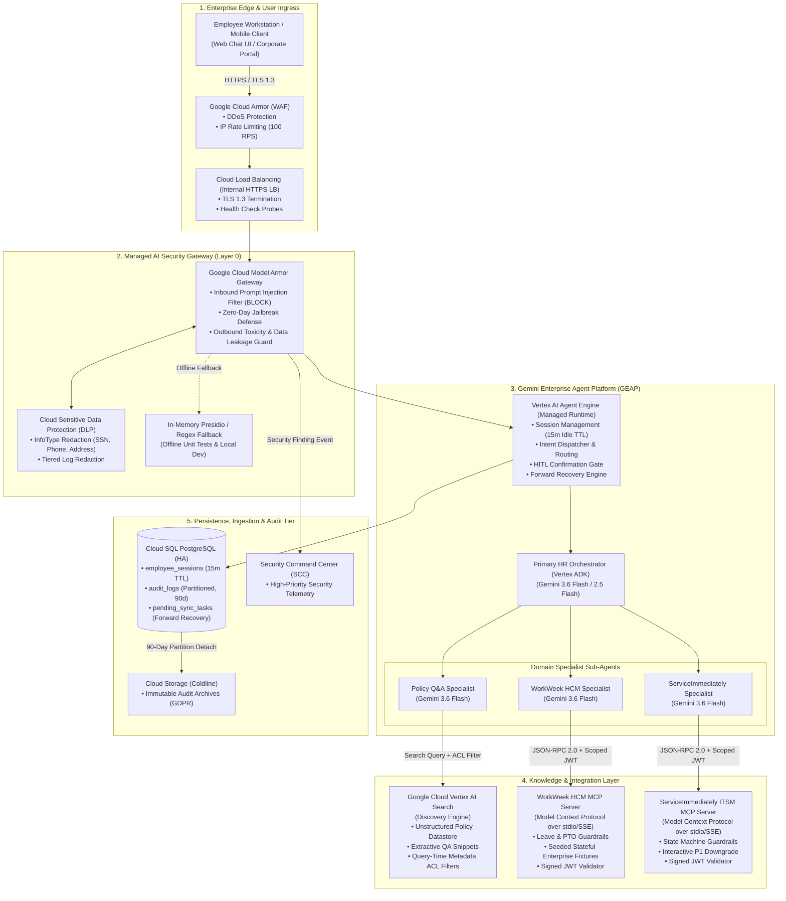

---

### Figure 2: Hierarchical Multi-Agent Orchestration & Dispatcher Runtime

```mermaid
flowchart TD
    InboundPrompt["Inbound Clean Prompt<br>(from Model Armor Gateway)"] --> Dispatcher{"Intent Classifier & Dispatcher<br>(Primary HR Orchestrator)"}
    
    Dispatcher -->|"Policy Inquiries<br>(Leave rules, Expenses, Remote work)"| RoutePolicy["Route to Policy Q&A Specialist"]
    Dispatcher -->|"HCM Actions<br>(Profile, PTO balance, Leave booking)"| RouteWW["Route to WorkWeek HCM Specialist"]
    Dispatcher -->|"ITSM Actions<br>(Ticket status, Incidents, Comments)"| RouteSI["Route to ServiceImmediately Specialist"]
    Dispatcher -->|"Cross-System Workflows<br>(UC-2.1 Equipment, UC-2.2 Medical, UC-2.3 Relocation)"| RouteWorkflow["Execute Cross-System Workflow Engine"]
    
    subgraph ExecutionPolicies["Orchestrator Execution Policies"]
        HITLGate{"Is Operation State-Changing?<br>(Leave booking, address update, ticket close)"}
        HITLGate -->|Yes| PromptHITL["Pause Execution & Prompt User for Confirmation<br>(ADR-0007)"]
        HITLGate -->|No (Read-Only / Comment)| ExecuteDirect["Execute Directly via Sub-Agent"]
        
        PromptHITL --> WaitUser{"User Confirmed?"}
        WaitUser -->|Yes| CommitMutation["Commit Mutation via Scoped Tool Call"]
        WaitUser -->|No / Cancel| AbortMutation["Abort Action & Confirm Cancellation"]
    end
    
    RouteWW --> HITLGate
    RouteSI --> HITLGate
    RouteWorkflow --> HITLGate
    RoutePolicy --> ExecuteDirect
```

---

### Figure 3: Low-Level Component & Service Interaction Diagram

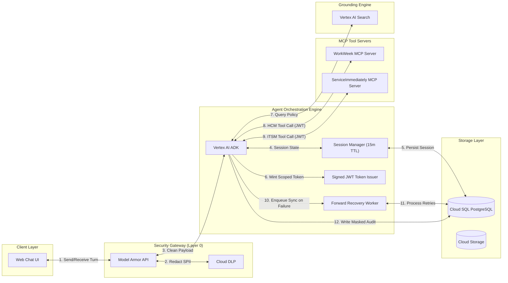

---

### Figure 4: Sequence Diagram — Cross-System Medical Leave Orchestration (UC-2.2)

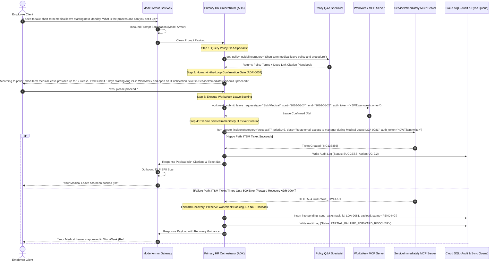

---

### Figure 5: Sequence Diagram — Grounded Policy Q&A with Live Vertex AI Search & Deep-Link Citations (UC-1.1)

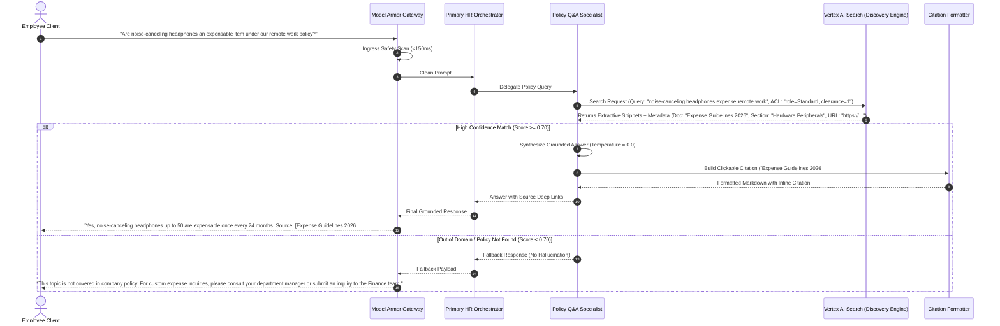

---

### Figure 6: Sequence Diagram — WorkWeek HCM PTO Inquiry & Guarded Vacation Booking (UC-1.2)

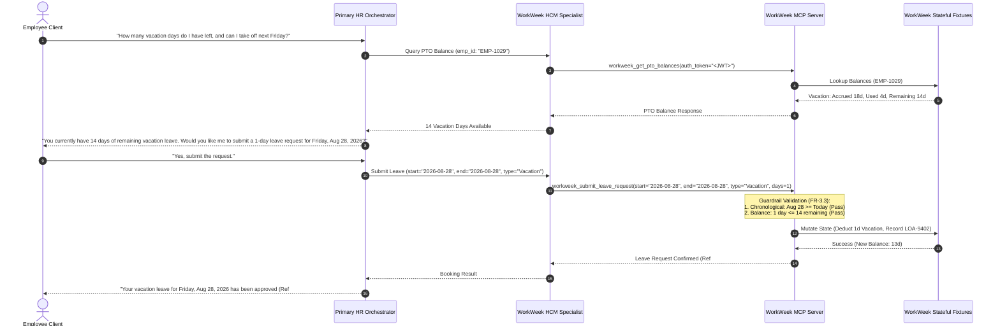

---

### Figure 7: Sequence Diagram — ServiceImmediately Incident Management & Interactive Priority 1 Downgrade (UC-1.3)

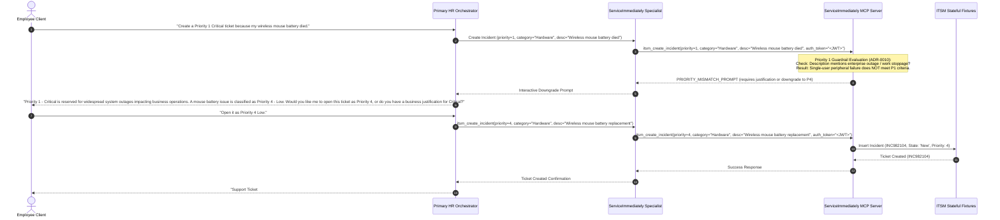

---

### Figure 8: Sequence Diagram — Event-Driven Real-Time Policy Sync Pipeline

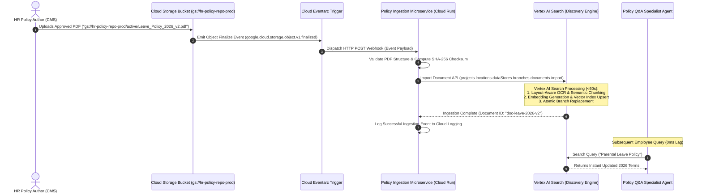

---

### Figure 9: Sequence Diagram — Identity Authentication, OAuth OBO Exchange & Webhook Revocation

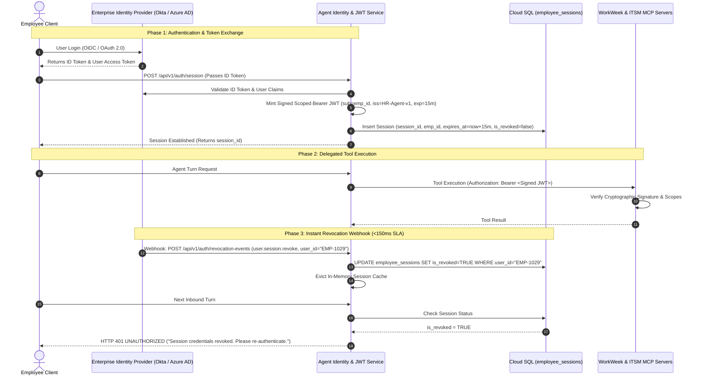

---

### Figure 10: Low-Level Database Entity-Relationship Diagram (ERD) & Data Flow

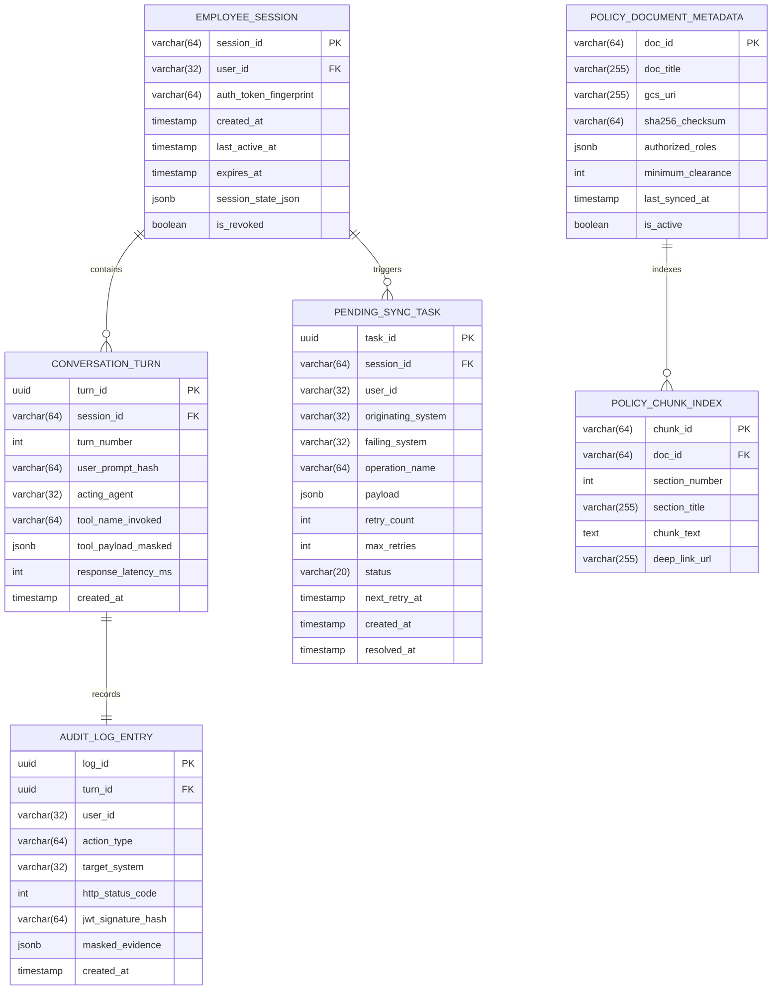

---

### Figure 11: Layer 0 Security Sentinel Gateway & Cloud DLP Tiered Redaction Pipeline

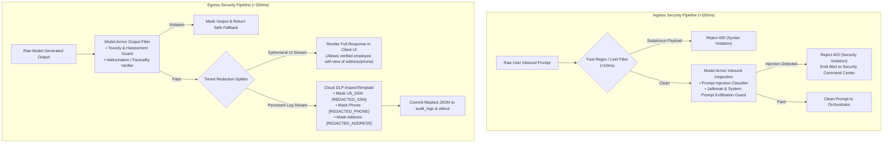

---

### Figure 12: CI/CD Deployment Pipeline & Automated `agents-cli` Evaluation Gate

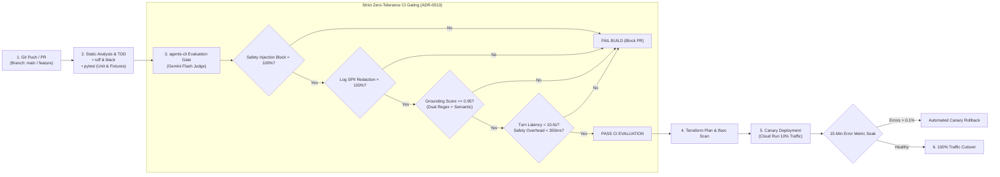

---

### Figure 13: Subsystem Failure Modes, Circuit Breakers & Forward Recovery State Machine

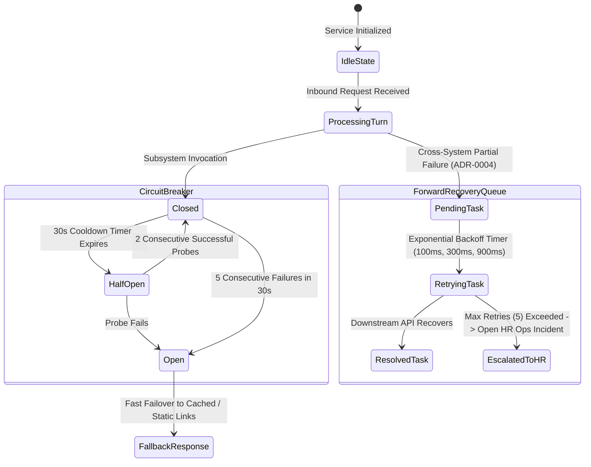
