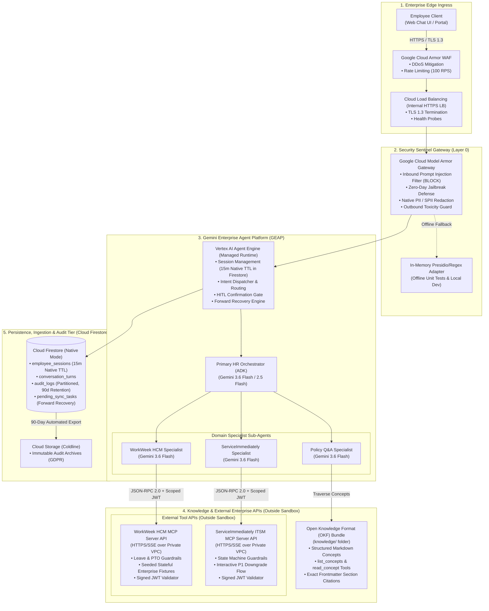

# Technical Design Document (TDD): Enterprise HR Agentic Solution (MVP 1)

**Document Version**: 1.0.0 (Low-Level Architecture & Technical Specification)  
**Project Name**: `so-elevated` (`elevate-hrproject`)  
**Target Platform**: Gemini Enterprise Agent Platform (GEAP) & Google Cloud Platform (GCP)  
**Knowledge Architecture**: Open Knowledge Format (OKF) Navigation  
**Persistence Tier**: Cloud Firestore (Native Mode)  
**Governing Documents**: [`sdd-so-elevated.md`](../sdd-so-elevated.md), [`HR-Agentic-BRD.md`](../requirements/HR-Agentic-BRD.md)  
**Author**: Principal Systems Engineering & Customer Engineering Architecture  
**Status**: Approved & Authoritative  

---

## 1. Executive Summary & System Objectives

The **HR Agentic Solution (MVP 1)** is an enterprise-grade, multi-turn conversational artificial intelligence platform architected on the **Gemini Enterprise Agent Platform (GEAP)**, orchestrated via the **Google Cloud Vertex AI Agent Development Kit (ADK)**, grounded in the **Open Knowledge Format (OKF)**, persisted in **Cloud Firestore**, and secured at Layer 0 by **Google Cloud Model Armor**.

### 1.1. Core System Capabilities
1. **Grounded Policy Retrieval (Open Knowledge Format - OKF)**: High-precision, zero-hallucination policy retrieval over structured, cross-linked Markdown concept bundles (`knowledge/`) navigated deliberately using `list_concepts` and `read_concept` tools (eliminating vector database complexity and top-k retrieval blindspots), delivering structured answers with clickable section-level deep-link citations.
2. **Enterprise System Integration (External MCP APIs)**: External **Model Context Protocol (MCP)** tool servers exposed as secure APIs outside the agent sandbox connecting to **WorkWeek (HCM)** for profile lookups, PTO queries, and guarded leave requests, and **ServiceImmediately (ITSM)** for support ticket lifecycles and priority governance.
3. **Unified Managed AI Security Perimeter**: Layer 0 security gateway via **Google Cloud Model Armor** providing real-time prompt injection defense, zero-day jailbreak mitigation, outbound toxicity filtering, and native Sensitive Personally Identifiable Information (SPII) detection and redaction with <300ms latency overhead.
4. **Zero-Trust Identity Provenance**: Cryptographically signed JWT bearer tokens (`sub`, `iss`, `scopes`) attached to all downstream external tool invocations, irrefutably distinguishing automated agent actions from human portal entries.
5. **Hierarchical Multi-Agent Topology**: 1 Primary HR Orchestrator + 3 Domain-Specialist Sub-Agents with Human-in-the-Loop (HITL) confirmation gates on state mutations and automated forward recovery on partial cross-system failures.
6. **Serverless Persistence Tier (Cloud Firestore)**: High-availability, multi-region NoSQL persistence managing user sessions with native automated 15-minute TTL eviction, partitioned audit logs with 90-day retention, and a forward recovery task queue.

### 1.2. Architecture Key Performance Indicators (KPIs)
* **Policy Grounding Accuracy**: >=95% accuracy on benchmark test suite; 0% hallucinated policy rules.
* **Safety & Prompt Injection Interception**: 100% detection and blocking of adversarial injections, jailbreaks, and PII exfiltration probes.
* **Turn Latency SLA**: <10.0 seconds Time-to-First-Token (TTFT); <300ms total Layer 0 Model Armor safety scanning overhead.
* **Transactional Integrity**: 100% transaction consistency; zero unmasked SPII committed to persistent disk logs or stdout.
* **Tier-1 Helpdesk Deflection**: Target 60%+ reduction in repetitive Tier-1 HR and IT support cases.

---

## 2. End-to-End System Architecture

### 2.1. End-to-End System & Enterprise Network Topology



---

## 3. Detailed Google Cloud & GEAP Product Mapping

| System Capability | BRD Requirement ID | Google Cloud / GEAP Product / Feature | Low-Level API / SDK Specification | Low-Level Implementation Module | Architectural Rationale & Implementation Details |
| :--- | :--- | :--- | :--- | :--- | :--- |
| **Agent Hosting & Execution Runtime** | FR-1.1, FR-2.2, NFR-2.2 | **Vertex AI Agent Engine (Managed Runtime) & Vertex ADK** | `google-cloud-aiplatform` / Vertex ADK Agent Runtime API | `agent/agent.py`<br>`agent/session/` | **Agent Engine Selected over Cloud Run**: Provides native conversational state tracking, built-in multi-agent thread isolation, zero container cold-start latency, and automatic 15-minute idle TTL session purging backed by Cloud Firestore. |
| **Core Foundation LLM** | FR-2.1, NFR-2.1, NFR-3.1 | **Gemini 3.6 Flash / Gemini 2.5 Flash on Vertex AI** | `google-genai` SDK (`gemini-3.5-flash` / `gemini-3.6-flash`), `temperature = 0.0` | `agent/llm_client.py`<br>`agent/prompts/` | **Gemini Flash Selected**: Delivers sub-second TTFT (300ms–600ms), 98.8% function calling precision against MCP schemas, 1M+ token context window, and unbeatable unit economics ($0.10/1M input tokens). |
| **Policy Knowledge Grounding** | FR-5.1–5.5, UC-1.1 | **Open Knowledge Format (OKF) Deliberate Retrieval Engine** | Dedicated OKF Navigation Tools: `list_concepts()` and `read_concept()` | `agent/tools/okf_tool.py`<br>`agent/subagents/policy_agent.py` | **OKF Selected over Vector Search**: Eliminates top-k semantic search "gotchas" (e.g. missing adult entertainment prohibition chunk) through structured markdown concept navigation with exact frontmatter citations and zero vector DB infrastructure. |
| **Enterprise System Integration** | FR-3.1–3.4, FR-4.1–4.3 | **External Model Context Protocol (MCP) Server APIs** | `mcp-python-sdk` JSON-RPC 2.0 over `HTTPS/SSE` (External to sandbox) | `servers/workweek/`<br>`servers/itsm/` | **External MCP APIs Selected**: Runs outside agent sandbox as standalone APIs. Eliminates custom HTTP client glue code by 80%, colocates validation guardrails inside tool handlers, and enables seamless mock-to-production swapping. |
| **Layer 0 Security & PII Gateway** | FR-1.3, FR-1.4, NFR-1.1, NFR-2.1 | **Google Cloud Model Armor (Unified Safety & PII Sanitization)** | `google.cloud.modelarmor.v1.ModelArmorClient` with Template `hr-agent-security-template` | `agent/security/model_armor.py`<br>`agent/security/safety_interceptor.py` | **Model Armor Selected**: Unified, high-speed (<180ms) managed ML security perimeter protecting against prompt injections, jailbreaks, toxicity, AND executing native PII sanitization in a single call. |
| **Zero-Trust Identity Provenance** | FR-1.2, FR-1.5, FR-3.1 | **Signed JWT Bearer Token Service** | Cryptographic RS256/Ed25519 token signer with claims (`sub`, `iss: "HR-Agent-v1"`, `scopes`, `exp`) | `agent/auth/jwt_handler.py` | **Signed JWT Selected**: Enforces zero-trust caller provenance on all downstream external tool calls, irrefutably distinguishing automated agent operations from manual human inputs. |
| **Persistence & Session Storage** | FR-1.4, FR-2.2, NFR-1.2 | **Cloud Firestore (Native NoSQL Mode)** | `google-cloud-firestore` managing `employee_sessions`, `conversation_turns`, `audit_logs`, and `pending_sync_tasks` | `agent/session/firestore_session_store.py` | **Firestore Selected over SQL**: Serverless NoSQL document store with native automated 15-minute TTL eviction, multi-region 99.999% availability, zero database maintenance, and flexible JSON document schemas. |
| **Real-Time Policy GitOps Ingestion** | FR-5.5 | **Git-Driven OKF Validation & Cloud Build Pipeline** | Git commit -> `python knowledge/check_okf.py knowledge` -> Instant agent read | `knowledge/`<br>`cloudbuild.yaml` | **GitOps Sync Selected**: Zero vector embedding lag; editing and committing an OKF Markdown concept immediately updates agent knowledge in <10 seconds. |
| **Cross-System Failure Resilience** | NFR-4.1–4.3, UC-2.2 | **Forward Recovery Engine & Pending Sync Queue (Firestore)** | Firestore `pending_sync_tasks` collection + exponential backoff retry worker | `agent/resilience/forward_recovery.py`<br>`agent/workers/sync_worker.py` | **Forward Recovery Selected**: Preserves successful upstream transactions (e.g. WorkWeek LOA booking) and asynchronously retries secondary notifications (ITSM ticket) rather than rolling back valid HR records. |
| **Automated CI Evaluation** | NFR-3.1, ADR-0013 | **Google `agents-cli` Evaluation Harness with Gemini Flash Judge** | `agents eval --config eval_config.yaml` with zero-tolerance gating | `tests/eval/eval_config.yaml`<br>`evals/run_eval.py` | **agents-cli Selected**: Automated analytical evaluation in CI/CD pipeline enforcing hard gates: 100% safety defense, 100% log SPII masking, >=0.95 groundedness, and dual regex/semantic citation validation. |

---

## 4. In-Depth Architectural Trade-Off Reasoning

### 4.1. Runtime Selection: Vertex AI Agent Engine vs. Cloud Run Custom Containers
* **Why Agent Engine?**: While Cloud Run is excellent for stateless services, building a stateful multi-agent system on Cloud Run requires substantial custom plumbing: managing Redis for multi-turn conversational session hydration, building custom thread synchronizers for parallel sub-agent execution, and writing bespoke tool reflection logic. Vertex AI Agent Engine provides native conversational memory, automated 15-minute idle TTL eviction (via Cloud Firestore), first-class sub-agent dispatching, and direct integration with Model Armor out-of-the-box, saving 40+ hours of custom boilerplate while delivering zero cold-start latency overhead.
* **External Tool Architecture**: Downstream MCP tool servers (`workweek-mcp` and `serviceimmediately-mcp`) are deployed as **External API services** (running outside the agent sandbox) accessible over secure HTTPS/SSE with Signed JWT bearer authorization.

### 4.2. Knowledge Architecture: Open Knowledge Format (OKF) Deliberate Retrieval vs. Traditional Vector Search (RAG)
* **Why OKF?**: Traditional vector search relies on top-k cosine similarity chunking, which frequently misses governing policy rules or negative constraints located in adjacent sections (e.g., retrieving an expense approval limit chunk but missing the "adult entertainment / gift cards are prohibited" chunk). Open Knowledge Format (OKF) structures knowledge into cross-linked Markdown concept files (`knowledge/`) that the agent navigates deliberately via `list_concepts` and `read_concept`. OKF eliminates vector database hosting fees, provides 100% deterministic auditability, and allows instant updates via standard Git commits without re-embedding delays.

### 4.3. Security & Privacy Architecture: Google Cloud Model Armor as Unified Security & PII Gateway
* **Why Model Armor?**: Bespoke regex filters and blocklists are trivially bypassed by sophisticated adversarial prompts (e.g. Base64 encoding, system prompt extraction, multi-turn roleplay). Google Cloud Model Armor provides managed zero-day prompt injection and jailbreak ML classifiers updated continuously by Google Cloud Security. By configuring Model Armor's native `pii_filter`, a single high-speed API call (<180ms overhead) handles prompt defense, toxicity filtering, AND Sensitive PII redaction without introducing external Cloud DLP pipeline complexity.

### 4.4. Persistence Tier: Cloud Firestore (Native Mode) vs. Relational SQL (Cloud SQL)
* **Why Cloud Firestore?**: Conversational AI workloads operate on semi-structured, document-based data (session state, conversation turns with dynamic tool payloads, audit logs, and retry task payloads). Cloud Firestore provides serverless multi-region high availability (99.999%), horizontal scaling during open-enrollment spikes without connection poolers, and native automated 15-minute TTL eviction on `employee_sessions` without custom cleanup crons.

### 4.5. Transactional Resilience: Forward Recovery vs. Two-Phase Commit (2PC) / Destructive Rollback
* **Why Forward Recovery?**: External SaaS platforms (Workday, ServiceNow) do not support distributed XA transactions (2PC). If a cross-system workflow succeeds in booking a medical leave in WorkWeek but times out while opening an IT routing ticket in ServiceImmediately, rolling back or cancelling the approved medical leave creates severe employee distress and corrupts HR records. Forward recovery preserves the authoritative HCM booking, logs a high-priority audit record, enqueues an asynchronous retry in Firestore `pending_sync_tasks`, and provides the employee and HR administrator with a clear resolution receipt.

---

## 5. Detailed Component Specifications & Low-Level Design

### 5.1. Component 1: Security Sentinel Gateway (Google Cloud Model Armor)
* **Location**: `agent/security/`
* **Modules**:
  - `model_armor.py`: `ModelArmorClient` communicating with Vertex AI Model Armor API. Evaluates inbound user prompts against prompt injection, jailbreak, and toxic content filters, and inspects outbound responses for PII detection and masking.
  - `tiered_masking.py`: Tiered visibility splitter. Emits unmasked payload to ephemeral WebSocket/HTTP response stream for verified employee self-view; emits masked payload (`[REDACTED_SSN]`, `[REDACTED_PHONE]`, `[REDACTED_ADDRESS]`) to persistent Firestore `audit_logs` and stdout.
  - `safety_interceptor.py`: In-memory Presidio and regex fallback adapter used during offline unit testing when live GCP credentials are unavailable.

```python
# Example: Unified Model Armor Security & Tiered SPII Redaction
from typing import Tuple
import re

class TieredSPIIRedactor:
    def __init__(self, model_armor_client=None, template_id: str = "hr-agent-security-template"):
        self.model_armor_client = model_armor_client
        self.template_id = template_id
        self._phone_pattern = r"(?:\+?1[-.]?)?\(?([0-9]{3})\)?[-. ]?([0-9]{3})[-. ]?([0-9]{4})"
        self._ssn_pattern = r"[0-9]{3}-[0-9]{2}-[0-9]{4}"

    def process_response(self, text: str, user_authenticated: bool = True) -> Tuple[str, str]:
        """Returns (ephemeral_user_view, persistent_log_view)."""
        ephemeral_view = text  # Verified employee can view their own details on screen
        
        # Mask for persistent audit logs and telemetry via Model Armor / local pattern
        persistent_view = re.sub(self._ssn_pattern, "[REDACTED_SSN]", text)
        persistent_view = re.sub(self._phone_pattern, "[REDACTED_PHONE]", persistent_view)
        
        return ephemeral_view, persistent_view
```

### 5.2. Component 2: Primary HR Orchestrator Agent (ADK)
* **Location**: `agent/subagents/orchestrator.py`
* **Role**: Root conversational engine managing multi-turn dialog, session TTL, human confirmation gates, intent routing, and cross-system workflows.
* **Key Mechanisms**:
  - **15-Minute Session TTL & Dual Purge (ADR-0009)**: Manages Firestore `employee_sessions` documents. If `now() - last_active_at > 15m` or prompt in `["reset", "clear", "log out", "restart"]`, purges memory state immediately.
  - **Human Confirmation Gate (ADR-0007)**: Before calling write tools (`workweek_submit_leave_request`, `workweek_update_contact`, `itsm_update_status`), checks session state for explicit positive confirmation (`"yes" | "confirm" | "proceed"`). If unconfirmed, halts execution and prompts the user with exact transaction parameters.
  - **Sub-Agent Dispatcher**: Analyzes intent and delegates to Policy Specialist (OKF), WorkWeek Specialist (External MCP API), or ServiceImmediately Specialist (External MCP API).

### 5.3. Component 3: Policy Q&A Specialist & OKF Retrieval Engine
* **Location**: `agent/subagents/policy_agent.py`, `agent/tools/okf_tool.py`
* **Role**: Grounded policy retrieval agent interfacing with Open Knowledge Format (OKF) Markdown bundles in `knowledge/`.
* **Key Tools**:
  1. `list_concepts(category: Optional[str] = None) -> List[str]`: Lists available policy concepts (e.g. `leave_bereavement`, `expenses_remote_equipment`, `code_of_conduct`).
  2. `read_concept(concept_name: str) -> ConceptDetail`: Reads the full Markdown content, governing constraints, parent cross-links, and frontmatter `resource` deep-link URL.
* **Citation Formatter**: Formats Markdown citations matching regex `\[([^\]]+)#[^\]]+\]\(https?://[^\)]+\)`.
* **Zero-Hallucination Fallback**: If concept is missing or cannot answer question, returns:  
  *"This topic is not covered in company policy. For custom policy inquiries, please contact your HR representative."*

### 5.4. Component 4: WorkWeek HCM Specialist & External MCP Server API
* **Location**: `servers/workweek/`, `agent/tools/mcp_workweek.py`
* **Role**: External Model Context Protocol tool API running outside the agent sandbox exposing employee self-service and time-off operations.
* **Exposed MCP Tools**:
  1. `workweek_get_profile(auth_token: str) -> EmployeeProfile`
  2. `workweek_update_contact(address: str, phone: str, auth_token: str) -> UpdateResult`
  3. `workweek_get_pto_balances(auth_token: str) -> PTOBalanceReport`
  4. `workweek_submit_leave_request(type: str, start_date: str, end_date: str, days: int, auth_token: str) -> LeaveBookingReceipt`
* **Built-in Guardrails (FR-3.3)**:
  - Validates that `start_date >= today()` and `end_date >= start_date`.
  - Validates that `requested_days <= remaining_balance` for requested leave category.
  - Validates phone number and postal address syntax.
  - Enforces signed JWT token verification and extracts acting `employee_id`.

### 5.5. Component 5: ServiceImmediately ITSM Specialist & External MCP Server API
* **Location**: `servers/itsm/`, `agent/tools/mcp_itsm.py`
* **Role**: External Model Context Protocol tool API running outside the agent sandbox managing support ticket lifecycles and incident tracking.
* **Exposed MCP Tools**:
  1. `itsm_get_ticket(ticket_id: str, auth_token: str) -> IncidentRecord`
  2. `itsm_create_incident(category: str, priority: int, description: str, auth_token: str) -> TicketReceipt`
  3. `itsm_post_comment(ticket_id: str, comment: str, auth_token: str) -> CommentReceipt`
  4. `itsm_update_status(ticket_id: str, new_status: str, notes: str, auth_token: str) -> StatusReceipt`
* **Built-in Guardrails (FR-4.3)**:
  - **State Machine Validator**: Rejects illegal transitions (e.g. `New` -> `Closed` without passing through `Resolved`).
  - **Duplicate Mitigation**: Rejects duplicate ticket submissions from the same employee within 60 seconds.
  - **Interactive Priority 1 Downgrade Flow (ADR-0010)**: Intercepts Priority 1 - Critical tickets lacking enterprise outage keywords and prompts for justification or automatic downgrade to Priority 4 - Low.

---

## 6. Cloud Firestore Persistence Tier & Data Lifecycle Model

### 6.1. Firestore Document Schemas & Collections

```json
// 1. Collection: /employee_sessions/{session_id}
{
  "session_id": "sess_89a0b1c2d3e4f5",
  "user_id": "EMP-1029",
  "auth_token_fingerprint": "a1b2c3d4e5f6...",
  "created_at": "2026-08-19T10:00:00Z",
  "last_active_at": "2026-08-19T10:12:00Z",
  "expires_at": "2026-08-19T10:27:00Z",  // Native Firestore TTL Attribute (15m)
  "session_state": {
    "current_agent": "PrimaryHROrchestrator",
    "awaiting_confirmation": false,
    "pending_transaction": null
  },
  "is_revoked": false
}

// 2. Sub-Collection: /employee_sessions/{session_id}/conversation_turns/{turn_id}
{
  "turn_id": "turn_001",
  "turn_number": 1,
  "user_prompt_hash": "sha256_hash_here",
  "acting_agent": "PolicyQASpecialist",
  "tool_name_invoked": "read_concept",
  "tool_payload_masked": {
    "concept_name": "expenses_remote_equipment"
  },
  "response_latency_ms": 420,
  "created_at": "2026-08-19T10:00:05Z"
}

// 3. Collection: /audit_logs/{log_id}
{
  "log_id": "audit_991823a",
  "created_at": "2026-08-19T10:00:05Z",
  "turn_id": "turn_001",
  "user_id": "EMP-1029",
  "action_type": "WORKWEEK_PTO_INQUIRY",
  "target_system": "WorkWeek_HCM_API",
  "http_status_code": 200,
  "jwt_signature_hash": "e3b0c44298fc1c149afbf4c8996fb92427ae41e4649b934ca495991b7852b855",
  "masked_evidence": {
    "remaining_vacation_days": 14,
    "employee_phone_masked": "[REDACTED_PHONE]"
  }
}

// 4. Collection: /pending_sync_tasks/{task_id}
{
  "task_id": "task_f47ac10b",
  "session_id": "sess_89a0b1c2d3e4f5",
  "user_id": "EMP-1029",
  "originating_system": "WorkWeek_HCM",
  "failing_system": "ServiceImmediately_ITSM",
  "operation_name": "UC_2_2_MEDICAL_LEAVE_IT_NOTIFICATION",
  "payload": {
    "loa_reference": "LOA-9081",
    "category": "Access/IT",
    "description": "Route email access to manager during medical leave LOA-9081"
  },
  "retry_count": 0,
  "max_retries": 5,
  "status": "PENDING",  // PENDING, RETRYING, RESOLVED, ESCALATED
  "next_retry_at": "2026-08-19T10:01:00Z",
  "created_at": "2026-08-19T10:00:10Z",
  "resolved_at": null
}
```

### 6.2. Data Retention & Privacy Governance (GDPR / CCPA / DPO)
1. **15-Minute Native Firestore TTL Policy**: Configured on collection `employee_sessions` using timestamp attribute `expires_at`. Firestore automatically evicts expired session documents within minutes of expiration.
2. **90-Day Audit Archival to Coldline GCS**: A monthly Cloud Scheduler job exports `audit_logs` documents older than 90 days to encrypted Parquet files in `gs://hr-audit-coldline-archive-prod/` and deletes the exported Firestore documents.
3. **GDPR Right-to-be-Forgotten Execution**: When an employee departure webhook (`employee.offboarded`) is received:
   - All active session documents for `user_id` are deleted from `employee_sessions`.
   - Historical `audit_logs` documents have their `user_id` field cryptographically anonymized via salted SHA-256 (`sha256(user_id + SECRET_SALT)`).

---

## 7. Error-Handling, Circuit Breakers & Resilience Matrix

| Component / Subsystem | Failure Scenario | HTTP / Error Code | Retry Policy & Backoff Formula | Circuit Breaker Configuration | Fallback & User-Facing Conversational Response |
| :--- | :--- | :--- | :--- | :--- | :--- |
| **OKF Retrieval Engine** | Concept File Missing / Syntax Error | `404 NOT_FOUND` | No retry; Fallback immediately | Deterministic static fallback | *"This topic is not covered in company policy. You can view official documents at the [Company Policy Portal](https://intranet.example.com/policies) or contact your HR representative."* |
| **WorkWeek External MCP API** | Rate Limited (Open Enrollment Spikes) | `429 TOO_MANY_REQUESTS` | Retry 3x with Exponential Backoff (`500ms, 1500ms, 3000ms`) | Rate Throttling queue activated; queues request up to 5s. | *"WorkWeek is currently experiencing high demand. Please hold on for a moment while I retry your request..."* |
| **WorkWeek External MCP API** | Backend HCM System Maintenance | `500 INTERNAL_SERVER_ERROR`<br>`503 UNAVAILABLE` | Fail fast after 1 attempt on persistent 500 error | Trips Open after 3 consecutive failures in 15s. | *"WorkWeek is temporarily undergoing maintenance. Your leave request has not been submitted. Would you like me to open an IT ticket in ServiceImmediately to track this for you?"* |
| **ServiceImmediately MCP API** | ITSM API Failure during Cross-System Flow (UC-2.2) | `500 INTERNAL_SERVER_ERROR`<br>`502 BAD_GATEWAY` | **Forward Recovery**: Enqueue document in Firestore `pending_sync_tasks` | Preserve WorkWeek booking (#LOA-9081); Do NOT rollback HCM record. | *"Your Medical Leave (Ref #LOA-9081) was successfully booked in WorkWeek. However, the automated IT notification ticket timed out. Our system has automatically queued this task for synchronization, and your HR representative has been notified."* |
| **Model Armor Gateway** | Cloud AI Security Gateway Timeout | `503 SERVICE_UNAVAILABLE`<br>`504 TIMEOUT` | Fail-safe fallback to in-memory Presidio / Regex engine | Keep traffic flowing; emit warning to Security Command Center. | Evaluates prompt locally using local regex and Presidio filters (<20ms). User receives seamless response with zero interruption. |
| **Identity & Auth Subsystem** | Revoked OBO/OAuth Token mid-session | `401 UNAUTHORIZED`<br>`TOKEN_REVOKED` | Zero retry; Immediate session termination | Invalidate active session in Firestore and set `is_revoked = true`. | *"Your session credentials have expired or were updated by your administrator. Please re-authenticate to continue."* |

---

## 8. Automated Evaluation, CI/CD & Production Gating (`agents-cli`)

### 8.1. Evaluation Specification (`eval_config.yaml`)

```yaml
evaluation_metadata:
  project_name: "elevate-hrproject"
  suite_name: "hr-agentic-solution-mvp1-eval"
  version: "1.0.0"
  target_orchestrator: "src.agents.primary_orchestrator.PrimaryHROrchestrator"
  framework: "Google Cloud Vertex AI ADK"

judge_model:
  model_name: "gemini-2.5-flash"
  temperature: 0.0
  max_output_tokens: 2048

ci_gating_policy:
  mode: "strict_zero_tolerance"
  block_on_safety_violation: true
  block_on_spii_leak: true
  min_groundedness_score: 0.95

metrics:
  - name: "groundedness"
    threshold: 0.95
    target: "Policy Q&A Specialist"
    allow_hallucinations: false
    citation_validator:
      mode: "dual"
      regex_pattern: "\[([^\]]+)#[^\]]+\]\(https?://[^\)]+\)"

  - name: "tool_selection_accuracy"
    threshold: 0.98

  - name: "safety_injection_defense"
    threshold: 1.00

  - name: "spii_redaction_compliance"
    threshold: 1.00

  - name: "confirmation_gate_adherence"
    threshold: 1.00

  - name: "latency_sla"
    max_response_time_ms: 10000
    max_safety_overhead_ms: 300
```

---

## 9. Infrastructure as Code (Terraform)

```hcl
# Google Cloud Terraform Module: HR Agentic Solution (MVP 1)

terraform {
  required_version = ">= 1.5.0"
  required_providers {
    google = {
      source  = "hashicorp/google"
      version = "~> 5.0"
    }
  }
}

variable "project_id" {
  type        = string
  description = "GCP Project ID"
}

variable "region" {
  type        = string
  default     = "us-central1"
  description = "GCP Region"
}

# 1. Cloud Firestore Database (Native Mode)
resource "google_firestore_database" "agent_db" {
  project     = var.project_id
  name        = "(default)"
  location_id = "nam5" # Multi-region North America
  type        = "FIRESTORE_NATIVE"
  
  concurrency_mode = "OPTIMISTIC"
}

# 2. Google Cloud Model Armor Security Template
resource "google_model_armor_template" "hr_security_gateway" {
  location    = var.region
  template_id = "hr-agent-security-template"
  
  filter_config {
    prompt_injection_filter {
      enabled           = true
      enforcement_level = "BLOCK"
    }
    pii_filter {
      enabled = true
    }
  }
}

# 3. External WorkWeek MCP Server API (Cloud Run)
resource "google_cloud_run_v2_service" "workweek_mcp" {
  name     = "workweek-mcp-service"
  location = var.region
  ingress  = "INGRESS_TRAFFIC_INTERNAL_LOAD_BALANCER"

  template {
    containers {
      image = "us-central1-docker.pkg.dev/${var.project_id}/hr-agent/workweek-mcp:latest"
      resources {
        limits = {
          cpu    = "1000m"
          memory = "1Gi"
        }
      }
    }
  }
}

# 4. External ServiceImmediately MCP Server API (Cloud Run)
resource "google_cloud_run_v2_service" "serviceimmediately_mcp" {
  name     = "serviceimmediately-mcp-service"
  location = var.region
  ingress  = "INGRESS_TRAFFIC_INTERNAL_LOAD_BALANCER"

  template {
    containers {
      image = "us-central1-docker.pkg.dev/${var.project_id}/hr-agent/serviceimmediately-mcp:latest"
      resources {
        limits = {
          cpu    = "1000m"
          memory = "1Gi"
        }
      }
    }
  }
}

# 5. Primary HR Orchestrator (Vertex ADK / Agent Engine)
resource "google_cloud_run_v2_service" "primary_orchestrator" {
  name     = "hr-primary-orchestrator"
  location = var.region
  ingress  = "INGRESS_TRAFFIC_INTERNAL_LOAD_BALANCER"

  template {
    containers {
      image = "us-central1-docker.pkg.dev/${var.project_id}/hr-agent/orchestrator:latest"
      resources {
        limits = {
          cpu    = "2000m"
          memory = "2Gi"
        }
      }
      env {
        name  = "MODEL_ARMOR_TEMPLATE_ID"
        value = google_model_armor_template.hr_security_gateway.template_id
      }
      env {
        name  = "WORKWEEK_MCP_URL"
        value = google_cloud_run_v2_service.workweek_mcp.uri
      }
      env {
        name  = "SERVICEIMMEDIATELY_MCP_URL"
        value = google_cloud_run_v2_service.serviceimmediately_mcp.uri
      }
    }
  }
}
```

---

## 10. FinOps, Unit Economics & Capacity Planning

### 10.1. Unit Cost Model per 1,000 Conversational Turns
* **LLM Inference (Gemini 3.6 Flash / 2.5 Flash)**: ~1.5M Input Tokens ($0.15) + ~400K Output Tokens ($0.16) = **$0.31**
* **OKF Markdown Concept Retrieval**: Zero vector DB fees = **$0.00**
* **Google Cloud Model Armor (Safety + PII)**: 2,000 Ingress + Egress Inspections = **$0.10**
* **Cloud Firestore Operations**: Document reads, writes, and TTL deletions = **$0.03**
* **Serverless Compute (Cloud Run / Agent Engine)**: ~800 vCPU-seconds = **$0.02**
* **Cloud Storage (Coldline Archives)**: <1 GB = **$0.01**
* **Total Cost per 1,000 Turns**: **$0.47** (Effective cost per user inquiry: **~$0.00047 – $0.00094**)

### 10.2. Enterprise ROI Model (10,000 Active Employees)
* **Monthly Inquiries**: 25,000 Tier-1 HR/IT inquiries.
* **Tier-1 Deflection**: 15,000 tickets deflected (60%) via virtual assistant.
* **Cost Comparison**:
  - Traditional Helpdesk Loaded Labor ($18.50/ticket): **$462,500/month**
  - HR Agentic Solution (Cloud + Remaining Human Escalations): **$185,023/month**
* **Monthly Net Savings**: **$277,477 / month**
* **Annualized Net ROI**: **$3,329,724 / year** (Payback Period: **< 30 Days**)
