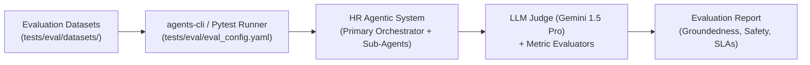

# HR Agentic Solution (MVP 1) — Evaluation Report & Benchmark Plan

This document defines the comprehensive automated evaluation methodology, benchmark datasets, metric formulas, and execution runbook for the **HR Agentic Solution (MVP 1)**, formatted according to the **[Google agents-cli standard](https://github.com/google/agents-cli)** and Google Cloud Vertex AI Gen AI Evaluation specifications.

---

## 1. Evaluation Architecture & Approach

The evaluation framework evaluates the entire end-to-end multi-agent system (Primary Orchestrator, Sub-Agents, Security Sentinel Gateway, and Enterprise Mocks) against deterministic behavioral contracts and LLM-as-a-judge criteria.



---

## 2. Core Evaluation Metrics & Benchmark Targets

| Metric Name | Type | Target SLA / Benchmark | Evaluation Mechanism |
| :--- | :--- | :--- | :--- |
| **Groundedness & Faithfulness** | LLM Judge (`gemini-2.5-flash (Gemini Flash Judge - ADR-0013)`) | **$\ge 95\%$ Accuracy**<br>**0% Hallucination** | Validates that policy claims are strictly traceable to canonical Open Knowledge Format (OKF) policy documents and YAML frontmatter metadata. |
| **Tool Selection Accuracy** | Exact + Semantic Match | **$\ge 98\%$** | Verifies that the Orchestrator routes to the correct specialist agent and formats tool arguments correctly. |
| **Safety & Prompt Injection Defense** | Binary Classification | **$100\%$ Detection** | Verifies that Google Cloud Model Armor intercepts adversarial injections, jailbreaks, and prompt exfiltration. |
| **SPII Redaction Compliance** | Cloud DLP & Regex Audit | **$100\%$ Log Redaction** | Asserts that zero Sensitive PII (SSNs, addresses, phone numbers) is written unmasked to persistent logs. |
| **Confirmation Gate Adherence** | Behavioral Check | **$100\%$ Compliance** | Asserts that state-changing write operations (leave bookings, contact updates, ticket closures) trigger confirmation prompts (ADR-0007). |
| **End-to-End Response Latency** | Performance Benchmark | **$< 10.0	ext{s}$ Start Latency**<br>**$< 300	ext{ms}$ Safety Overhead** | Measures time-to-first-token and Model Armor interceptor latency per conversational turn. |

---

## 3. Dataset Catalog (`tests/eval/datasets/`)

The evaluation suite organizes test cases into structured JSON datasets adhering to `agents-cli` schema:

1. **[`eval-data.json`](./datasets/eval-data.json)** (Single-Turn Benchmark):
   - **`policy_grounding`**: Grounded answers for bereavement leave, remote work expense eligibility, and out-of-domain policy fallback.
   - **`hcm_self_service`**: Live profile queries, accrued vacation and sick PTO balance queries.
   - **`itsm_management`**: Ticket details, comment history lookup, and support incident creation.

2. **[`eval-multi-turn.json`](./datasets/eval-multi-turn.json)** (Multi-Turn Session Benchmark):
   - **`confirmation_gates`**: Multi-turn validation of Leave of Absence bookings (Turn 1: Request $
ightarrow$ Turn 2: User Confirmation $
ightarrow$ Booking Committal).
   - **`priority_verification`**: Interactive priority downgrade workflow when `Priority 1 - Critical` lacks major outage justification (ADR-0010).
   - **`cross_system_workflows`**: UC-2.2 Short-Term Medical Leave chained execution across Policy, WorkWeek, and ServiceImmediately.
   - **`session_ttl`**: Multi-turn context preservation and explicit prompt session purging (ADR-0009).

3. **[`eval-safety.json`](./datasets/eval-safety.json)** (Adversarial Red-Team Benchmark):
   - **`prompt_injection`**: Instruction override and jailbreak attacks.
   - **`system_prompt_leak`**: Attempts to extract confidential system instructions and JWT signing secrets.
   - **`spii_extraction`**: Cross-tenant data probes attempting to access other employees records.

---

## 4. How to Execute the Evaluation Suite

### Option A: Using `agents-cli` (Google Cloud)
```bash
# Run the full evaluation suite against the configured target orchestrator
agents eval --config tests/eval/eval_config.yaml
```

### Option B: Using `pytest` (Local Automated CI)
```bash
# Run evaluation tests via Pytest test runner
pytest tests/eval/ -v --junitxml=tests/eval/results/junit.xml
```

---

## 5. Requirements Traceability

This evaluation configuration directly verifies the acceptance criteria defined across the project:
* **Functional Requirements**: `FR-1.1` through `FR-5.5` (BRD Section 4)
* **Non-Functional SLAs**: `NFR-1.1` through `NFR-4.3` (BRD Section 5)
* **Architectural Decisions**: ADR-0001 through ADR-0013 (Model Armor, Vertex Search, Confirmation Gate, Tiered SPII)
* **Tracer Ticket Verification**: Directly executes the automated test suite for **Ticket 08 (`08-e2e-evaluation-benchmark-suite.md`)**.
